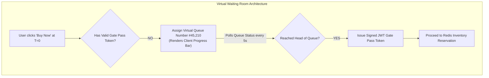

# HLD — E-Commerce Flash Sale System (Amazon Flash Sale)

## Mental Model

Think of an **E-Commerce Flash Sale System (Amazon Prime Day / Black Friday)** as an extreme physical stadium gate entrance where 1,000,000 eager fans rush to buy 1,000 limited-edition concert tickets. 

If all 1,000,000 fans charge the stadium ticket booth simultaneously (**Database Overselling & Crash**), the ticket counter collapses, database row locks freeze for minutes, and 5,000 fans are accidentally issued duplicate tickets (**Inventory Overselling Disaster**). 

An enterprise Flash Sale architecture employs **Virtual Queueing (Token Bucket Ingress)** at the gateway layer to allow only 1,000 users into the stadium at a time. Inventory deduction executes atomically in **Redis RAM using Lua Scripts**, and orders are buffered in **Kafka Queues** for asynchronous database processing.

---

## 1. Requirement & Capacity Estimation

### A. Functional & Non-Functional Requirements
1. **Flash Sale Catalog:** Display item details, sale countdown, and real-time inventory count.
2. **Zero Overselling Guarantee:** ABSOLUTELY NEVER sell more items than available stock ($K$ items).
3. **High Concurrency & Low Latency:** Handle 500,000 requests/sec at exact sale start ($T=0$) with $< 100\text{ms}$ response time.
4. **Fairness & Anti-Bot Protection:** Block automated scalper bots using CAPTCHAs, rate limiting, and virtual waiting rooms.

### B. Capacity Estimation Math
- **Flash Sale Event Constraints:**
  - Available Item Stock = 10,000 Units (e.g. iPhone at 90% discount)
  - Concurrent Traffic Spike at $T=0$ = 500,000 QPS
  - DB Capacity Limit = 2,000 Writes/sec
- **Traffic Shedding Target:**
  - $99.6\%$ of requests MUST be shed or queued at the edge layer! Only $0.4\%$ of valid requests proceed to inventory processing!

---

## 2. High-Level System Architecture Diagram

```mermaid
flowchart TD
    subgraph ClientsBots["Clients & Scalper Bots"]
        Users["1,000,000 Users at Sale Start T=0"]
    end

    subgraph PerimeterProtection["Perimeter Edge & Virtual Queue Tier"]
        CDN["CDN Edge (Static Page Caching)"]
        WAF["WAF & Anti-Bot Service (CAPTCHA / Rate Limiting)"]
        VirtualQueue["Virtual Waiting Room (Token Bucket Ingress)\nAllows max 5,000 requests/min to proceed!"]
    end

    subgraph InventoryTier["High-Speed In-Memory Inventory Tier"]
        RedisLua[("Redis Cluster (Atomic Lua Script Inventory Decrement)\nKey: `flash_sale:item_100` | Stock: 10,000")]
    end

    subgraph OrderProcessing["Asynchronous Order Ingestion Tier"]
        KafkaOrder["Kafka Order Queue\n(Buffers valid reservation events)"]
        OrderService["Order Fulfillment Microservice"]
        MainDB[("SQL Database (PostgreSQL Sharded)\nStores Permanent Orders & Payment Records")]
    end

    Users --> CDN --> WAF --> VirtualQueue
    
    VirtualQueue -->|1. Valid Request| RedisLua
    
    RedisLua -->|2a. Lua Decrement Stock > 0 (Success!)| KafkaOrder
    RedisLua -->|2b. Lua Decrement Stock <= 0 (Sold Out!)| SoldOut["Return HTTP 200: SOLD OUT!"]
    
    KafkaOrder --> OrderService --> MainDB
```

---

## 3. Zero-Overselling Atomic Inventory Decrement via Redis Lua

How do we guarantee ZERO inventory overselling under 500,000 QPS?

Executing `SELECT stock FROM items WHERE id = 1` followed by `UPDATE items SET stock = stock - 1` in SQL under high concurrency causes **Race Conditions and Database Row Lock Contention**.

### Solution: Atomic Redis Lua Script
The inventory counter is pre-warmed in Redis. Decrementing stock runs in **RAM in sub-millisecond atomic execution**:

```lua
-- Atomic Redis Flash Sale Inventory Decrement Lua Script
-- KEYS[1]: Inventory Key (e.g. "item:iphone15:stock")
-- ARGV[1]: Quantity to Decrement (e.g. 1)

local stock = tonumber(redis.call('get', KEYS[1]))

if stock == nil then
    return -1 -- Item does not exist
end

if stock >= tonumber(ARGV[1]) then
    redis.call('decrby', KEYS[1], ARGV[1])
    return redis.call('get', KEYS[1]) -- SUCCESS: Returns remaining stock!
else
    return -2 -- FAIL: SOLD OUT!
end
```

---

## 4. Virtual Waiting Room & Traffic Shedding Flow



---

## 5. Failure Modes and Trade-offs

1. **Database Crash from Direct DB Hits** — Bypassing Redis and letting 100,000 checkout requests hit the SQL database directly. Row locks on `stock` freeze PostgreSQL CPU at 100%, crashing the website. *Mitigation*: **NEVER hit the primary database during inventory reservation**; reserve stock strictly in Redis.
2. **Payment Timeout Stock Trapping** — User reserves stock in Redis, but fails or abandons credit card payment 10 minutes later. 2,000 reserved items sit in limbo while real buyers see "Sold Out". *Mitigation*: Set a **10-Minute Lock TTL** on reservations. If payment expires, a background worker runs `redis.call('incrby', key, quantity)` to return stock!
3. **Scalper Bot Token Exhaustion** — Bots script 50,000 headless requests to bypass UI buttons. *Mitigation*: Require **Cryptographic CAPTCHA Tokens** and device finger-printing at the API Gateway.

---

## 6. Active-Recall Prompts

1. **Why does atomic Redis Lua script inventory decrement eliminate race conditions and database row lock bottlenecks?**
2. **What is a Virtual Waiting Room, and how does traffic shedding protect internal infrastructure at $T=0$?**
3. **How does a 10-minute reservation TTL return unsold inventory when a user abandons payment?**
4. **Why must static flash sale page assets be 100% cached at CDN Edge servers before sale start?**

---

## Related Notes

- [[Distributed Locks - Redis Redlock vs ZooKeeper or Etcd Consensus]]
- [[Distributed Transactions - 2PC, Saga Pattern, and Outbox Pattern]]
- [[LLD - Thread-Safe In-Memory Cache with LRU and LFU Eviction]]
- [[Message Queues vs Event Streams - RabbitMQ vs Apache Kafka]]

> **Interview Style Question:** *"Design an E-Commerce Flash Sale System (Amazon Prime Day) selling 10,000 limited items with 500,000 QPS spike traffic at T=0. Estimate capacity math, design the Virtual Waiting Room traffic shedding tier, demonstrate atomic Redis Lua inventory reservation (Zero Overselling Guarantee), build the Kafka asynchronous checkout pipeline, and handle 10-minute payment timeout inventory rollbacks."*

---
