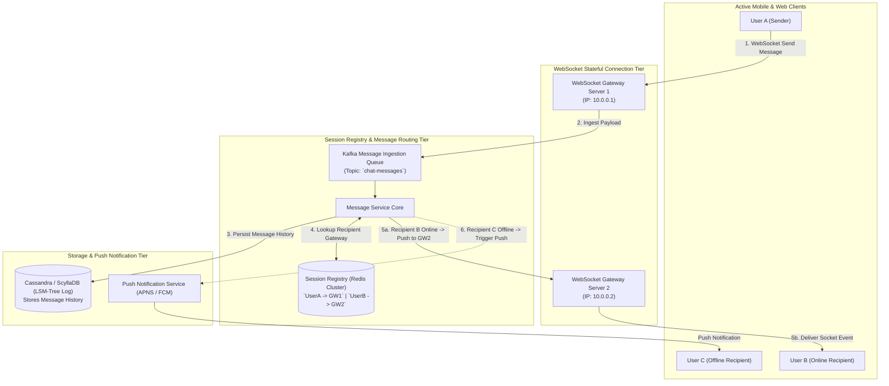
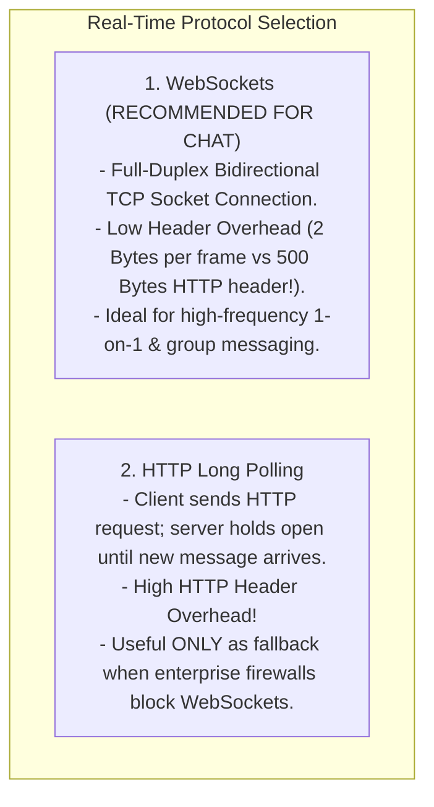

# HLD — Real-Time Chat Application (WhatsApp / Slack)

## Mental Model

Think of a **Real-Time Chat Application (WhatsApp / Slack)** as an instantaneous peer-to-peer message routing network. 

Instead of client apps repeatedly polling a REST server every 2 seconds (*"Do I have new messages?"*), every active mobile or desktop client maintains an open, long-lived bidirectional TCP socket connection (**WebSockets / Long Polling**). 

When User A sends a message to User B, User A's client writes the payload to their open socket. The **Chat Gateway Node** looks up User B's active connection location in a global Session Registry (`user_id -> gateway_node_ip`). If User B is online, the gateway pushes the message down User B's open socket in **$< 10\text{ms}$**. If User B is offline, the message is persisted to an LSM-Tree storage store (Cassandra) and delivered via APNS/FCM Push Notification!

---

## 1. Requirement & Capacity Estimation

### A. Functional & Non-Functional Requirements
1. **1-on-1 & Group Chat Messaging:** Support 1-on-1 direct messaging and group chat channels (up to 500 members).
2. **Real-Time Delivery & Online Status:** Deliver messages in $< 50\text{ms}$ when recipient is online; track online/offline presence status.
3. **Message Receipts:** Track 3-stage delivery receipts: `SENT` (1 checkmark) $\to$ `DELIVERED` (2 checkmarks) $\to$ `READ` (2 blue checkmarks).
4. **Media Sharing:** Support images, voice notes, and videos.
5. **High Scale & High Availability:** Support 500 Million Daily Active Users (DAU) sending 10 Billion messages/day.

### B. Capacity Estimation Math
- **Messaging Traffic Math:**
  - 10 Billion Messages / Day
  - Average Messaging QPS = $\frac{10,000,000,000}{86,400} \approx \mathbf{115,000 \text{ Messages / Second}}$
  - Peak Messaging QPS = $115,000 \times 2 = \mathbf{230,000 \text{ QPS}}$

- **Storage & Connection Math:**
  - Active Concurrent WebSockets = 50 Million Connections
  - RAM per WebSocket Connection = $10 \text{ KB}$
  - Total Connection RAM = $50 \times 10^6 \times 10 \text{ KB} = \mathbf{500 \text{ Gigabytes (GB) RAM}}$
  - Daily Message Storage (100 Bytes/message) = $10^{10} \times 100 \text{ Bytes} = \mathbf{1 \text{ Terabyte (TB) / Day}}$
  - 5-Year Storage = $1 \text{ TB/Day} \times 365 \times 5 = \mathbf{1.82 \text{ Petabytes (PB)}}$

---

## 2. High-Level System Architecture Diagram



---

## 3. Persistent Connection Protocol Selection: WebSockets vs. HTTP Long Polling



---

## 4. Message Storage Engine Selection: Why Cassandra / ScyllaDB?

Chat history storage requires an **LSM-Tree Storage Engine (Apache Cassandra / ScyllaDB)** rather than a relational B+ Tree database (PostgreSQL):

1. **Ultra-High Write Throughput:** 230,000 Messages/sec write throughput requires sequential append-only disk I/O ($O(1)$ SSTable writes).
2. **Clustered Range Scans by Conversation:** Primary Key design allows reading latest 50 messages in a single disk sweep:
   ```sql
   CREATE TABLE chat_messages (
       channel_id uuid,
       message_id timeuuid,
       sender_id uuid,
       content text,
       PRIMARY KEY (channel_id, message_id)
   ) WITH CLUSTERING ORDER BY (message_id DESC);
   ```

---

## 5. Failure Modes and Trade-offs

1. **Session Registry Disconnect Desynchronization** — User B drops Wi-Fi connection abruptly without sending TCP FIN packet. Redis Session Registry still marks User B as `Online -> GW2`. Messages sent to User B fail silently until heartbeat timeout. *Mitigation*: Implement 30-second WebSocket ping/pong heartbeats.
2. **Group Chat Message Explosion (Fanout Overhead)** — A user posts a message to a group channel with 10,000 members. Pushing 10,000 WebSocket frames synchronously blocks the gateway thread. *Mitigation*: Use **Kafka Group Message Topics** and pull-based client fetching for large groups.
3. **Out-of-Order Message Rendering** — Messages arriving out of order on mobile devices due to network jitter (`Msg 2` renders before `Msg 1`). *Mitigation*: Sort messages on client devices using **Monotonic Time UUIDs (TimeUUID)** or **Lamport Timestamps**.

---

## 6. Active-Recall Prompts

1. **Why are WebSockets preferred over HTTP Long Polling for real-time chat applications?**
2. **Calculate connection memory required to support 50 Million active concurrent WebSocket connections (500 GB RAM).**
3. **Why is Cassandra (LSM-Tree) superior to PostgreSQL (B+ Tree) for storing chat message history?**
4. **How does the Session Registry (`user_id -> gateway_ip`) route messages between User A on Gateway 1 and User B on Gateway 2?**

---

## Related Notes

- [[Message Queues vs Event Streams - RabbitMQ vs Apache Kafka]]
- [[Database Indexing & Storage Engine Selection for HLD]]
- [[API Gateway Pattern - Rate Limiting, Authentication, TLS Termination, Request Routing]]
- [[Consistent Hashing - Hash Rings, Virtual Nodes, and Data Rebalancing]]

> **Interview Style Question:** *"Design a Real-Time Chat Application (WhatsApp/Slack) supporting 500M DAU and 230,000 Peak Messaging QPS. Estimate connection RAM (500 GB), design the stateful WebSocket Gateway architecture with Redis Session Registry, justify Cassandra LSM-Tree schema design for chat history, and handle offline Push Notifications."*

---
