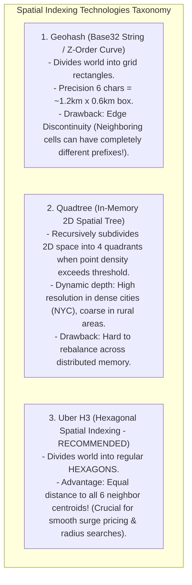
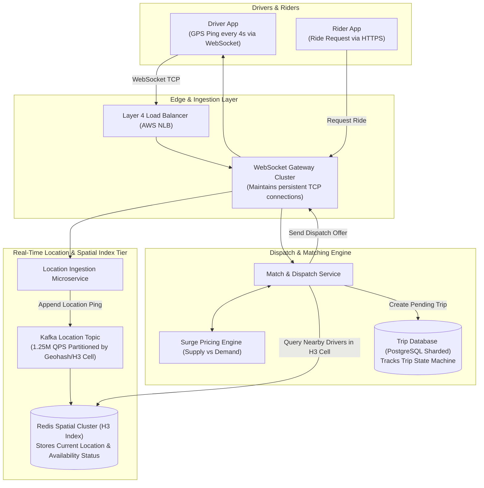
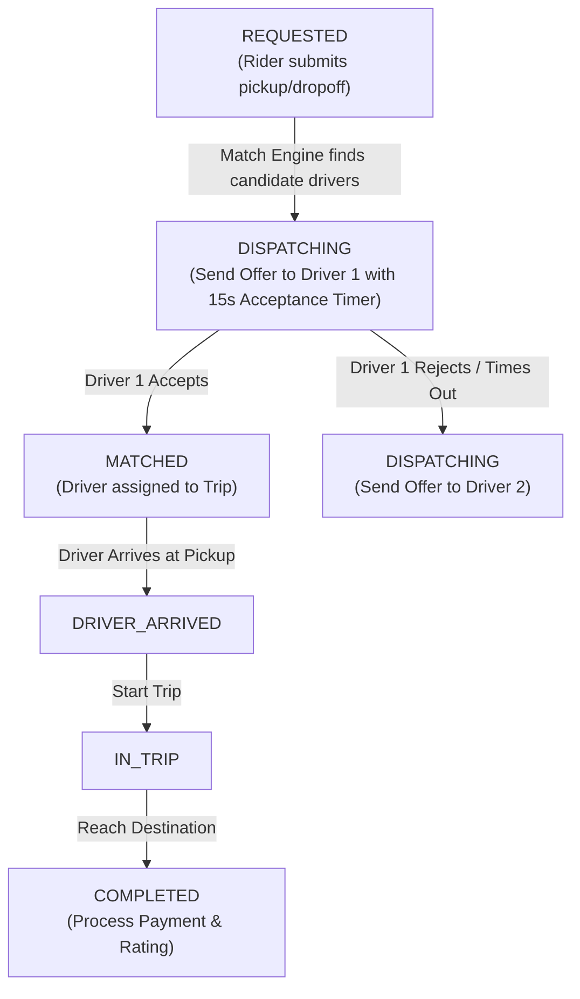

# HLD — Ride-Sharing Platform (Uber / Lyft)

## Mental Model

Think of a **Global Ride-Sharing Platform (Uber / Lyft)** as a high-frequency real-time spatial matchmaker. 

Millions of active drivers continually broadcast their GPS coordinates (`lat`, `lng`) every 4 seconds (**Location Ingestion Pipeline**). Thousands of riders open their apps and request rides (**Ride Dispatch Engine**). 

The core system must map 2D spherical geographical coordinates into spatial index cells (**Geohash / Uber H3 Hexagonal Grid / Quadtree**), locate all available drivers within a 3-kilometer radius in sub-50 milliseconds (**Spatial Radius Search**), calculate dynamic surge pricing based on local supply/demand density (**Surge Pricing Engine**), and dispatch the optimal driver without double-booking (**Match Locking**).

---

## 1. Requirement & Capacity Estimation

### A. Functional & Non-Functional Requirements
1. **Location Ingestion:** 5 Million active drivers send GPS location updates every 4 seconds.
2. **Driver Matching & Dispatch:** Match a rider with the nearest available driver within 3 km in $< 100\text{ms}$.
3. **Surge Pricing Engine:** Dynamically calculate surge multipliers based on real-time supply vs demand in spatial zones.
4. **Trip State Machine:** Track ride lifecycle: `REQUESTED` $\to$ `MATCHED` $\to$ `DRIVER_ARRIVED` $\to$ `IN_TRIP` $\to$ `COMPLETED`.
5. **High Availability & Low Latency:** $99.99\%$ availability ($52$ mins downtime/year) with sub-second location tracking latency.

### B. Capacity Estimation Math
- **Location Ingestion Traffic:**
  - Active Drivers = 5 Million
  - GPS Ping Frequency = Every 4 Seconds
  - Ingestion QPS = $\frac{5,000,000}{4} = \mathbf{1,250,000 \text{ Location Updates / Second (1.25M QPS)!}}$

- **Location Storage Payload & Bandwidth:**
  - Location Payload = 64 Bytes (`driver_id`, `lat`, `lng`, `timestamp`, `status`)
  - Incoming Bandwidth = $1.25 \times 10^6 \times 64 \text{ Bytes} = \mathbf{80 \text{ MB/sec} = 640 \text{ Mbps}}$
  - Memory required to store all 5M drivers' current location in Redis RAM:
    $$5 \times 10^6 \times 64 \text{ Bytes} \approx \mathbf{320 \text{ MB RAM! (Extremely compact in-memory dataset!)}}$$

---

## 2. Spatial Indexing Architecture: Geohash vs. Quadtree vs. Uber H3

Standard relational SQL database indexes (`B+ Tree`) cannot execute 2D radius queries efficiently (`WHERE lat BETWEEN ... AND lng BETWEEN ...` requires full table scans!). 

Ride-sharing platforms map 2D Earth coordinates into 1D spatial index strings:



---

## 3. High-Level System Architecture Diagram



---

## 4. Trip Lifecycle State Machine & Match Locking

When the Match Engine locates 3 candidate drivers near a rider, how does it prevent double-booking a single driver?



### Match Locking via Redis Distributed Lock / Fencing Token:
When an offer is dispatched to Driver 1, the system sets an atomic lock key in Redis:
```bash
SET lock:driver_1 "trip_9988" NX PX 15000
```
This guarantees Driver 1 cannot receive duplicate trip offers during the 15-second decision window!

---

## 5. Failure Modes and Trade-offs

1. **Edge Discontinuity Bottleneck in Geohash** — A rider is located at the exact border boundary of a Geohash cell. The driver is 100 meters away in the adjacent cell, but their Geohash string prefixes are completely different! *Mitigation*: Query the target cell PLUS its **8 surrounding neighboring cells** (9-cell query pattern) or switch to **Uber H3 Hexagonal Grid**.
2. **WebSocket Gateway Connection Memory Saturation** — 5 Million active drivers maintain open TCP WebSocket connections to Gateway nodes. Each connection consumes 10 KB RAM = 50 GB RAM total. *Mitigation*: Use lightweight C++ Envoy or Go Netty WebSocket gateways and separate Location Pings from HTTP API calls.
3. **Surge Pricing Flapping** — Surge multiplier fluctuates rapidly between $1.0\times$ and $3.0\times$ every 5 seconds as drivers enter/leave a zone, frustrating users. *Mitigation*: Apply **Hysteresis Smoothing** to surge price transitions (require surge threshold to remain stable for 3 minutes before updating prices).

---

## 6. Active-Recall Prompts

1. **Why do standard B+ Tree 2D database queries fail for real-time location radius searches (`lat`, `lng`), and how does spatial indexing solve this?**
2. **Compare Geohash vs. Quadtree vs. Uber H3 Hexagonal spatial indexing.**
3. **Calculate memory required to store real-time GPS locations for 5 Million drivers in Redis RAM (320 MB).**
4. **How does an atomic Redis Distributed Lock prevent double-booking a driver during the 15-second offer acceptance window?**

---

## Related Notes

- [[Consistent Hashing - Hash Rings, Virtual Nodes, and Data Rebalancing]]
- [[Distributed Locks - Redis Redlock vs ZooKeeper or Etcd Consensus]]
- [[Message Queues vs Event Streams - RabbitMQ vs Apache Kafka]]
- [[System Design Interview Framework - 4-Step Blueprint]]

> **Interview Style Question:** *"Design a Real-Time Ride-Sharing Platform (Uber/Lyft) processing 1.25 Million GPS location pings per second from 5M active drivers. Estimate storage math, compare Geohash vs Quadtree vs Uber H3 spatial indexing, design the 3-km radius driver matching engine, detail the 15-second offer acceptance state machine with Redis distributed locks, and scale dynamic Surge Pricing."*

---
