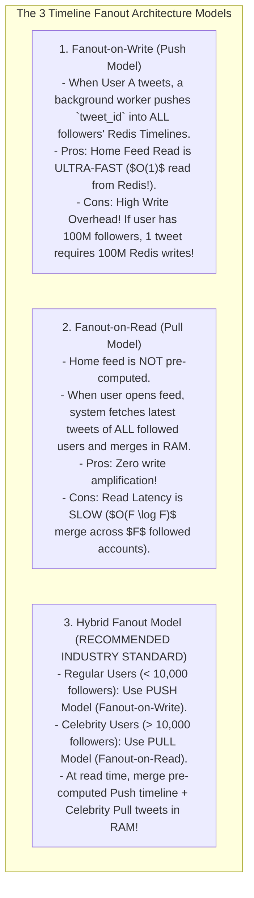
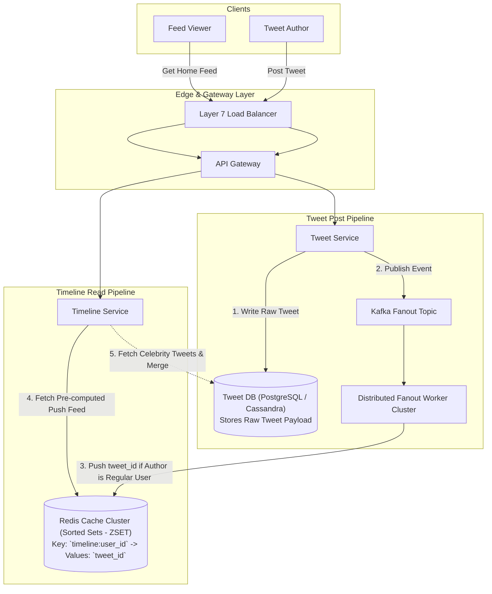

# HLD — Social Network News Feed (Twitter / X)

## Mental Model

Think of a **Social Network News Feed (Twitter / X)** as a massive multi-user mailbox delivery network. 

When a regular user posts a message (**Tweet / Post**), the system pushes that message into the inbox timeline of all their followers (**Fanout-on-Write / Push Model**). 

However, when a celebrity with 150 million followers (like Elon Musk or Cristiano Ronaldo) posts a tweet, pushing 150 million inbox items synchronously would crash the server infrastructure (**Celebrity Fanout Explosion**). 

Instead, celebrity posts are handled using a **Fanout-on-Read (Pull Model)**: their tweets are stored in a dedicated celebrity buffer, and followers pull those tweets on-demand when opening their feed (**Hybrid Fanout Architecture**).

---

## 1. Requirement & Capacity Estimation

### A. Functional & Non-Functional Requirements
1. **Post / Tweet Creation:** Users can publish tweets (text, images, links).
2. **Timeline Generation (Home Feed):** Viewers can load a reverse-chronological feed of tweets posted by accounts they follow.
3. **Fanout System:** Support both regular users and celebrity accounts (high follower counts).
4. **Low Latency & High Scale:** Home feed generation latency $< 200\text{ms}$ for 300 Million Daily Active Users (DAU).

### B. Capacity Estimation Math
- **Traffic Assumptions:**
  - DAU = 300 Million
  - Tweets / User / Day = 2 $\implies$ Total Tweets = 600 Million / Day
  - Read / Write Ratio = 100 : 1 (Read heavy!)
  - Write QPS = $\frac{600,000,000}{86,400} \approx \mathbf{7,000 \text{ Writes/sec}}$ (Peak = $14,000 \text{ QPS}$)
  - Read QPS = $7,000 \times 100 = \mathbf{700,000 \text{ Reads/sec}}$ (Peak = $1.4 \text{ Million QPS}$)

- **Feed Fanout Storage Math:**
  - Average Followers / User = 200
  - Fanout Deliveries / Day = $600\text{M} \times 200 = \mathbf{120 \text{ Billion Deliveries / Day!}}$
  - Timeline RAM Storage (800 tweets/user in Redis `ZSET`):
    $$300\text{M Users} \times 800 \text{ TweetIDs} \times 8 \text{ Bytes} \approx \mathbf{1.92 \text{ Terabytes (TB) RAM!}}$$

---

## 2. Fanout Models: Push vs. Pull vs. Hybrid Architecture



---

## 3. High-Level System Architecture Diagram



---

## 4. Timeline Generation in Redis (`ZSET`)

Each user's home timeline is stored in a Redis **Sorted Set (`ZSET`)** where:
- **Key:** `timeline:<user_id>`
- **Member:** `tweet_id`
- **Score:** Tweet Creation Timestamp (`epoch_millis`)

```bash
# Push new tweet_id 998877 to User 42's timeline
ZADD timeline:42 1767225600000 998877

# Trim timeline to retain only latest 800 tweets (Memory Efficiency!)
ZREMRANGEBYRANK timeline:42 0 -801

# Read latest 20 tweets for Home Feed display
ZREVRANGE timeline:42 0 19 WITHSCORES
```

---

## 5. Failure Modes and Trade-offs

1. **Celebrity Fanout Avalanche** — A celebrity with 100M followers tweets using pure Push Model. Fanout workers saturate CPU and network for 15 minutes, blocking regular user timeline updates. *Mitigation*: Strictly enforce **Hybrid Fanout**: bypass Push pipeline for any user with $> 10,000$ followers.
2. **Inactive User Memory Waste** — Pre-computing and storing Redis timelines for 200 million inactive users who haven't logged in for 6 months, wasting Terabytes of expensive RAM. *Mitigation*: Passive timeline eviction (remove timelines for users inactive for $> 30$ days; reconstruct timeline on-demand upon login).
3. **Timeline Pagination Drift** — A user scrolls through their feed. New tweets arrive at the top. Traditional offset pagination (`page=2&limit=20`) returns duplicate tweets! *Mitigation*: Use **Cursor-Based Pagination** (`max_id = tweet_id`).

---

## 6. Active-Recall Prompts

1. **Compare Fanout-on-Write (Push) vs. Fanout-on-Read (Pull) vs. Hybrid Fanout models.**
2. **Why are Redis Sorted Sets (`ZSET`) ideal for storing reverse-chronological user timelines?**
3. **How does the Hybrid Fanout Model handle celebrity accounts with $> 10,000$ followers?**
4. **Why is Cursor-Based Pagination (`max_id`) preferred over Offset Pagination for dynamic feeds?**

---

## Related Notes

- [[Distributed Caching Strategies - Cache-Aside, Write-Through, Write-Around, Write-Back]]
- [[Consistent Hashing - Hash Rings, Virtual Nodes, and Data Rebalancing]]
- [[Message Queues vs Event Streams - RabbitMQ vs Apache Kafka]]
- [[System Design Interview Framework - 4-Step Blueprint]]

> **Interview Style Question:** *"Design a Social Network News Feed (Twitter/X) supporting 300M DAU, 700,000 Read QPS, and 14,000 Write QPS. Calculate timeline RAM math (1.92 TB RAM), compare Push vs Pull vs Hybrid Fanout architectures, demonstrate Redis Sorted Set timeline operations, solve the Celebrity Fanout problem, and implement Cursor-Based Pagination."*

---
