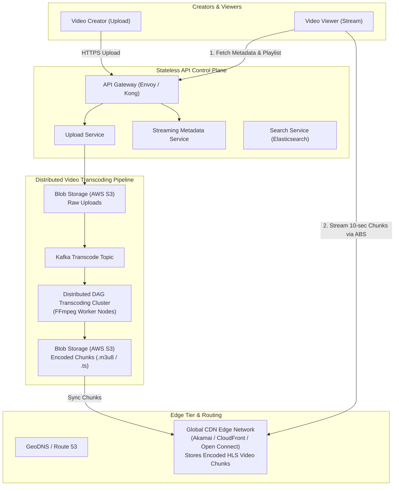
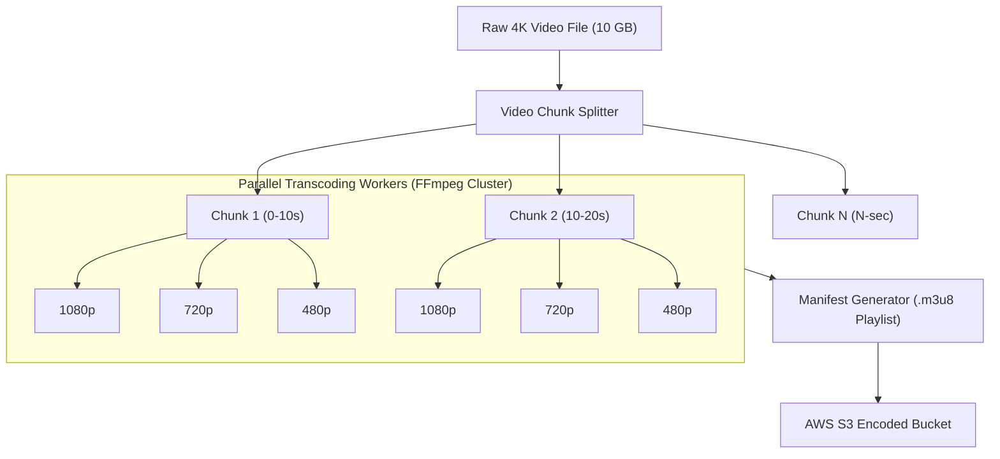

# HLD — Video Streaming Platform (YouTube / Netflix)

## Mental Model

Think of a **Global Video Streaming Platform (YouTube / Netflix)** as a high-throughput, multi-resolution video publishing factory and global delivery engine. 

When a creator uploads a raw 10 GB 4K video file (**Video Upload Pipeline**), the system doesn't store or stream that single monolithic file directly to users (**Single File Bottleneck**). Instead, a distributed Transcoding Pipeline breaks the video into 10-second chunk files, converts them into multiple resolutions ($1080\text{p}, 720\text{p}, 480\text{p}, 360\text{p}$) and formats (**HLS / DASH Protocols**), and pushes the encoded chunks to a global network of **CDN Edge Servers**. 

When a viewer watches the video, their mobile device dynamically measures local Wi-Fi signal strength and fetches the optimal chunk resolution (**Adaptive Bitrate Streaming - ABS**) without buffering!

---

## 1. Requirement & Capacity Estimation

### A. Functional & Non-Functional Requirements
1. **Video Upload & Transcoding:** Creators upload raw video files; system transcodes them into HLS/DASH formats across resolutions ($1080\text{p}, 720\text{p}, 480\text{p}, 360\text{p}$).
2. **Video Streaming:** Viewers stream video with sub-200ms initial playback start latency using Adaptive Bitrate Streaming (ABS).
3. **Search & Metadata Catalog:** Search videos by title, tags, or description; track view counts and like counters.
4. **High Availability & Global Scale:** $99.99\%$ availability ($52$ mins downtime/year) supporting 500 Million Daily Active Users (DAU).

### B. Capacity Estimation Math
- **Streaming Traffic Math:**
  - DAU = 500 Million Users
  - Average View Time / User / Day = 30 Minutes
  - Concurrent Streams (Peak) = 50 Million Concurrent Viewers
  - Video Stream Bitrate (720p Average) = $2 \text{ Mbps} = 0.25 \text{ MB/sec}$
  - Peak Egress Bandwidth = $50 \times 10^6 \times 2 \text{ Mbps} = \mathbf{100 \text{ Terabits / second (100 Tbps)!}}$

- **Upload & Storage Math:**
  - Daily Uploaded Videos = 10 Million Videos / Day
  - Average Raw Upload Size = $300 \text{ MB}$
  - Daily Ingestion Storage = $10^7 \times 300 \text{ MB} = \mathbf{3 \text{ Petabytes (PB) / Day}}$
  - Transcoding Multiplier (Multiple resolutions + formats) = $3\times$ raw size = $\mathbf{9 \text{ PB / Day}}$
  - 5-Year Storage = $9 \text{ PB/Day} \times 365 \times 5 \approx \mathbf{16.4 \text{ Exabytes (EB)}}$

---

## 2. High-Level System Architecture Diagram



---

## 3. Video Transcoding & Chunking Pipeline (DAG Processing)

Transcoding a 2-hour 4K video on a single machine takes 10 hours. YouTube splits the raw video into small 10-second chunk files and processes them in parallel across a **Directed Acyclic Graph (DAG) Transcoding Cluster**:



---

## 4. Streaming Protocols & Adaptive Bitrate Streaming (ABS)

How does the player switch video quality seamlessly on a mobile device?

```mermaid
flowchart TD
    subgraph ABSMechanism["Adaptive Bitrate Streaming (HLS / DASH)"]
        Player["Video Player Engine (HLS.js / ExoPlayer)"] -->|1. Requests Master Playlist (.m3u8)| CDNServer["CDN Edge Server"]
        CDNServer -->|2. Returns Playlist with Resolution Variants| Player
        
        Player -->|3. Monitors Network Bandwidth continuously| BandwidthCheck{"Current Bandwidth?"}
        
        BandwidthCheck -->|> 10 Mbps| Chunk1080["Fetch 1080p Chunk (`segment_1080.ts`)"]
        BandwidthCheck -->|2 - 10 Mbps| Chunk720["Fetch 720p Chunk (`segment_720.ts`)"]
        BandwidthCheck -->|< 2 Mbps| Chunk360["Fetch 360p Chunk (`segment_360.ts`)"]
    end
```

### Protocol Comparison Matrix

| Protocol | Transport | Latency | Browser Support | Adaptive Bitrate Support? |
|---|---|---|---|---|
| **HLS (Apple HTTP Live Streaming)** | HTTP / TCP | 5s - 10s | **Universal (100% Mobile & Web)** | ✅ Yes (`.m3u8` playlist) |
| **DASH (Dynamic Adaptive Streaming over HTTP)** | HTTP / TCP | 5s - 10s | Universal (Android / Web) | ✅ Yes (`.mpd` manifest) |
| **WebRTC** | UDP / SRTP | **Sub-second (< 500ms)** | Web / Native Apps | ❌ Hard (Used for 1:1 Video Calls) |

---

## 5. Failure Modes and Trade-offs

1. **100 Tbps CDN Edge Saturation** — 95%+ of global video egress bandwidth MUST be served directly by CDN edge servers. If a viral video misses the edge cache, the origin S3 buckets collapse under bandwidth load. *Mitigation*: Deploy **Custom Edge CDN Nodes (Netflix Open Connect)** directly inside ISP data centers.
2. **High-Cost Transcoding Bottleneck** — Transcoding millions of low-view home videos into 10 resolutions wastes massive CPU compute. *Mitigation*: Implement **Lazy Transcoding**: transcode uploaded videos into 720p immediately; transcode into 4K/1080p ONLY if the video crosses 1,000 views.
3. **Counter Hotspot Overhead (View Count Scalability)** — A viral video receives 1,000,000 views per minute. Executing `UPDATE videos SET view_count = view_count + 1` directly on a database row creates extreme lock contention. *Mitigation*: Batch view count increments in **Kafka / Redis** and flush asynchronously to the database every 10 seconds.

---

## 6. Active-Recall Prompts

1. **How does Adaptive Bitrate Streaming (HLS/DASH) adjust video quality dynamically using `.m3u8` playlists and 10-second chunk segments?**
2. **Calculate the peak egress bandwidth required for 50 Million concurrent viewers watching 720p video streams (100 Tbps).**
3. **Why is a raw video split into 10-second chunks before entering a parallel DAG Transcoding cluster?**
4. **How do custom CDN PoPs placed inside ISP data centers (Netflix Open Connect) eliminate origin transit costs?**

---

## Related Notes

- [[Content Delivery Networks - CDN Architecture, Edge Caching, and Anycast Routing]]
- [[Back-of-the-Envelope Calculations - Throughput, Storage, and Bandwidth Estimation]]
- [[API Gateway Pattern - Rate Limiting, Authentication, TLS Termination, Request Routing]]
- [[Message Queues vs Event Streams - RabbitMQ vs Apache Kafka]]

> **Interview Style Question:** *"Design a Global Video Streaming Platform like YouTube/Netflix. Estimate capacity math (100 Tbps peak egress, 16.4 EB storage), design the parallel DAG Transcoding pipeline, explain Adaptive Bitrate Streaming (HLS/DASH), detail the 2-tier CDN edge caching architecture (Netflix Open Connect), and scale real-time view count tracking."*

---
