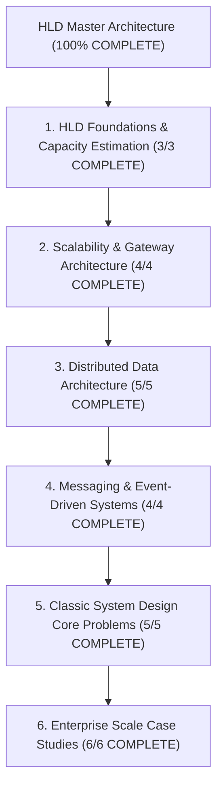

# High Level Design (HLD / System Design) — Map of Content

> [!abstract] Architectural Mission
> This Map of Content organizes the complete **High Level Design (HLD) & System Design** knowledge base. It covers back-of-the-envelope capacity estimations, availability math ($99.999\%$), L4 vs L7 load balancing, API gateways, distributed caching (Cache-Aside, Write-Through, Write-Back), database partitioning & sharding, message queues (Kafka, RabbitMQ), and full end-to-end architecture blueprints for real-world enterprise applications.

---

## 1. HLD Foundations & Capacity Estimation (3/3 COMPLETE)

- [x] [[System Design Interview Framework - 4-Step Blueprint]]
- [x] [[Back-of-the-Envelope Calculations - Throughput, Storage, and Bandwidth Estimation]]
- [x] [[High Availability Architecture - SLAs, SLOs, Fault Tolerance, and High-9s Math]]

---

## 2. Scalability & Gateway Architecture (4/4 COMPLETE)

- [x] [[Load Balancers - Layer 4 vs Layer 7, Algorithms, and Health Checks]]
- [x] [[API Gateway Pattern - Rate Limiting, Authentication, TLS Termination, Request Routing]]
- [x] [[Content Delivery Networks - CDN Architecture, Edge Caching, and Anycast Routing]]
- [x] [[Domain Name System in HLD - GeoDNS, Latency-Based Routing, and Failover]]

---

## 3. Distributed Data Architecture (5/5 COMPLETE)

- [x] [[Database Scaling - Vertical vs Horizontal, Read Replicas, and Master-Slave]]
- [x] [[Database Sharding - Hash-Based, Range-Based, and Directory-Based Partitioning]]
- [x] [[Consistent Hashing - Hash Rings, Virtual Nodes, and Data Rebalancing]]
- [x] [[Distributed Caching Strategies - Cache-Aside, Write-Through, Write-Around, Write-Back]]
- [x] [[Database Indexing & Storage Engine Selection for HLD]]

---

## 4. Messaging & Event-Driven Systems (4/4 COMPLETE)

- [x] [[Message Queues vs Event Streams - RabbitMQ vs Apache Kafka]]
- [x] [[Event-Driven Architecture - Pub-Sub, Event Sourcing, and CQRS]]
- [x] [[Distributed Transactions - 2PC, Saga Pattern, and Outbox Pattern]]
- [x] [[Distributed Locks - Redis Redlock vs ZooKeeper or Etcd Consensus]]

---

## 5. Classic System Design Core Problems (5/5 COMPLETE)

- [x] [[HLD - URL Shortener (TinyURL)]]
- [x] [[HLD - Distributed Unique ID Generator (Twitter Snowflake)]]
- [x] [[HLD - Distributed Web Crawler]]
- [x] [[HLD - Distributed Rate Limiter]]
- [x] [[HLD - Distributed Notification Service (Email, SMS, Push)]]

---

## 6. Enterprise Scale Case Studies (6/6 COMPLETE)

- [x] [[HLD - Video Streaming Platform (YouTube or Netflix)]]
- [x] [[HLD - Ride-Sharing Platform (Uber or Lyft)]]
- [x] [[HLD - Social Network News Feed (Twitter or X)]]
- [x] [[HLD - Real-Time Chat Application (WhatsApp or Slack)]]
- [x] [[HLD - E-Commerce Flash Sale System (Amazon Flash Sale)]]
- [x] [[HLD - Collaborative Document Editor (Google Docs or Figma)]]

---

*Last updated: 2026-08-18 | Status: COMPLETE (27 Canonical Notes + 1 MOC) | Subject 06 — High Level Design*
