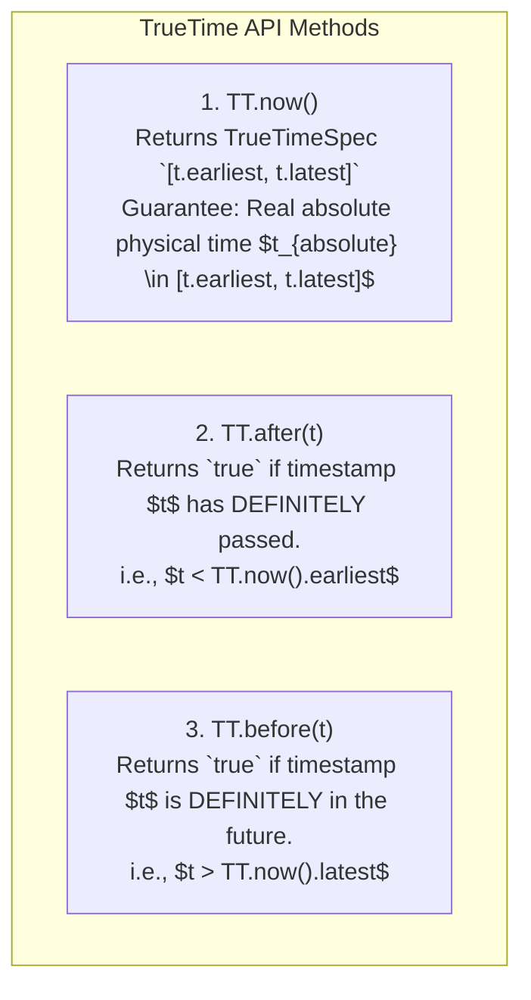
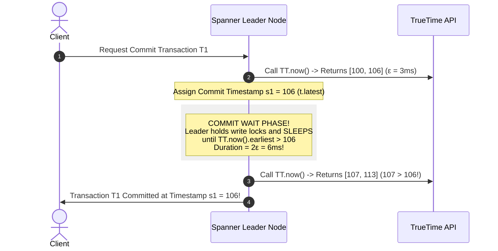

# Google TrueTime and Synchronized Atomic Clocks in Spanner

## Mental Model

Think of **Google TrueTime** as a high-security global vault system equipped with atomic clocks and GPS receivers in every data center, replacing unreliable software clocks. 

In standard servers, physical software clocks drift unpredictably (**NTP Clock Drift of up to 100ms - 500ms**). As a result, distributed databases cannot trust local timestamps for global multi-region transactions without expensive coordination protocols. 

Google solved this fundamental physics barrier by installing **GPS receivers and Rubidium Atomic Clocks** in every Google Spanner data center. TrueTime exposes time not as a discrete single number, but as an **Uncertainty Time Interval $[t_{\text{earliest}}, t_{\text{latest}}]$** bounded by a tight maximum clock error $\epsilon \approx 1\text{ms} - 7\text{ms}$. By waiting out the uncertainty window (**Commit Wait Rule**), Google Spanner achieves global **External Consistency (Strict Serializability)** without cross-region locks!

---

## 1. The Physical Limits of Time: Why NTP Fails

Physical quartz clocks on commodity server motherboards drift due to thermal fluctuations. Network Time Protocol (NTP) synchronizes clocks over WAN, but network jitter creates unavoidable clock drift $\epsilon$:

$$\text{NTP Clock Drift Error } \epsilon = 50\text{ms} - 500\text{ms}$$

If Server A (Clock $+100\text{ms}$) executes Transaction 1 at local time 10:00:00.100, and Server B (Clock $-100\text{ms}$) executes Transaction 2 causally later at real physical time 10:00:00.050, the database records Transaction 2 as *before* Transaction 1! Logical order is violated!

---

## 2. The TrueTime API Architecture

Google TrueTime exposes time explicitly as a bounded time interval $[t.earliest, t.latest]$ where:

$$t.latest - t.earliest = 2\epsilon$$

### TrueTime Hardware Infrastructure:
- **Armada 1 (GPS Receivers):** Primary time source (antenna failure risk).
- **Armada 2 (Rubidium Atomic Clocks):** Secondary independent time source (fails independently of GPS signals).

---

## 3. The Commit Wait Rule (Achieving External Consistency)

To guarantee that Transaction 2 (started after Transaction 1 commits) receives a strictly higher timestamp ($s_1 < s_2$), Spanner enforces the **Commit Wait Rule**:

$$\text{Commit Wait Rule: The leader MUST NOT release commit locks until } TT.after(s_1) \text{ is TRUE!}$$

---

## 4. Mathematical Proof of External Consistency

Let $e_1^{\text{start}}, e_1^{\text{commit}}$ be the physical start and commit times of Transaction 1, and $s_1$ be its assigned TrueTime commit timestamp.

1. By Commit Wait Rule:
   $$s_1 \le e_1^{\text{commit}}$$
2. If Transaction 2 starts physically after Transaction 1 commits ($e_1^{\text{commit}} < e_2^{\text{start}}$):
   $$s_1 \le e_1^{\text{commit}} < e_2^{\text{start}} \le s_2$$
3. Therefore:
   $$\mathbf{s_1 < s_2}$$

> **Conclusion:** Causally later transactions are guaranteed to receive strictly higher commit timestamps globally without cross-region locks!

---

## 5. Failure Modes and Trade-offs

1. **Atomic Clock / GPS Antenna Failure (Increased $\epsilon$)** — If GPS antennas fail or atomic clocks drift, uncertainty $\epsilon$ grows from $1\text{ms}$ to $100\text{ms}$. Due to the Commit Wait Rule, **transaction commit latency increases linearly with $2\epsilon$** ($200\text{ms}$ commit wait per transaction!). *Mitigation*: Continuous hardware monitoring and dual-redundant GPS/Atomic clock hardware.
2. **High Infrastructure Cost** — Operating dedicated atomic clock and GPS hardware across data centers requires proprietary hardware investments impossible for standard cloud deployments. *Mitigation*: Open-source databases (CockroachDB / YugabyteDB) use **Hybrid Logical Clocks (HLC)** to approximate TrueTime without atomic clocks.
3. **Commit Wait Overhead on Short Transactions** — A 0.1ms memory transaction is forced to wait 6ms for the TrueTime commit wait window to elapse. *Mitigation*: Batch transactions or use read-only transactions (which require ZERO locks and ZERO commit wait!).

---

## 6. Active-Recall Prompts

1. **Why does standard NTP clock drift ($50\text{ms}-500\text{ms}$) prevent databases from using physical wall-clock timestamps for linearizable transactions?**
2. **What does TrueTime `TT.now()` return, and what is the relationship between $t.earliest$, $t.latest$, and $\epsilon$?**
3. **State the TrueTime Commit Wait Rule and prove why it guarantees $s_1 < s_2$ for causally sequential transactions.**
4. **What happens to Google Spanner commit latency if clock uncertainty $\epsilon$ spikes from $1\text{ms}$ to $50\text{ms}$?**

---

## Related Notes

- [[Lamport Timestamps and Happened-Before Relation]]
- [[Vector Clocks - Causal Ordering and Conflict Detection]]
- [[Linearizability vs. Serializability - Formal Definitions and Differences]]
- [[Paxos Consensus Protocol - Basic Paxos, Multi-Paxos, and Proposers]]

> **Interview Style Question:** *"Explain how Google Spanner uses TrueTime atomic clocks to achieve Global External Consistency (Strict Serializability). Detail the TrueTime `TT.now()` interval math $[t.earliest, t.latest]$, write the formal proof of the Commit Wait Rule, evaluate what happens when clock drift $\epsilon$ increases, and compare TrueTime to Hybrid Logical Clocks (HLC) in CockroachDB."*

---
