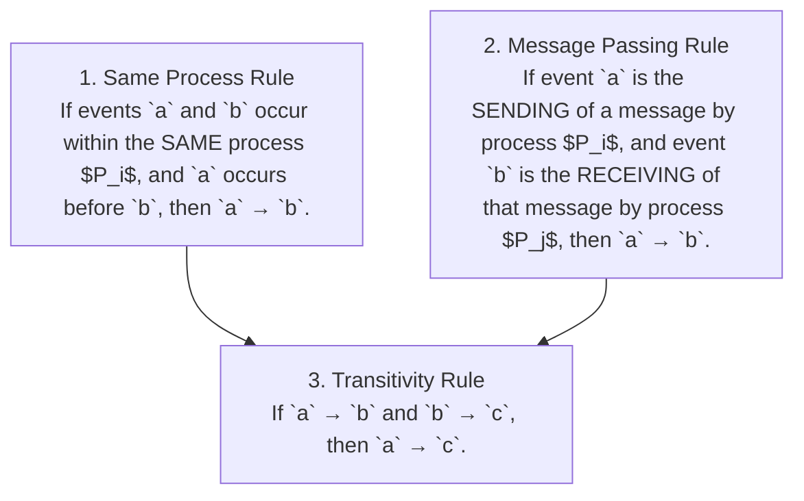
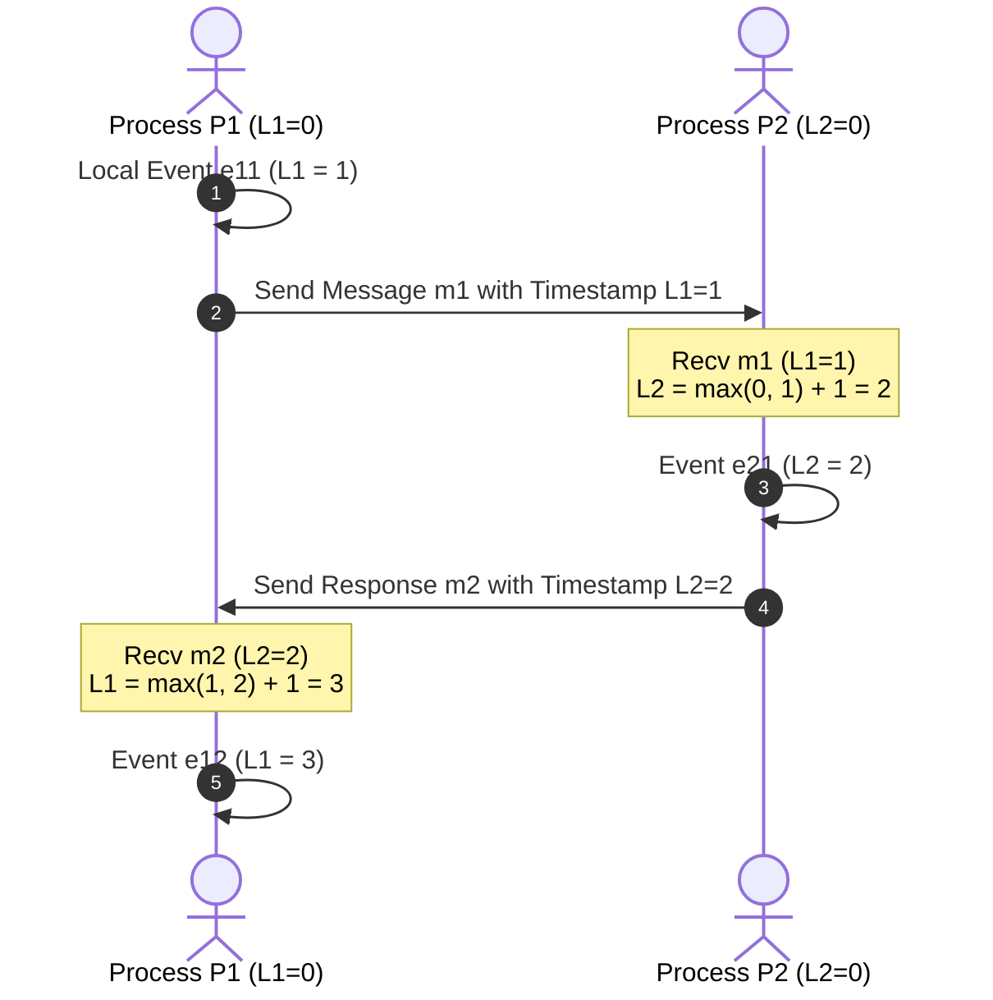

# Lamport Timestamps and Happened-Before Relation

## Mental Model

Think of **Lamport Timestamps** as a referee assigning sequential page numbers to an inter-city postal chess match. 

Because computer processors in different data centers have physical quartz clocks that drift apart (**Clock Skew / NTP Synchronization Drift**), you can NEVER rely on physical wall-clock timestamps (`System.currentTimeMillis()`) to determine which event occurred first in a distributed system! 

Leslie Lamport introduced a purely logical clock mechanism based on causality: every process maintains a simple integer counter. When an event happens locally, the counter increments. When a message is sent, the timestamp is attached. When a message is received, the receiver updates its clock to $\max(\text{localClock}, \text{msgClock}) + 1$. This defines a strict mathematical partial order: the **Happened-Before Relation ($\to$)**.

---

## 1. The Happened-Before Relation ($\to$)

The **Happened-Before Relation** (denoted by $\to$) is a strict partial ordering defined over all events in a distributed system according to 3 fundamental rules:



### Concurrent Events ($\parallel$)
If neither $a \to b$ nor $b \to a$ holds, then event $a$ and event $b$ are mathematically **Concurrent** (denoted as $a \parallel b$). Neither event caused the other!

---

## 2. Lamport Logical Clock Algorithm

Each process $P_i$ maintains a local integer counter $L_i$ initialized to 0.



### The 2 Clock Update Rules:
1. **Before executing a local event:**
   $$L_i = L_i + 1$$
2. **Upon receiving a message $m$ with attached timestamp $L_m$:**
   $$L_i = \max(L_i, L_m) + 1$$

---

## 3. Clock Invariant & The Total Order Extension

### The Lamport Clock Invariant:
$$\text{If } a \to b \implies L(a) < L(b)$$

> ⚠️ **CRITICAL WARNING (The Converse Trap):**
> $L(a) < L(b)$ does **NOT** imply $a \to b$! If $L(a) < L(b)$, events $a$ and $b$ might be causally related, OR they might be completely concurrent ($a \parallel b$). Lamport clocks CANNOT detect concurrency!

### Total Ordering Tie-Breaking Rule:
To convert Lamport's partial order into a **Total Order** ($\Rightarrow$), tie-break identical timestamps using process IDs ($P_i$):

$$a \Rightarrow b \iff (L(a) < L(b)) \lor (L(a) == L(b) \land P_i < P_j)$$

---

## 4. Production Code Implementation (Java)

```java
package com.lld.lamport;

import java.util.Objects;

public class LamportClock {
    private int clock = 0;
    private final String processId;

    public LamportClock(String processId) {
        this.processId = Objects.requireNonNull(processId);
    }

    // Rule 1: Local Event
    public synchronized int tick() {
        clock++;
        System.out.println("Process [" + processId + "] Local Event -> Clock: " + clock);
        return clock;
    }

    // Rule 1: Send Message
    public synchronized int sendEvent() {
        clock++;
        System.out.println("Process [" + processId + "] Send Event -> Clock: " + clock);
        return clock;
    }

    // Rule 2: Receive Message
    public synchronized int receiveEvent(int receivedClock) {
        clock = Math.max(clock, receivedClock) + 1;
        System.out.println("Process [" + processId + "] Receive Event (Recv: " + receivedClock + ") -> Updated Clock: " + clock);
        return clock;
    }

    public synchronized int getClock() { return clock; }
    public String getProcessId() { return processId; }
}
```

---

## 5. Failure Modes and Trade-offs

1. **Inability to Detect Concurrent Conflicts** — Events $a$ and $b$ have $L(a)=2$ and $L(b)=2$. Lamport clocks tie-break using process ID ($P_1 < P_2$), picking $a$ as "earlier". But in reality, both users updated a document concurrently! Lamport clocks silently discard true concurrency. *Mitigation*: Upgrade to **Vector Clocks** to detect concurrent write conflicts.
2. **Process Crash Clock Reset** — Process $P_1$ reaches $L_1 = 5,000$ and crashes. On reboot, $L_1$ resets to $0$, violating the monotonically increasing invariant. *Mitigation*: Persist logical clock values to Write-Ahead Logs (WAL) on disk.
3. **Malicious / Corrupted Clock Overflow** — A compromised process sends a message with $L_m = 2,000,000,000$. All receiving nodes instantly jump their clocks to 2 Billion, rendering lower timestamps useless. *Mitigation*: Validate incoming timestamps against plausible bounds.

---

## 6. Active-Recall Prompts

1. **State the 3 rules defining Lamport's Happened-Before Relation ($\to$).**
2. **Why does $L(a) < L(b)$ NOT prove that $a$ happened before $b$?**
3. **How do process ID tie-breakers convert a Lamport Partial Order into a Total Order ($\Rightarrow$)?**
4. **Why are Lamport Timestamps insufficient for detecting concurrent write conflicts in DynamoDB/Cassandra?**

---

## Related Notes

- [[Vector Clocks - Causal Ordering and Conflict Detection]]
- [[Google TrueTime and Synchronized Atomic Clocks in Spanner]]
- [[Raft Consensus Algorithm - Leader Election, Log Replication, and Safety]]
- [[Event-Driven Architecture - Pub-Sub, Event Sourcing, and CQRS]]

> **Interview Style Question:** *"Explain Leslie Lamport's Happened-Before Relation ($\to$) and Logical Clock update algorithm. Prove why $a \to b \implies L(a) < L(b)$ but the converse is false, write a thread-safe Java implementation, demonstrate total ordering tie-breaking, and explain why Vector Clocks are required to detect concurrent write collisions."*

---
