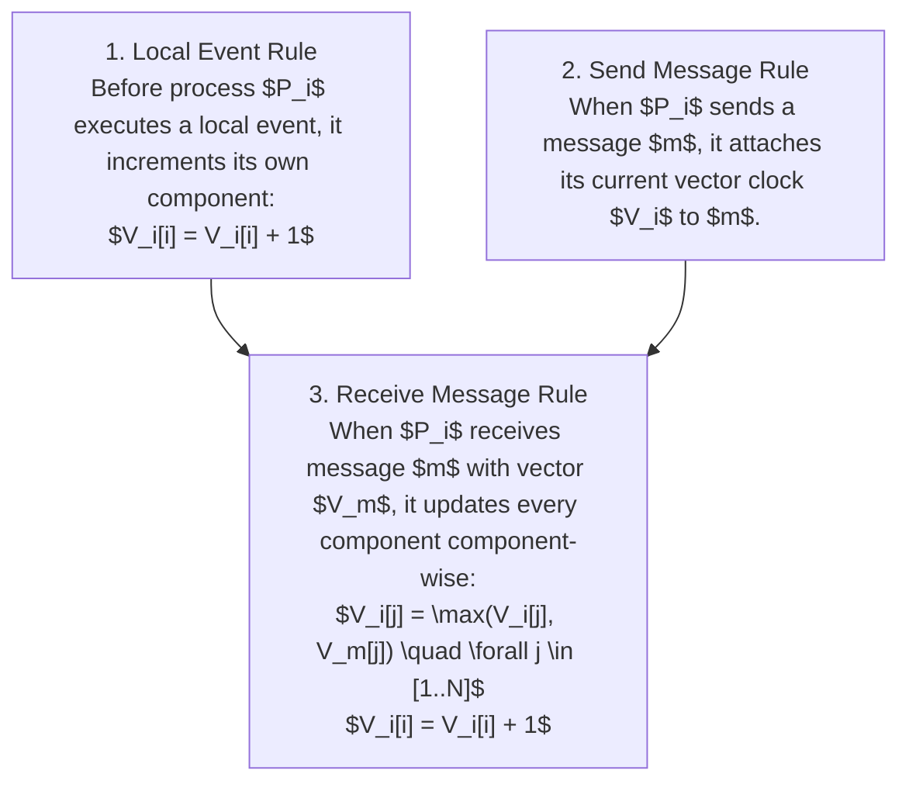

# Vector Clocks — Causal Ordering and Conflict Detection

## Mental Model

Think of **Vector Clocks** as a multi-player scorecard where every player carries a personal tally sheet tracking the exact move count of all other players in the game. 

While a Lamport Timestamp condenses time into a single integer (losing the ability to detect whether two edits happened concurrently), a **Vector Clock** maintains an array of logical clocks—one counter for every node in the distributed cluster ($V = [V_A, V_B, V_C]$). 

By comparing vector clock scorecards element-by-element, a distributed storage engine (like Amazon DynamoDB or Riak) can mathematically prove whether Event X causally preceded Event Y ($X \to Y$), or if two edits occurred **concurrently without knowledge of each other ($X \parallel Y$)**, triggering automatic conflict resolution (Siblings / Last-Write-Wins).

---

## 1. Vector Clock Definition & Math Rules

In a system of $N$ processes, each process $P_i$ maintains a vector clock array $V_i$ of size $N$, where $V_i[j]$ represents $P_i$'s knowledge of the logical time at process $P_j$.



---

## 2. Vector Comparison & Concurrency Detection Math

Given two vector clocks $V_A$ and $V_B$:

### A. Strictly Causal Ordering ($V_A < V_B$)
$$V_A < V_B \iff (\forall k, V_A[k] \le V_B[k]) \land (\exists k, V_A[k] < V_B[k])$$
If $V_A < V_B$, then Event $A$ **causally preceded** Event $B$ ($A \to B$). No conflict exists; $V_B$ safely overwrites $V_A$.

### B. Concurrent Conflict ($V_A \parallel V_B$)
$$V_A \parallel V_B \iff (V_A \not< V_B) \land (V_B \not< V_A)$$
If neither vector is less than the other, Event $A$ and Event $B$ occurred **concurrently**! A write-write conflict is detected, requiring application-level resolution (e.g. merging shopping cart items).

---

## 3. Step-by-Step Vector Clock Conflict Example

```text
Cluster of 3 Nodes: P1, P2, P3. Initial Vector: [0, 0, 0]

1. P1 receives write "Cart = {Apple}".
   P1 Vector: [1, 0, 0]

2. P1 syncs payload "Cart = {Apple}" to P2.
   P2 Vector: max([0,0,0], [1,0,0]) + P2 tick = [1, 1, 0]

3. CONCURRENT WRITE AT P1: User adds "Banana" at P1.
   P1 Vector: [2, 0, 0]  (Payload: Cart = {Apple, Banana})

4. CONCURRENT WRITE AT P2: User adds "Cherry" at P2.
   P2 Vector: [1, 2, 0]  (Payload: Cart = {Apple, Cherry})

5. VECTOR COMPARISON BETWEEN P1 [2, 0, 0] AND P2 [1, 2, 0]:
   - Is P1 <= P2? Component 0: (2 <= 1) is FALSE!
   - Is P2 <= P1? Component 1: (2 <= 0) is FALSE!
   => CONFLICT DETECTED! (P1 || P2)
   => Resolution: Merge Carts -> {Apple, Banana, Cherry} [2, 2, 0]
```

---

## 4. Production Code Implementation (Java)

```java
package com.lld.vectorclock;

import java.util.*;

public class VectorClock {
    private final Map<String, Integer> vector = new HashMap<>();

    public VectorClock() {}

    public VectorClock(VectorClock other) {
        this.vector.putAll(other.vector);
    }

    public synchronized void tick(String nodeId) {
        vector.put(nodeId, vector.getOrDefault(nodeId, 0) + 1);
    }

    public synchronized void update(VectorClock other, String localNodeId) {
        for (Map.Entry<String, Integer> entry : other.vector.entrySet()) {
            String key = entry.getKey();
            int otherVal = entry.getValue();
            int localVal = this.vector.getOrDefault(key, 0);
            this.vector.put(key, Math.max(localVal, otherVal));
        }
        tick(localNodeId);
    }

    public enum Comparison { CAUSALLY_BEFORE, CAUSALLY_AFTER, CONCURRENT, EQUAL }

    public static Comparison compare(VectorClock v1, VectorClock v2) {
        Set<String> allKeys = new HashSet<>(v1.vector.keySet());
        allKeys.addAll(v2.vector.keySet());

        boolean v1HasGreater = false;
        boolean v2HasGreater = false;

        for (String key : allKeys) {
            int val1 = v1.vector.getOrDefault(key, 0);
            int val2 = v2.vector.getOrDefault(key, 0);

            if (val1 > val2) v1HasGreater = true;
            if (val2 > val1) v2HasGreater = true;
        }

        if (v1HasGreater && v2HasGreater) return Comparison.CONCURRENT;
        if (v1HasGreater) return Comparison.CAUSALLY_AFTER;
        if (v2HasGreater) return Comparison.CAUSALLY_BEFORE;
        return Comparison.EQUAL;
    }

    public Map<String, Integer> getVector() { return Collections.unmodifiableMap(vector); }
}
```

---

## 5. Failure Modes and Trade-offs

1. **Vector Size Explosion (Actor Explosion)** — In a system where thousands of ephemeral worker nodes handle writes, a Vector Clock array grows to thousands of elements per key, consuming megabytes of metadata RAM. *Mitigation*: Implement **Vector Pruning**: remove the oldest node entries when vector length exceeds 10 elements (used in Amazon DynamoDB).
2. **False Positives in Concurrent Detection** — Vector pruning removes old actor entries, occasionally causing causally related events to be misclassified as concurrent. *Mitigation*: Accept minor sibling creation and delegate resolution to application layer.
3. **Last-Write-Wins (LWW) Data Loss** — Relying on physical wall-clock timestamps to overwrite vector clock conflicts (`LWW policy`) silently discards legitimate concurrent edits (e.g. deleting a user's shopping cart items). *Mitigation*: Provide application-level merge functions (CRDTs).

---

## 6. Active-Recall Prompts

1. **Why can Vector Clocks detect concurrent write conflicts ($V_A \parallel V_B$) while Lamport Timestamps cannot?**
2. **State the mathematical condition for $V_A$ causally preceding $V_B$ ($V_A < V_B$).**
3. **How does Vector Pruning prevent vector arrays from growing indefinitely in large distributed clusters?**
4. **Walk through how Amazon DynamoDB uses Vector Clocks to detect shopping cart update conflicts.**

---

## Related Notes

- [[Lamport Timestamps and Happened-Before Relation]]
- [[Google TrueTime and Synchronized Atomic Clocks in Spanner]]
- [[Eventual Consistency and Strong Eventual Consistency (CRDTs)]]
- [[Raft Consensus Algorithm - Leader Election, Log Replication, and Safety]]

> **Interview Style Question:** *"Explain how Vector Clocks achieve causal ordering and concurrent conflict detection in leaderless distributed databases (like DynamoDB/Riak). Write the vector clock comparison math ($V_A < V_B$ vs $V_A \parallel V_B$), write a thread-safe Java VectorClock implementation, and demonstrate Vector Pruning to prevent vector size explosion."*

---
