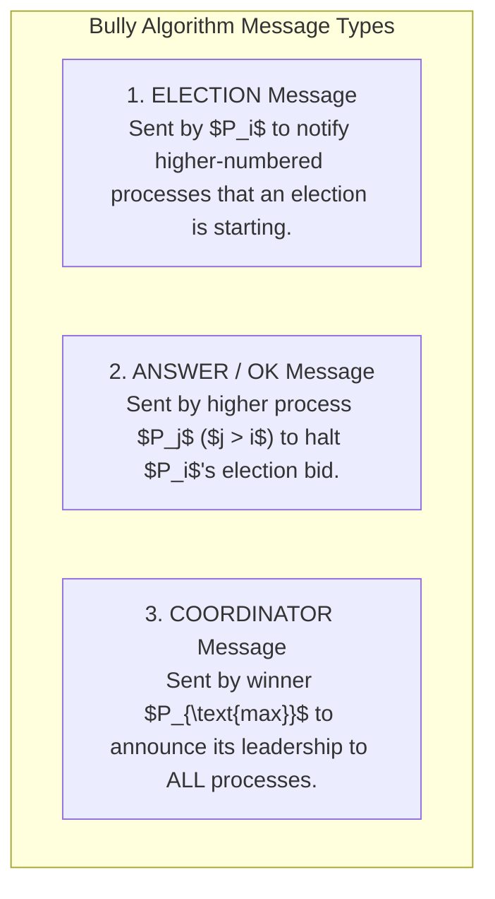
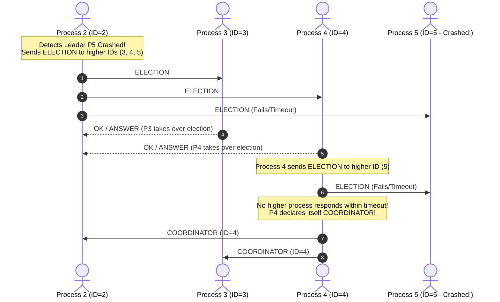
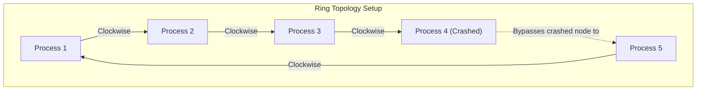

# Distributed Leader Election — Bully Algorithm and Ring Algorithm

## Mental Model

Think of **Distributed Leader Election** as a group of shipwrecked survivors on a deserted island electing a leader without a phone or central authority. 

In classic distributed systems theory (outside complex consensus frameworks like Raft or Paxos), two classic algorithms solve leader election:

- **The Bully Algorithm:** The survivor with the highest numerical ID (e.g. Survivor #99) "bullies" all lower-numbered survivors into submission. Any node can initiate an election; if no higher-numbered node responds within a timeout window, the node unilaterally declares itself the Coordinator.
- **The Ring Algorithm:** Nodes are arranged in a logical circular ring ($1 \to 2 \to 3 \to 1$). Election messages travel clockwise around the ring, accumulating node IDs. When the message completes a full loop, the node with the highest ID is crowned Coordinator.

---

## 1. The Bully Algorithm Mechanics

The **Bully Algorithm** assumes that every process $P_i$ knows the unique numeric ID of every other process in the system ($P_1, P_2 \dots P_N$). The process with the highest ID is always elected Coordinator.



### Step-by-Step Bully Election Sequence



---

## 2. The Ring Algorithm Mechanics

The **Ring Algorithm** organizes processes in a logical unidirectional circular ring where each process $P_i$ knows its immediate active clockwise neighbor.



### Step-by-Step Ring Election Sequence
1. Process $P_k$ detects the coordinator has crashed.
2. $P_k$ builds an `ELECTION` message containing an active list $[k]$ and forwards it to its clockwise neighbor.
3. Each active neighbor $P_j$ appends its ID to the list $[k, \dots, j]$ and forwards to its neighbor.
4. When the `ELECTION` message completes a $360^\circ$ loop back to $P_k$:
   - $P_k$ inspects the accumulated ID list.
   - The node with the **maximum ID** in the list ($\max(\text{list})$) is elected Coordinator.
5. $P_k$ sends a `COORDINATOR` message around the ring announcing the winner.

---

## 3. Production Code Implementation (Java: Bully Algorithm)

```java
package com.lld.bully;

import java.util.*;
import java.util.concurrent.ConcurrentHashMap;

public class BullyLeaderElection {
    private final int nodeId;
    private final List<Integer> allNodeIds;
    private final Map<Integer, Boolean> nodeStatusMap = new ConcurrentHashMap<>();
    private volatile int currentLeaderId = -1;
    private volatile boolean isElectionInProgress = false;

    public BullyLeaderElection(int nodeId, List<Integer> allNodeIds) {
        this.nodeId = nodeId;
        this.allNodeIds = new ArrayList<>(allNodeIds);
        Collections.sort(this.allNodeIds);
        for (int id : allNodeIds) nodeStatusMap.put(id, true);
    }

    public void startElection() {
        if (isElectionInProgress) return;
        isElectionInProgress = true;

        System.out.println("Node [" + nodeId + "] STARTING ELECTION...");
        boolean higherNodeResponded = false;

        for (int higherId : allNodeIds) {
            if (higherId > nodeId) {
                System.out.println("Node [" + nodeId + "] -> Sending ELECTION to Node [" + higherId + "]");
                if (pingNode(higherId)) {
                    higherNodeResponded = true;
                    System.out.println("Node [" + higherId + "] -> Responded OK to Node [" + nodeId + "]");
                }
            }
        }

        if (!higherNodeResponded) {
            // No higher node responded! Node declares itself Leader!
            this.currentLeaderId = nodeId;
            this.isElectionInProgress = false;
            System.out.println("**************************************************");
            System.out.println("  Node [" + nodeId + "] ELECTED AS NEW COORDINATOR!");
            System.out.println("**************************************************");
            announceCoordinator();
        } else {
            // Higher node took over
            this.isElectionInProgress = false;
        }
    }

    private void announceCoordinator() {
        for (int id : allNodeIds) {
            if (id != nodeId && pingNode(id)) {
                System.out.println("Node [" + nodeId + "] -> Sending COORDINATOR announcement to Node [" + id + "]");
            }
        }
    }

    private boolean pingNode(int id) {
        return nodeStatusMap.getOrDefault(id, false);
    }

    public void setNodeOnlineStatus(int id, boolean isOnline) {
        nodeStatusMap.put(id, isOnline);
    }

    public int getCurrentLeaderId() { return currentLeaderId; }
}
```

---

## 4. Architectural Comparison Matrix

| Property | Bully Algorithm | Ring Algorithm | Raft / Paxos Consensus |
|---|---|---|---|
| **Network Topology** | All-to-All Full Mesh. | Logical Circular Ring. | Quorum Mesh. |
| **Message Complexity (Worst Case)** | $O(N^2)$ messages. | $O(N)$ messages (2 full ring loops). | $O(N)$ RPCs. |
| **Assumptions** | Reliable message delivery + known IDs. | Reliable ring links + known topology. | Network partitions & message loss allowed. |
| **Fault Tolerance** | Low (Network partitions cause Split-Brain). | Low (Multiple ring link cuts break election). | **High** (Tolerates $\lfloor (N-1)/2 \rfloor$ failures). |
| **Primary Use Case** | Classic textbook systems / Static clusters. | Token Ring Networks / Static Topologies. | **Enterprise Production Systems** (Etcd/Spanner). |

---

## 5. Active-Recall Prompts

1. **How does the Bully Algorithm use node numeric IDs to guarantee that the highest active node is elected Coordinator?**
2. **What is the message complexity of the Bully Algorithm ($O(N^2)$) vs. the Ring Algorithm ($O(N)$)?**
3. **How does the Ring Algorithm collect active node IDs as the election message travels $360^\circ$ clockwise around the ring?**
4. **Why are classic Bully and Ring algorithms vulnerable to Split-Brain during network partitions compared to Raft majority quorums?**

---

## Related Notes

- [[Raft Consensus Algorithm - Leader Election, Log Replication, and Safety]]
- [[Paxos Consensus Protocol - Basic Paxos, Multi-Paxos, and Proposers]]
- [[ZooKeeper Atomic Broadcast (Zab) Protocol]]
- [[Gossip Protocol - Epidemic Dissemination and Peer-to-Peer Membership]]

> **Interview Style Question:** *"Compare classic Distributed Leader Election algorithms (Bully Algorithm vs Ring Algorithm) against modern quorum consensus (Raft/Paxos). Explain the 3 Bully message types, detail the $O(N^2)$ message complexity, write a Java Bully election implementation, and analyze why network partitions cause Split-Brain in Bully algorithms."*

---
