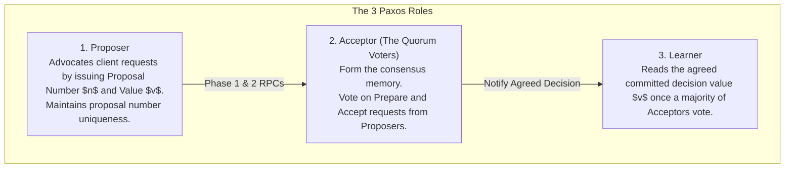
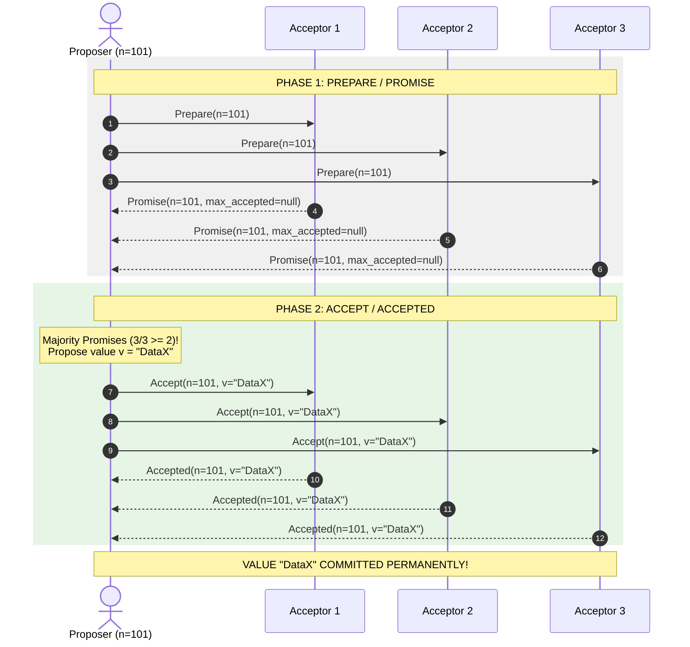
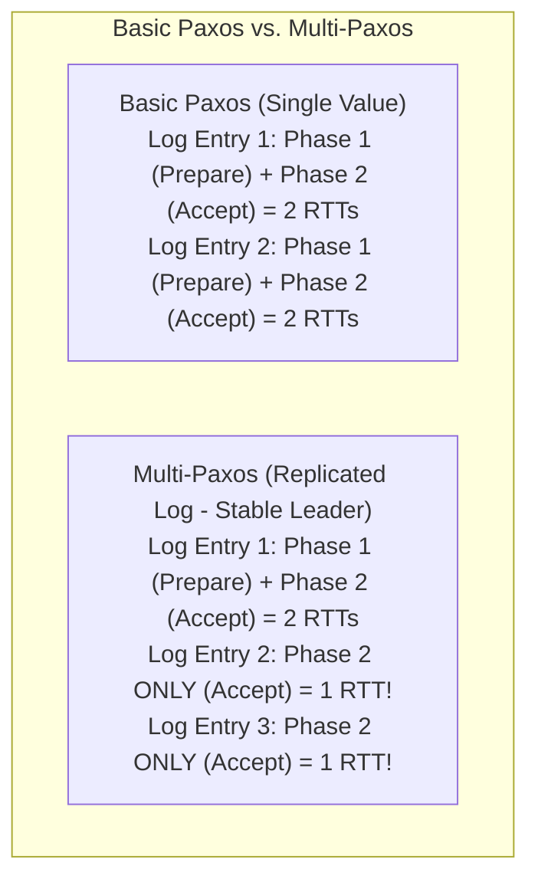

# Paxos Consensus Protocol — Basic Paxos, Multi-Paxos, and Proposers

## Mental Model

Think of **Basic Paxos** as an ancient Greek parliament (the island of Paxos) deciding on a single legislative decree. 

3 distinct roles operate in the parliament: **Proposers** (politicians introducing proposals), **Acceptors** (parliamentary judges who vote on proposals), and **Learners** (clerks recording agreed decisions). 

Because politicians may interrupt each other or lose connection, Paxos operates in a strict 2-phase protocol: 
- **Phase 1 (Prepare / Promise):** A proposer requests a ballot number ($n$). Acceptors promise never to accept any future proposal with a lower ballot number.
- **Phase 2 (Accept / Committed):** If a majority of acceptors promise, the proposer sends the value ($v$). Once a majority accepts, the value is **permanently committed**.

---

## 1. The 3 Paxos Node Roles

In the Paxos protocol, a single physical server node can fulfill one, two, or all three mathematical roles simultaneously:



---

## 2. Basic Paxos 2-Phase Protocol Execution

Basic Paxos achieves consensus on a **single value** $v$ across $N$ Acceptors using majority quorums ($\lfloor N/2 \rfloor + 1$).



---

## 3. The Acceptor Rules (Invariants)

An Acceptor node maintains 3 state variables:
1. `max_promised_n`: Highest proposal number $n$ promised.
2. `max_accepted_n`: Highest proposal number $n$ accepted.
3. `max_accepted_v`: Value corresponding to `max_accepted_n`.

### Acceptor Rule 1 (Phase 1b Promise):
Upon receiving `Prepare(n)`:
$$\text{If } n > \text{max\_promised\_n} \implies \text{Promise never to accept } < n, \text{ and return } (\text{max\_accepted\_n}, \text{max\_accepted\_v})$$

### Acceptor Rule 2 (Phase 2b Accepted):
Upon receiving `Accept(n, v)`:
$$\text{If } n \ge \text{max\_promised\_n} \implies \text{Accept } (n, v) \text{ and set } \text{max\_accepted\_n} = n, \text{max\_accepted\_v} = v$$

---

## 4. Multi-Paxos: Optimizing Throughput for Replicated Logs

Basic Paxos requires **2 full round-trip times (2 RTTs)** for every single value committed. For a stream of thousands of transactions, executing 2 RTTs per log entry is too slow.

**Multi-Paxos** elects a stable Leader proposer. Once Phase 1 (Prepare/Promise) is executed **once** for the leader's term, Phase 1 is bypassed for subsequent log entries, reducing commit latency to **1 RTT (Phase 2 Accept only)**!



---

## 5. Basic Paxos Livelock & Safety Comparison

### The Dueling Proposers Livelock Scenario
In Basic Paxos without randomized delays, two Proposers $P_1$ and $P_2$ can infinitely preempt each other:

```text
1. P1 sends Prepare(n=1) -> Accepted by Majority.
2. P2 sends Prepare(n=2) -> Acceptors override promise to n=2!
3. P1 sends Accept(n=1, v1) -> REJECTED by Acceptors (promised n=2)!
4. P1 sends Prepare(n=3) -> Acceptors override promise to n=3!
5. P2 sends Accept(n=2, v2) -> REJECTED by Acceptors (promised n=3)!
=> LIVELOCK! Both proposers preempt each other infinitely (Zero progress!).
```
*Mitigation*: Use **Randomized Backoff Delays** before retrying Phase 1 or elect a single Leader in Multi-Paxos.

---

## 6. Architectural Comparison: Paxos vs. Raft

| Property | Basic Paxos | Multi-Paxos | Raft Consensus |
|---|---|---|---|
| **Consensus Target** | Single Value | Replicated Log Stream | Replicated Log Stream |
| **Commit Latency** | 2 RTTs | **1 RTT** (after leader elected) | **1 RTT** |
| **Leader Model** | No fixed leader required | Single Stable Leader | Single Strict Leader |
| **Understandability** | Extremely difficult | Complex | **Designed for Understandability** |
| **Industry Products** | Academic Reference | Google Spanner, Chubby | Etcd, CockroachDB, Consul |

---

## 7. Active-Recall Prompts

1. **What are the 3 roles in Paxos (Proposer, Acceptor, Learner)?**
2. **Detail Phase 1 (Prepare/Promise) and Phase 2 (Accept/Accepted) of Basic Paxos.**
3. **How does Multi-Paxos reduce consensus latency from 2 RTTs to 1 RTT per log entry?**
4. **What is a Dueling Proposers Livelock in Basic Paxos, and how do randomized backoff delays prevent it?**

---

## Related Notes

- [[Raft Consensus Algorithm - Leader Election, Log Replication, and Safety]]
- [[ZooKeeper Atomic Broadcast (Zab) Protocol]]
- [[Distributed Leader Election - Bully Algorithm and Ring Algorithm]]
- [[Google TrueTime and Synchronized Atomic Clocks in Spanner]]

> **Interview Style Question:** *"Explain the Paxos Consensus Protocol. Deconstruct the 2-phase protocol (Prepare/Promise -> Accept/Accepted) across Proposer, Acceptor, and Learner roles, write the Acceptor invariant rules, explain how Multi-Paxos optimizes log replication down to 1 RTT, analyze the Dueling Proposers Livelock, and compare Paxos vs. Raft."*

---
