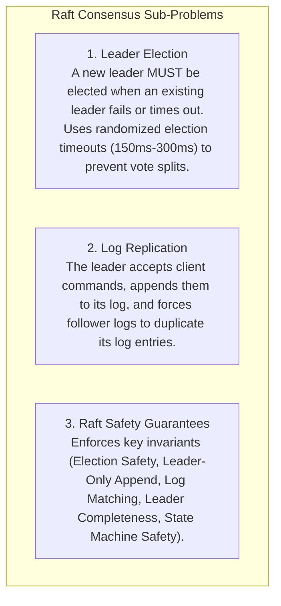
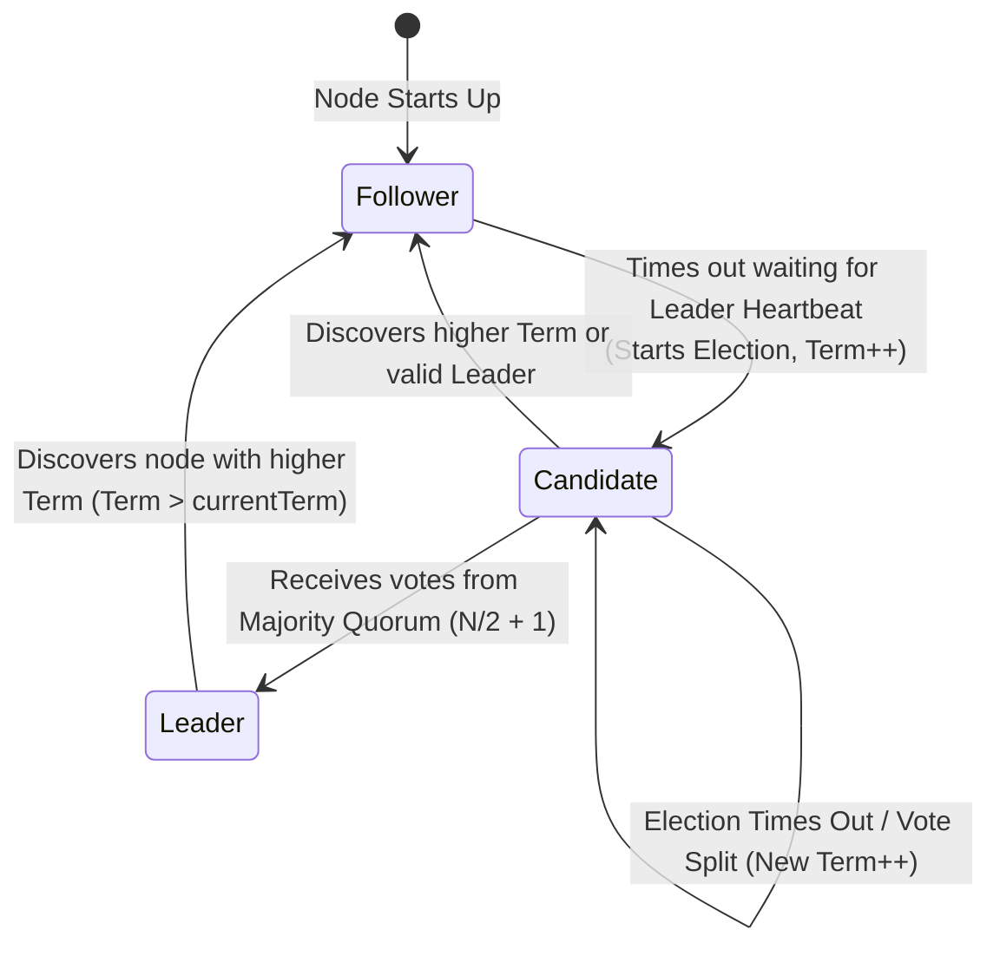
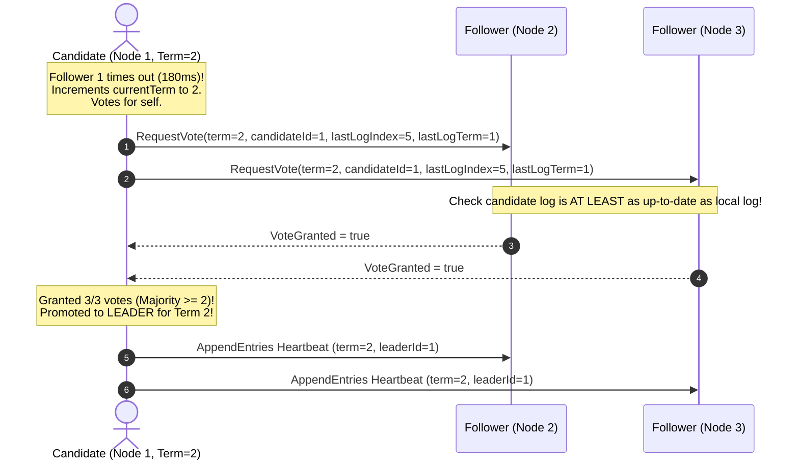

# Raft Consensus Algorithm — Leader Election, Log Replication, and Safety

## Mental Model

Think of the **Raft Consensus Algorithm** as a 5-member parliamentary government maintaining an identical official law book (**Replicated Log**). 

The government operates in strict terms of office (**Terms $1, 2, 3\dots$**). One elected Prime Minister (**The Leader**) receives all new bill proposals from citizens (**Client Write Requests**), writes them into their draft ledger, and streams the proposal to the 4 other MPs (**Followers**). 

If a majority (at least 3 out of 5 MPs) sign off on the bill (**Majority Quorum ACK**), the Leader officially stamps the law into the permanent record (**Commit Entry**). If the Prime Minister dies or loses network connection (**Heartbeat Timeout**), remaining MPs detect the absence, increment the term number, and elect a new Prime Minister (**Randomized Election Timeout**).

---

## 1. Deconstructing Raft: The 3 Sub-Problems

Raft decomposes the distributed consensus problem into 3 distinct, independent sub-problems:



---

## 2. Server States & Term Transitions

In a Raft cluster of $N$ nodes (typically $N=3$ or $N=5$), every node is in one of 3 states at any given moment:



---

## 3. Leader Election Mechanism



### Election Safety Rule:
A voter **DENIES** a vote if the candidate's log is less up-to-date than the voter's own log:
$$\text{Up-To-Date Log} \iff (\text{candidateTerm} > \text{voterTerm}) \lor (\text{terms equal} \land \text{candidateIndex} \ge \text{voterIndex})$$

---

## 4. Log Replication & Commit Invariants

```mermaid
flowchart TD
    Client["Client"] -->|1. Command: `SET x=10`| Leader["Leader Node (Term 2)"]
    
    Leader -->|2. Append entry to local log| LeaderLog["Leader Log: [Term 1: SET y=5] [Term 2: SET x=10]"]
    
    Leader -->|3. AppendEntries RPC| F1["Follower 1"] & F2["Follower 2"]
    
    F1 & F2 -->|4. Append to local log & ACK| Leader
    
    Leader -->|5. Majority ACKs received (2/3)! Mark COMMITTED| StateMachine["Apply `SET x=10` to State Machine"]
    
    Leader -->|6. Return Success to Client| Client
```

---

## 5. The 5 Raft Safety Invariants

| Safety Invariant | Formal Definition / Rule |
|---|---|
| **Election Safety** | At most one leader can be elected per term ($N/2 + 1$ majority quorum). |
| **Leader Append-Only** | A leader NEVER overwrites or truncates its own log entries; it only appends. |
| **Log Matching Property** | If two logs contain an entry with same index and term, they are identical in all entries up to that index. |
| **Leader Completeness** | If a log entry is committed in a given term, that entry will be present in the logs of the leaders for ALL higher terms. |
| **State Machine Safety** | If a server has applied a log entry at a given index to its state machine, no other server will ever apply a different log entry for that same index. |

---

## 6. Failure Modes and Trade-offs

1. **Split-Vote Deadlocks** — In a 4-node cluster, 2 nodes time out at the exact same millisecond. Node 1 gets 2 votes, Node 2 gets 2 votes. Neither achieves a majority ($3/4$). Election stalls. *Mitigation*: **Randomized Election Timeouts** (e.g. randomly chosen between $150\text{ms} - 300\text{ms}$ per node).
2. **Uncommitted Entries Overwrite Danger** — A leader crash leaves uncommitted entries on followers. A new leader appends new entries for its term. *Mitigation*: Raft leaders **NEVER commit log entries from previous terms by counting replicas**; previous entries are committed implicitly by committing an entry from the CURRENT term.
3. **Network Partition Asymmetric Split** — 5-node cluster split into $\{N_1, N_2\}$ (Minority) and $\{N_3, N_4, N_5\}$ (Majority). Minority $N_1$ continues accepting client writes locally, but cannot commit because it cannot reach majority. *Mitigation*: Uncommitted minority writes are rejected upon client commit or rolled back when the partition heals.

---

## 7. Active-Recall Prompts

1. **What are the 3 states of a Raft node, and how does a candidate achieve a majority election quorum ($N/2 + 1$)?**
2. **How do Randomized Election Timeouts ($150\text{ms}-300\text{ms}$) eliminate split-vote deadlocks?**
3. **State the Raft Election Safety Rule regarding when a follower denies a candidate's vote.**
4. **State the 5 Raft Safety Invariants (Election Safety, Leader Append-Only, Log Matching, Leader Completeness, State Machine Safety).**

---

## Related Notes

- [[Paxos Consensus Protocol - Basic Paxos, Multi-Paxos, and Proposers]]
- [[ZooKeeper Atomic Broadcast (Zab) Protocol]]
- [[Distributed Leader Election - Bully Algorithm and Ring Algorithm]]
- [[Database Replication - Single-Leader, Multi-Leader, Leaderless, Raft Consensus]]

> **Interview Style Question:** *"Explain the Raft Consensus Algorithm in detail. Deconstruct Leader Election, Log Replication, and Safety Invariants, prove how majority quorums ($N/2 + 1$) prevent split-brain leaders, demonstrate how randomized election timeouts eliminate split votes, and explain how a new leader forces follower logs to match its own log during network partition recovery."*

---
