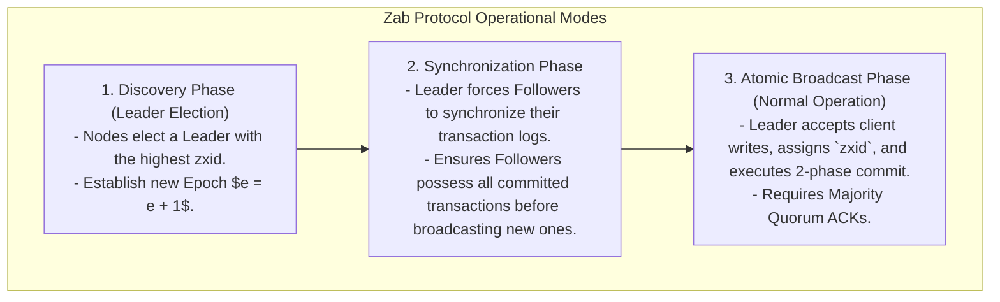
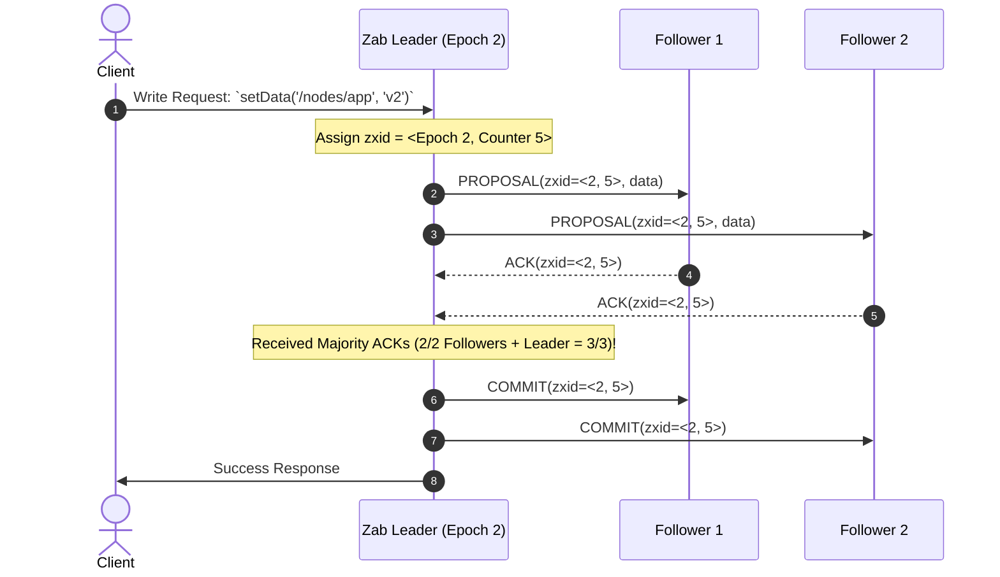

# ZooKeeper Atomic Broadcast (Zab) Protocol

## Mental Model

Think of the **ZooKeeper Atomic Broadcast (Zab) Protocol** as a high-security court system's centralized legal transcript recorder. 

An ensemble of Apache ZooKeeper servers forms a primary-backup cluster. One server is elected Chief Justice (**The Leader**), while the remaining servers act as associate judges (**Followers**). 

All client update requests (**State-Mutating Transactions**) are forwarded to the Leader. The Leader assigns a 64-bit strictly sequential transaction identifier (**zxid**) composed of an Epoch ID and a Counter. The Leader broadcasts proposals to Followers using a **2-Phase Atomic Broadcast Protocol**. If a majority of Followers ACK the proposal, the Leader issues a `COMMIT` message, guaranteeing that all judges apply identical updates in exact sequential order.

---

## 1. Zab Protocol Phases & Modes of Operation

The Zab Protocol alternates between 2 operational modes: **Phase 1: Crash Recovery (Leader Election & Synchronization)** and **Phase 2: Atomic Broadcast**.



---

## 2. 64-Bit Transaction Identifier (zxid) Structure

Every transaction proposal in Zab receives a unique 64-bit integer called a **zxid** (ZooKeeper Transaction ID):

```text
 32 Bits (Epoch e)                        32 Bits (Transaction Counter c)
+---------------------------------------+---------------------------------------+
| 00000000 00000000 00000000 00000010   | 00000000 00000000 00000000 00000101   |
+---------------------------------------+---------------------------------------+
```

- **Epoch ($e$ - Higher 32 Bits):** Incremented by 1 every time a new Leader is elected ($e_1, e_2, e_3\dots$). Represents the term of leadership.
- **Counter ($c$ - Lower 32 Bits):** Monotonically increasing transaction counter reset to 0 at the beginning of each new epoch.

---

## 3. Atomic Broadcast Phase Sequence

During normal operation, the Leader processes state updates using a **FIFO 2-Phase Commit** without Phase 1 Prepare overhead:



---

## 4. Primary Order Properties & Safety Guarantees

Zab enforces 4 critical ordering invariants for replicated state machines:

| Property | Formal Definition |
|---|---|
| **Reliable Delivery** | If a message is committed by the leader, it will eventually be committed by all healthy followers. |
| **Total Order** | If a message $a$ is committed before message $b$ by one server, $a$ is committed before $b$ by ALL servers. |
| **Causal Consistency (Prefix Property)** | If message $a$ is sent before message $b$ by the same leader, $a$ must be proposed before $b$. |
| **Leader Single-Copy Consistency** | At any given moment, at most one leader can broadcast transactions. |

---

## 5. Architectural Comparison: Zab vs. Raft vs. Paxos

| Property | Zab Protocol (ZooKeeper) | Raft Consensus | Multi-Paxos |
|---|---|---|---|
| **Primary Focus** | Primary-Backup Atomic Broadcast | Replicated Log State Machine | Replicated Log State Machine |
| **Term / Epoch Identifier** | **zxid** (High 32-bit Epoch) | **currentTerm** (Integer) | Ballot Number |
| **Log Recovery Strategy** | Synchronization Phase before Broadcast | Forced Leader Overwrite | Complex Log Filling |
| **FIFO TCP Order Requirement?** | **Yes** (Requires ordered TCP channels) | No (Idempotent log indexes) | No |
| **Primary Industry Product** | Apache ZooKeeper, Apache Kafka (KRaft) | Etcd, CockroachDB, Consul | Google Spanner, Chubby |

---

## 6. Failure Modes and Trade-offs

1. **Leader Crash During Uncommitted Proposal** — A leader proposes `zxid = <1, 10>`, sends it to Follower 1, and crashes before sending to Follower 2. Follower 1 has `zxid = <1, 10>` uncommitted; Follower 2 does not. During Phase 1 Discovery, the new leader for Epoch 2 **MUST truncate un-committed proposals from old epochs** if they were not acknowledged by a majority quorum.
2. **TCP Order Disruption** — Network glitches reorder packets between Leader and Follower. Zab requires strict FIFO TCP connection pipelines per follower. If TCP connections drop, the follower must re-synchronize its log.
3. **Write Bottleneck on Single Leader** — All ZooKeeper write requests must pass through a single Zab Leader node. Scale reads across followers using local ZooKeeper reads, but writes remain bounded by leader CPU and disk WAL performance.

---

## 7. Active-Recall Prompts

1. **What are the 2 operational modes of the Zab protocol (Crash Recovery vs. Atomic Broadcast)?**
2. **Deconstruct the 64-bit zxid structure (High 32-bit Epoch vs. Low 32-bit Counter).**
3. **How does Zab's Synchronization Phase guarantee that a new leader aligns all follower logs before accepting new writes?**
4. **Compare Zab vs. Raft regarding zxid vs. currentTerm and FIFO TCP ordering requirements.**

---

## Related Notes

- [[Paxos Consensus Protocol - Basic Paxos, Multi-Paxos, and Proposers]]
- [[Raft Consensus Algorithm - Leader Election, Log Replication, and Safety]]
- [[Distributed Leader Election - Bully Algorithm and Ring Algorithm]]
- [[Distributed Locks - Redis Redlock vs ZooKeeper or Etcd Consensus]]

> **Interview Style Question:** *"Explain the ZooKeeper Atomic Broadcast (Zab) Protocol. Deconstruct the 64-bit `zxid` structure (Epoch vs Counter), explain the 2 operational phases (Crash Recovery & Synchronization vs Atomic Broadcast), prove how majority quorums ensure Total Order, and compare Zab vs Raft."*

---
