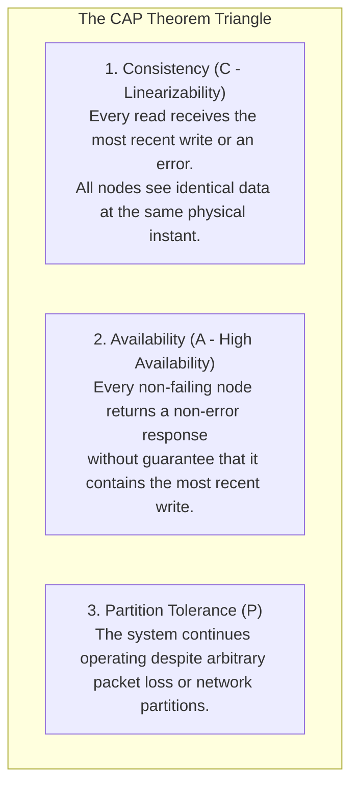
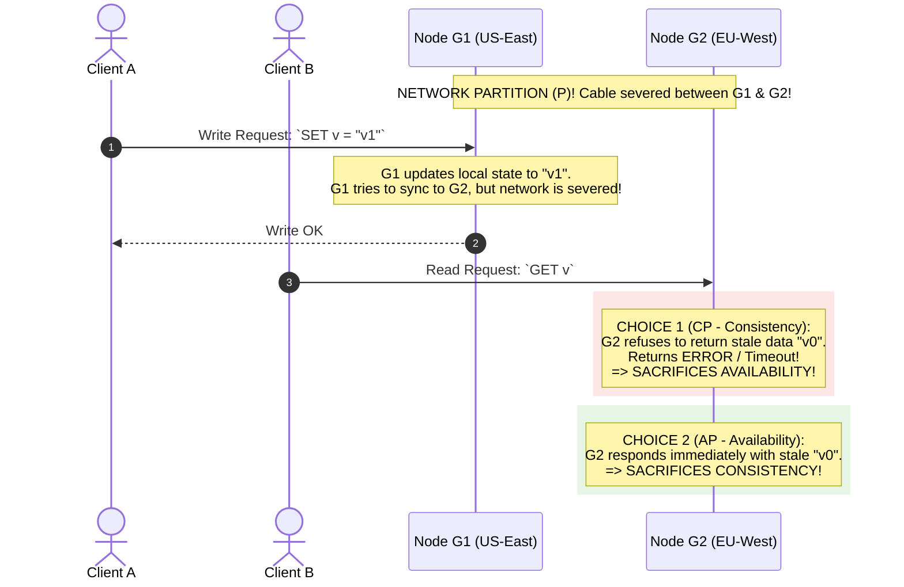

# CAP Theorem vs. PACELC Theorem — Trade-offs and Proofs

## Mental Model

Think of the **CAP Theorem** as a strict physical trade-off rule governing an international banking network separated by an ocean cable cut (**Network Partition**). 

If the fiber-optic submarine cable snaps between New York and London (**Partition $P$ occurs**), the system must make a non-negotiable choice: 

Do you allow London customers to withdraw cash using their local database instance, risking that New York doesn't know about it (**Choose Availability $A$ over Consistency $C$ $\to$ AP System**), or do you block London withdrawals until the cable is repaired (**Choose Consistency $C$ over Availability $A$ $\to$ CP System**)? 

Daniel Abadi extended this rule with the **PACELC Theorem**, recognizing that even when the network is functioning normally (**No Partition**), a system must STILL choose between **Latency ($L$)** and **Consistency ($C$)**!

---

## 1. Deconstructing Brewer's CAP Theorem

Formulated by Eric Brewer in 2000 and mathematically proven by Seth Gilbert and Nancy Lynch in 2002, the **CAP Theorem** states that a distributed data store can simultaneously provide at most 2 of the following 3 guarantees:



### The Unforgiving Truth of Distributed Networks:
$$\text{Network Partitions } (\mathbf{P}) \text{ ARE INEVITABLE IN DISTRIBUTED SYSTEMS!}$$

Because network cables snap, routers crash, and switches drop packets, **Partition Tolerance ($P$) cannot be sacrificed**. Therefore, the CAP theorem is NOT "Pick 2 out of 3"; it is strictly:

$$\text{During a Network Partition } (P): \text{ Choose } \mathbf{CP} \text{ (Consistency) OR } \mathbf{AP} \text{ (Availability)!}$$

---

## 2. Formal Proof of CAP Theorem (Gilbert & Lynch)



---

## 3. Abadi's PACELC Theorem (Extending CAP to Normal Operation)

In 2012, Daniel Abadi published the **PACELC Theorem**, pointing out that CAP *only* describes system behavior during rare network partitions. What about the $99.9\%$ of time when the network is operating normally?

$$\text{If } \mathbf{P} \text{ (Partition): } \mathbf{A} \text{ (Availability) vs. } \mathbf{C} \text{ (Consistency), } \mathbf{E} \text{lse: } \mathbf{L} \text{ (Latency) vs. } \mathbf{C} \text{ (Consistency)}$$

```mermaid
flowchart TD
    PACELC["PACELC Decision Tree"] --> IsP{"Is there a Network Partition (P)?"}
    
    IsP -->|YES (Partition)| ChoiceP{"Choose Availability (A) or Consistency (C)?"}
    ChoiceP -->|Availability| AP["AP"]
    ChoiceP -->|Consistency| CP["CP"]
    
    IsP -->|NO (Else - Normal Operation)| ChoiceE{"Choose Low Latency (L) or Consistency (C)?"}
    ChoiceE -->|Low Latency| PA_EL["PA / EL (e.g. DynamoDB, Cassandra)"]
    ChoiceE -->|High Consistency| PC_EC["PC / EC (e.g. PostgreSQL, Spanner, MongoDB)"]
```

---

## 4. Real-World Database Classification Matrix

| Database System | CAP Classification | PACELC Classification | Default System Behavior |
|---|---|---|---|
| **Google Spanner** | **CP** | **PC / EC** | Synchronous commit wait for strict consistency. |
| **Apache Cassandra / DynamoDB** | **AP** | **PA / EL** | Asynchronous replication; returns fast local reads ($L$) during normal operation. |
| **MongoDB** | **CP** | **PC / EC** | Primary node steps down on partition; blocks reads/writes until new leader elected. |
| **Apache HBase / HDFS** | **CP** | **PC / EC** | RegionServer consistency prioritized over availability. |
| **Amazon DynamoDB (Configured)** | Configurable | **PA / EL** or **PC / EC** | Configurable via Read Consistency parameter (`StronglyConsistentReads`). |

---

## 5. Failure Modes and Trade-offs

1. **Misclassifying "High Availability" in AP Systems** — Assuming an AP database (Cassandra) guarantees 100% availability during node failure. If a client uses `QUORUM` reads/writes ($R + W > N$), Cassandra acts as a **CP system** and fails writes if a quorum is unreachable! *Mitigation*: Understand that AP/CP depends on **Client Read/Write Consistency Levels**.
2. **Ignoring Latency Penalties in Normal Operation (EL vs. EC)** — Selecting a PC/EC database (Spanner/Postgres) for high-frequency IoT logging. Synchronous multi-datacenter replication adds 100ms WAN latency to every single write. *Mitigation*: Choose PA/EL databases for write-heavy logging.
3. **Silent Data Overwrites in AP Systems** — Two network-partitioned nodes accept conflicting writes (`v="A"` and `v="B"`). When the partition heals, Last-Write-Wins (LWW) silently discards `v="A"`. *Mitigation*: Use **Vector Clocks** or **CRDTs**.

---

## 6. Active-Recall Prompts

1. **State Brewer's CAP Theorem and explain why Partition Tolerance ($P$) cannot be omitted.**
2. **Walk through the Gilbert & Lynch formal proof of the CAP Theorem using 2 nodes ($G_1, G_2$).**
3. **State Abadi's PACELC Theorem and explain what $E, L,$ and $C$ represent during normal network operation.**
4. **Classify Google Spanner vs. Apache Cassandra under the PACELC Theorem.**

---

## Related Notes

- [[Linearizability vs. Serializability - Formal Definitions and Differences]]
- [[Eventual Consistency and Strong Eventual Consistency (CRDTs)]]
- [[High Availability Architecture - SLAs, SLOs, Fault Tolerance, and High-9s Math]]
- [[Database Scaling - Vertical vs Horizontal, Read Replicas, and Master-Slave]]

> **Interview Style Question:** *"Explain the CAP Theorem and Abadi's PACELC Theorem in detail. Provide the Gilbert & Lynch proof of CAP using a 2-node sequence diagram, state the PACELC formula (If P: A vs C, Else: L vs C), classify Cassandra vs Google Spanner, and demonstrate how client consistency levels (LOCAL_ONE vs QUORUM) alter CAP trade-offs."*

---
