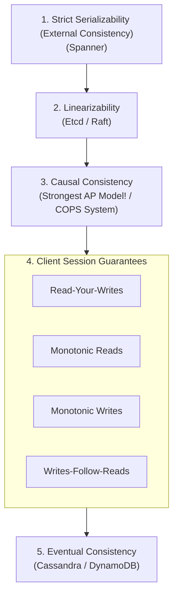
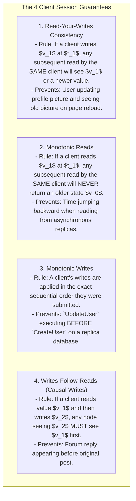
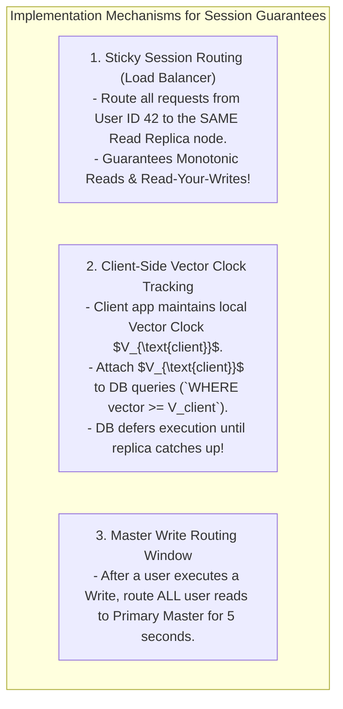

# Causal Consistency and Read-Your-Writes Guarantees

## Mental Model

Think of **Causal Consistency** as an online discussion forum thread where replies must strictly follow the comments that prompted them. 

If User A posts a question (*"Who won the game?"*) and User B posts a reply (*"Team X won!"*), Causal Consistency guarantees that no user anywhere in the world will ever see User B's reply BEFORE seeing User A's question (**Causal Dependability**). 

However, if User C in London posts an unrelated comment (*"Nice weather today!"*) at the same time, User C's comment is concurrent ($A \parallel C$); different users may see User C's comment appear before or after User A's post. 

Causal Consistency is the strongest consistency model that remains **100% Available under Network Partitions (AP in CAP theorem)**!

---

## 1. The Consistency Spectrum Hierarchy

---

## 2. The 4 Essential Client Session Guarantees

To prevent jarring user experiences in distributed systems (like posting a comment and seeing it disappear on refresh), distributed engines enforce 4 **Session Guarantees**:

---

## 3. Causal Consistency Formal Definition

A system is **Causally Consistent** if all processes see causally related operations in the same order. Operations that are not causally related (concurrent operations) may be seen in different orders by different processes.

$$\text{Causally Related Edits } (A \to B) \implies \text{Order } (A \text{ before } B) \text{ everywhere}$$
$$\text{Concurrent Edits } (A \parallel B) \implies \text{Order can vary across nodes}$$

---

## 4. Architectural Implementation Techniques

---

## 5. Failure Modes and Trade-offs

1. **Replication Lag Violating Monotonic Reads** — A user is routed to Replica 1 (up-to-date), reads balance = $\$100$. Next request hits Replica 2 (500ms behind), balance drops to $\$50$. The user panics thinking money disappeared! *Mitigation*: Enforce **Sticky Sessions** or client-side vector clock tracking.
2. **Over-Constraining Causal Dependencies** — Tracking causal dependencies across all global data keys creates massive dependency graphs that saturate RAM. *Mitigation*: Track causal dependencies strictly within individual user sessions or document IDs.
3. **Master Outage during Write Routing Window** — Master DB crashes while a user is inside their 5-second Read-Your-Writes window. Client receives an error instead of reading from available replicas. *Mitigation*: Fall back to replica reads with a stale data warning UI prompt.

---

## 6. Active-Recall Prompts

1. **Why is Causal Consistency called the strongest consistency model achievable in AP systems under the CAP theorem?**
2. **Define the 4 Client Session Guarantees (Read-Your-Writes, Monotonic Reads, Monotonic Writes, Writes-Follow-Reads).**
3. **How does Sticky Session routing at the Load Balancer level guarantee Read-Your-Writes and Monotonic Reads?**
4. **Explain how a client app uses local Vector Clocks to enforce Causal Consistency across asynchronous database replicas.**

---

## Related Notes

- [[Lamport Timestamps and Happened-Before Relation]]
- [[Vector Clocks - Causal Ordering and Conflict Detection]]
- [[Eventual Consistency and Strong Eventual Consistency (CRDTs)]]
- [[CAP Theorem vs. PACELC Theorem - Trade-offs and Proofs]]

> **Interview Style Question:** *"Explain Causal Consistency and the 4 Client Session Guarantees. Detail Read-Your-Writes, Monotonic Reads, Monotonic Writes, and Writes-Follow-Reads with real-world failure scenarios, demonstrate how Load Balancer sticky sessions enforce these guarantees, and explain why Causal Consistency is the strongest consistency model achievable in AP systems."*

---
