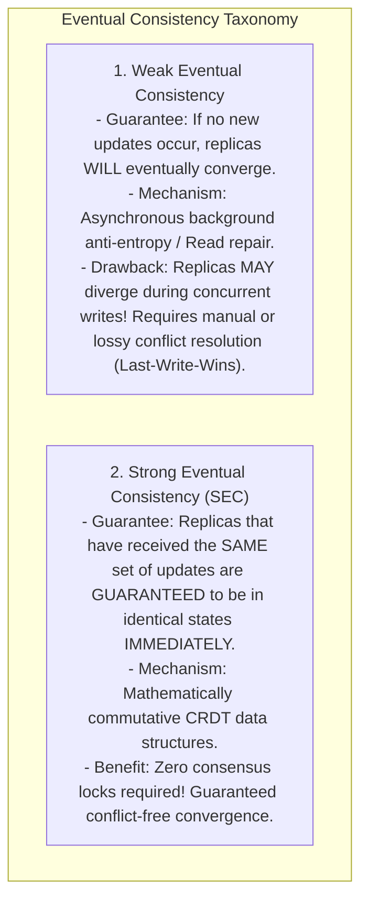
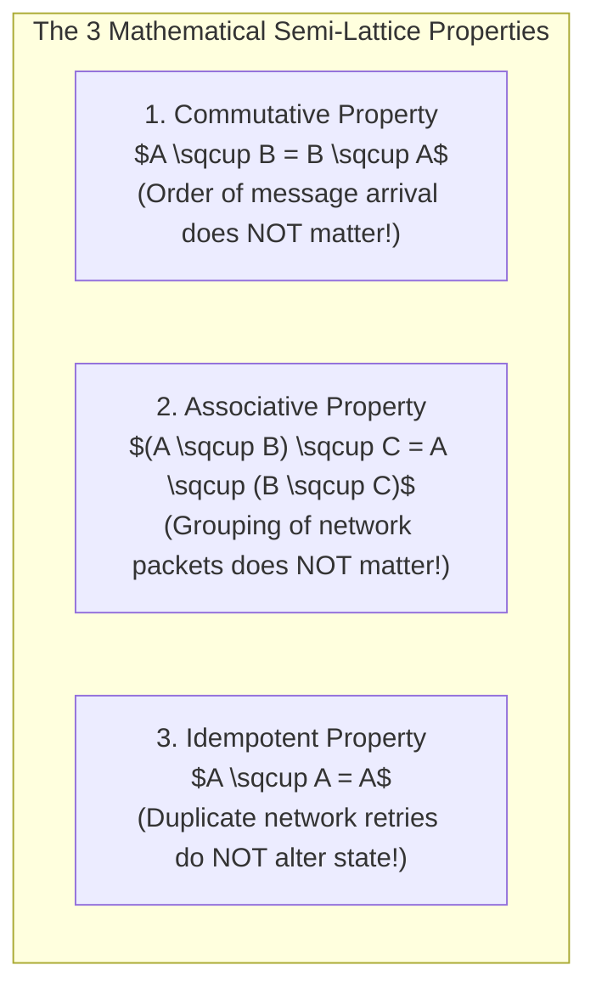
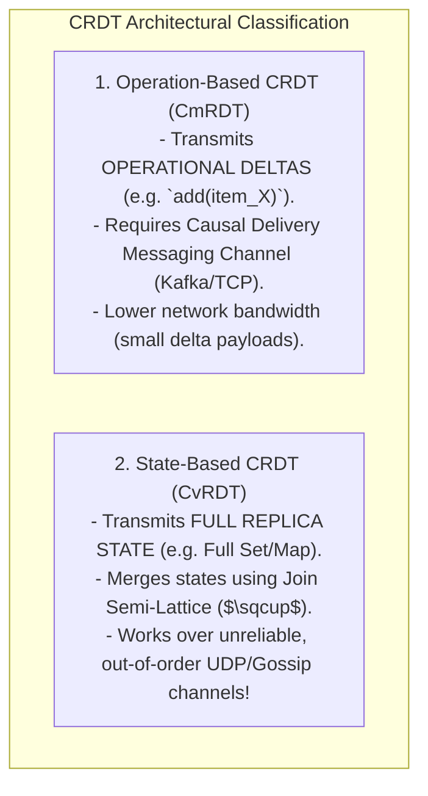

# Eventual Consistency and Strong Eventual Consistency (CRDTs)

## Mental Model

Think of **Weak Eventual Consistency** as a group of friends editing a shared spreadsheet offline during a flight. 

When the plane lands, everyone syncs their changes. If two friends edited the exact same cell concurrently, a central server or Last-Write-Wins rule arbitrarily picks one edit and deletes the other (**Data Loss / Destructive Resolution**). 

Think of **Strong Eventual Consistency (SEC)** powered by **Conflict-Free Replicated Data Types (CRDTs)** as a collaborative multi-player Lego set. 

No matter in what order or over what delayed network routes players add or remove Lego bricks, the underlying mathematical data structure guarantees that once all updates reach all players, **every single player's Lego structure converges to the exact same identical shape automatically**—without requiring a central server or consensus locks!

---

## 1. Weak Eventual Consistency vs. Strong Eventual Consistency (SEC)



---

## 2. Mathematical Foundation of CRDTs (Lattices & Monoids)

To guarantee automatic convergence without consensus, a data structure must form a **Bounded Semi-Lattice** under a binary merge operation ($\sqcup$):



---

## 3. The 2 Types of CRDTs: Operation-Based vs. State-Based



---

## 4. Practical CRDT Examples

### A. PN-Counter (Positive-Negative Counter)
Tracks increments and decrements independently across $N$ nodes using two internal vector arrays ($P$ for increments, $N$ for decrements):

$$\text{Value} = \sum P_i - \sum N_i$$

### B. LWW-Element-Set (Last-Write-Wins Element Set)
Maintains an Add-Set and a Remove-Set with timestamps. An element is present if it is in the Add-Set and has a higher timestamp than in the Remove-Set.

---

## 5. Production Code Implementation (Java: State-Based G-Counter CvRDT)

```java
package com.lld.crdt;

import java.util.*;
import java.util.concurrent.ConcurrentHashMap;

// State-Based Grow-Only Counter (G-Counter) CvRDT
public class GCounter {
    private final String nodeId;
    private final Map<String, Integer> state = new ConcurrentHashMap<>();

    public GCounter(String nodeId) {
        this.nodeId = Objects.requireNonNull(nodeId);
        this.state.put(nodeId, 0);
    }

    public void increment() {
        state.put(nodeId, state.getOrDefault(nodeId, 0) + 1);
    }

    public int value() {
        return state.values().stream().mapToInt(Integer::intValue).sum();
    }

    // SEMI-LATTICE JOIN MERGE OPERATION (Idempotent, Commutative, Associative)
    public synchronized void merge(GCounter other) {
        for (Map.Entry<String, Integer> entry : other.state.entrySet()) {
            String key = entry.getKey();
            int otherVal = entry.getValue();
            int localVal = this.state.getOrDefault(key, 0);
            this.state.put(key, Math.max(localVal, otherVal)); // Monotonic Max!
        }
    }

    public Map<String, Integer> getState() { return Collections.unmodifiableMap(state); }
}
```

---

## 6. Active-Recall Prompts

1. **Differentiate Weak Eventual Consistency from Strong Eventual Consistency (SEC).**
2. **What 3 mathematical properties (Commutative, Associative, Idempotent) must a CRDT merge operation ($\sqcup$) satisfy?**
3. **Compare Operation-Based CRDTs (CmRDT) vs. State-Based CRDTs (CvRDT).**
4. **How does a PN-Counter (Positive-Negative Counter) track increments and decrements using vector arrays?**

---

## Related Notes

- [[Vector Clocks - Causal Ordering and Conflict Detection]]
- [[CAP Theorem vs. PACELC Theorem - Trade-offs and Proofs]]
- [[Linearizability vs. Serializability - Formal Definitions and Differences]]
- [[HLD - Collaborative Document Editor (Google Docs or Figma)]]

> **Interview Style Question:** *"Explain Strong Eventual Consistency (SEC) and Conflict-Free Replicated Data Types (CRDTs). Prove why the merge operation ($\sqcup$) must be Commutative, Associative, and Idempotent, compare State-Based (CvRDT) vs Operation-Based (CmRDT) implementations, write a Java G-Counter implementation, and demonstrate how Figma uses CRDTs for real-time collaborative canvas editing."*

---
