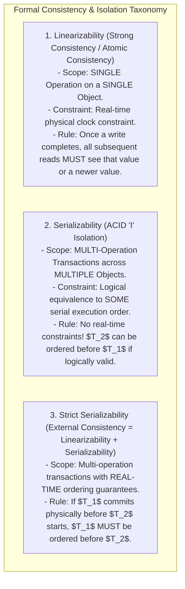
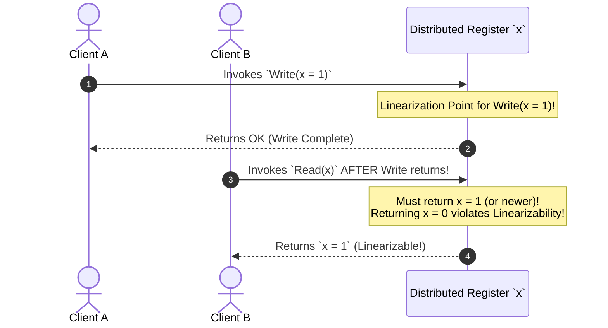

# Linearizability vs. Serializability — Formal Definitions and Differences

## Mental Model

Think of **Linearizability** as a single real-time global wall clock governing a single register, and **Serializability** as an accounting audit of multi-step business transactions. 

- **Linearizability (Real-Time Single-Operation Consistency):** If User A completes writing a value to a database key at $t=10.000\text{s}$, ANY user reading that key at $t \ge 10.001\text{s}$ **MUST** see User A's write or a later write. It is a recency guarantee on a single register in real time.
- **Serializability (Multi-Operation Transaction Isolation):** A guarantee that multi-step transactions ($T_1, T_2, T_3$) execute as if they ran sequentially one after another in *some* valid order, preventing race conditions like Dirty Reads or Phantom Reads.
- **Strict Serializability (External Consistency):** Combining BOTH guarantees! Transactions execute as if sequential AND obey real-time wall-clock ordering (achieved by Google Spanner via TrueTime).

---

## 1. Formal Mathematical Definitions

---

## 2. Linearizability Execution Diagram

A system is **Linearizable** if every operation appears to take effect instantaneously at a single point in time (the *linearization point*) between its invocation and its response:

---

## 3. Serializability without Linearizability (The Real-Time Gap)

Can a database be **Serializable** but **NOT Linearizable**? YES!

### Example of Non-Linearizable Serializability:
Suppose $T_1$ deposits $\$100$ at $t=10:00$, and $T_2$ checks balance at $t=10:05$. A database executes $T_2$ first in logical sequence:

$$\text{Equivalent Serial Order: } T_2 \to T_1$$

- **Serializable?** ✅ YES (Equivalent to the valid sequential order $T_2$ then $T_1$).
- **Linearizable?** ❌ NO! $T_1$ completed physically at $10:00$, but $T_2$ reading at $10:05$ failed to see $T_1$'s write! Real-time ordering was violated!

---

## 4. Comprehensive Comparison Matrix

| Property | Linearizability | Serializability | Strict Serializability (External Consistency) |
|---|---|---|---|
| **Domain** | Distributed Systems (Replication). | Database Systems (ACID Transactions). | Distributed Relational Databases (Spanner). |
| **Scope** | Single Operation / Single Key. | Multi-Operation / Multi-Key Transactions. | Multi-Operation / Multi-Key Transactions. |
| **Real-Time Constraint?** | ✅ **YES (Physical Wall-Clock)**. | ❌ NO (Logical equivalent order). | ✅ **YES (Physical Wall-Clock)**. |
| **Primary Goal** | Prevent stale reads across replicas. | Prevent race conditions (Dirty/Phantom Reads). | Absolute data correctness globally. |
| **Example Technologies** | Etcd, ZooKeeper, Raft. | PostgreSQL (Serializable 2PL/SSI). | Google Spanner, CockroachDB. |

---

## 5. Failure Modes and Trade-offs

1. **Confusing Linearizability with Serializability** — Assuming a PostgreSQL database configured with `SERIALIZABLE` isolation is safe from stale replica reads. Asynchronous read replicas can still serve stale data! *Mitigation*: Understand that `SERIALIZABLE` governs local multi-operation isolation, while `LINEARIZABLE` governs global single-key replication recency.
2. **Performance Penalty of Linearizability** — Enforcing linearizability on every read requires fetching majority consensus ACKs or executing read-index checks (Raft), adding network RTT latency to every `GET` query. *Mitigation*: Use **Bounded Staleness** or **Causal Consistency** for read-heavy workloads where minor staleness is acceptable.
3. **Clock Drift Breaking Strict Serializability** — Attempting to build Strict Serializability using un-synchronized software clocks. Software clock drift breaks real-time transaction ordering. *Mitigation*: Use **Google TrueTime (Commit Wait Rule)** or **Hybrid Logical Clocks (HLC)**.

---

## 6. Active-Recall Prompts

1. **Define Linearizability and explain the concept of a Linearization Point.**
2. **Define Serializability and explain why it does NOT enforce real-time physical clock constraints.**
3. **What is Strict Serializability (External Consistency), and how is it defined mathematically ($Linearizability + Serializability$)?**
4. **Construct an example of a transaction execution that is Serializable but NOT Linearizable.**

---

## Related Notes

- [[CAP Theorem vs. PACELC Theorem - Trade-offs and Proofs]]
- [[Google TrueTime and Synchronized Atomic Clocks in Spanner]]
- [[Eventual Consistency and Strong Eventual Consistency (CRDTs)]]
- [[Transactions and ACID Properties - Atomicity, Consistency, Isolation, Durability]]

> **Interview Style Question:** *"Compare Linearizability vs. Serializability vs. Strict Serializability (External Consistency). Detail the Linearization Point concept, construct a scenario proving that a system can be Serializable without being Linearizable, explain why Etcd provides Linearizability while PostgreSQL provides Serializability, and demonstrate how Google Spanner combines both into Strict Serializability."*

---
