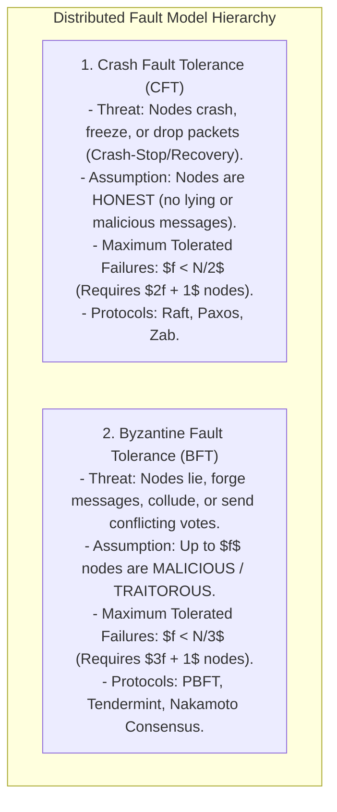
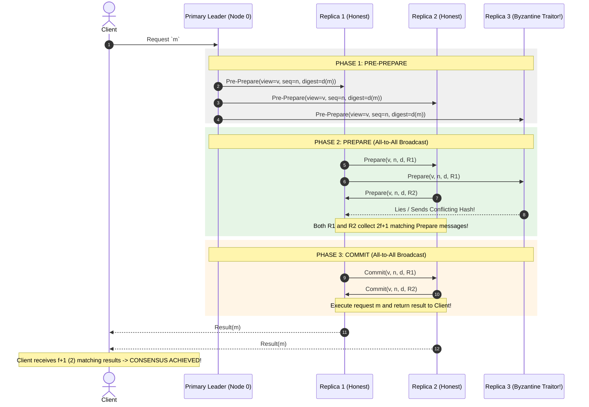
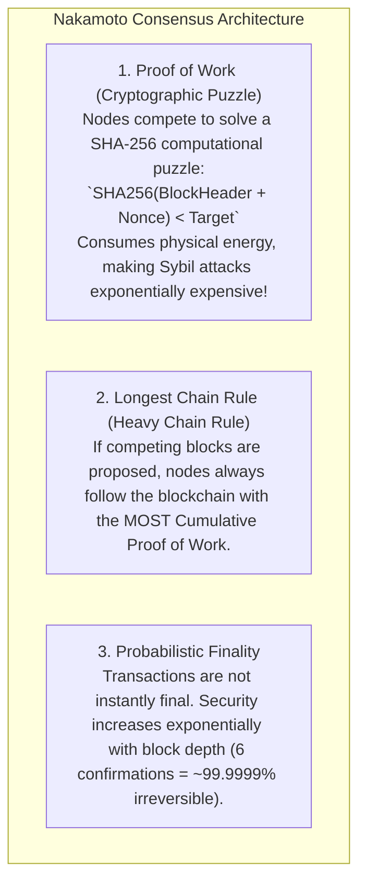

# Byzantine Fault Tolerance — BFT, PBFT, and Nakamoto Consensus

## Mental Model

Think of **Byzantine Fault Tolerance (BFT)** as a military council of generals surrounding an enemy city. 

In standard crash-fault tolerant systems (like Raft or Paxos), nodes may crash or go offline (**Crash-Stop / Crash-Recovery**), but nodes are assumed to be **honest** (they never deliberately send forged or malicious messages). 

In a **Byzantine Environment**, a fraction of the nodes ($f$) are traitorous or compromised by attackers (**Byzantine Faults**). Traitorous nodes can forge messages, send conflicting votes to different peers, or lie about transactions (**The Byzantine Generals Problem**). 

BFT algorithms guarantee that as long as the number of traitorous nodes $f$ is strictly bounded ($f < N/3$ in PBFT), the honest nodes will reach identical, un-tamperable consensus.

---

## 1. Crash Fault Tolerance (CFT) vs. Byzantine Fault Tolerance (BFT)

### The $3f + 1$ Mathematical Proof:
Why does BFT require at least $N = 3f + 1$ nodes to tolerate $f$ Byzantine traitors?

1. Out of $N$ total nodes, $f$ nodes are traitorous and may remain silent. To avoid waiting forever, the system must make decisions based on $N - f$ responses.
2. Among those $N - f$ responses, $f$ of them could be from traitorous nodes lying to the leader.
3. To ensure that the honest nodes ($N - 2f$) outnumber the traitorous nodes ($f$), we must have:
   $$(N - 2f) > f \implies N > 3f \implies \mathbf{N \ge 3f + 1}$$

---

## 2. Practical Byzantine Fault Tolerance (PBFT) Architecture

Introduced by Castro and Liskov in 1999, **PBFT** achieves Byzantine consensus in stateful systems with $O(N^2)$ message complexity across 3 phases:

---

## 3. Nakamoto Consensus (Proof of Work)

How do open, permissionless networks (like Bitcoin) scale Byzantine consensus to 100,000 untrusted nodes where $O(N^2)$ PBFT message complexity would crash the network?

Satoshi Nakamoto introduced **Nakamoto Consensus (Proof of Work)**:

---

## 4. Architectural Comparison Matrix

| Property | Crash Fault Tolerant (Raft/Paxos) | Practical BFT (PBFT) | Nakamoto Consensus (Bitcoin) |
|---|---|---|---|
| **Threat Model** | Node Crashes / Network Drops. | Malicious Lie / Message Forgery. | Sybil Attacks & Malicious Actors. |
| **Max Traitorous Nodes ($f$)** | $f < N/2$ (Requires $2f+1$). | **$f < N/3$ (Requires $3f+1$)**. | $< 50\%$ Hash Rate ($51\%$ Attack). |
| **Network Scale** | 3 - 10 Nodes. | 4 - 100 Nodes ($O(N^2)$ messages). | **100,000+ Nodes (Global Scale)**. |
| **Finality Type** | Deterministic (Instant on commit). | Deterministic (Instant on 3rd phase). | **Probabilistic** (6 confirmations). |
| **Message Complexity** | $O(N)$ RPCs. | $O(N^2)$ All-to-All Broadcasts. | $O(1)$ Gossip Block Broadcast. |

---

## 5. Failure Modes and Trade-offs

1. **51% Hash Rate Attack in Nakamoto Consensus** — A single entity controls $> 50\%$ of total network hashing power. They can rewrite transaction history and execute Double-Spend attacks by creating a longer private chain. *Mitigation*: Ensure high total network hash rate distribution.
2. **PBFT $O(N^2)$ Message Scalability Wall** — In a PBFT network of 1,000 nodes, 1 commit requires $1,000^2 = 1,000,000$ messages, saturating network bandwidth. *Mitigation*: Use **Tendermint BFT** or **BLS Signature Aggregation** to compress $O(N^2)$ messages into $O(N)$.
3. **Sybil Attacks in Permissionless Networks** — An attacker spawns 10,000 virtual nodes on AWS to manipulate voting. *Mitigation*: Require Proof of Work (PoW) or Proof of Stake (PoS) to bind voting power to scarce physical resources (Energy or Capital).

---

## 6. Active-Recall Prompts

1. **What is a Byzantine Fault, and how does it differ from a Crash-Stop Fault in Raft/Paxos?**
2. **Prove why Byzantine Fault Tolerance requires $N \ge 3f + 1$ nodes to tolerate $f$ traitorous nodes.**
3. **Detail the 3 phases of Practical Byzantine Fault Tolerance (Pre-Prepare, Prepare, Commit).**
4. **How does Nakamoto Consensus (Proof of Work) prevent Sybil attacks in open permissionless networks?**

---

## Related Notes

- [[Paxos Consensus Protocol - Basic Paxos, Multi-Paxos, and Proposers]]
- [[Raft Consensus Algorithm - Leader Election, Log Replication, and Safety]]
- [[Gossip Protocol - Epidemic Dissemination and Peer-to-Peer Membership]]
- [[SWIM Protocol - Scalable Weakly-Consistent Infection-Style Process Group Membership]]

> **Interview Style Question:** *"Compare Crash Fault Tolerance (CFT) vs Byzantine Fault Tolerance (BFT). Prove why BFT requires $N \ge 3f + 1$ nodes, detail the 3-phase PBFT sequence (Pre-Prepare, Prepare, Commit), explain how Nakamoto Consensus (Proof of Work) scales Byzantine agreement to 100,000 nodes using the Longest Chain Rule, and contrast Deterministic vs Probabilistic finality."*

---
