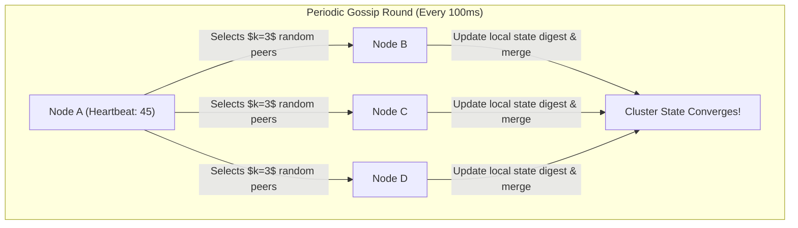
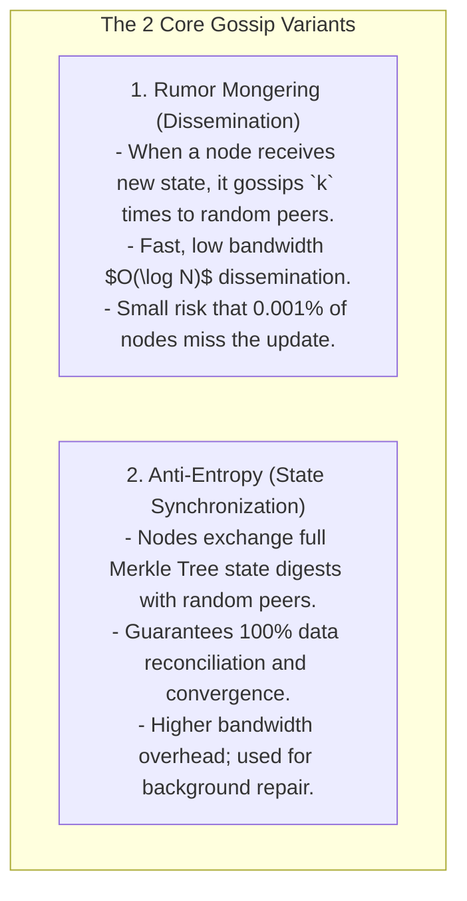

# Gossip Protocol — Epidemic Dissemination and Peer-to-Peer Membership

## Mental Model

Think of the **Gossip Protocol** as an office rumor spreading rapidly through a company cafeteria during lunch. 

Instead of an executive standing on a stage with a megaphone to announce news (**Centralized Master Broadcast / Single Point of Failure**), every employee periodically turns to $k$ random coworkers and whispers the latest rumor (**Random Peer-to-Peer UDP Gossip**). 

Within a few seconds, the information spreads exponentially across 10,000 employees (**$O(\log N)$ Epidemic Convergence**). Even if 50% of the employees leave the building (**Node Crashes / Network Partitions**), the rumor still reaches every remaining active employee!

---

## 1. Gossip Protocol Mechanics & Mathematical Bounds

Every node $P_i$ in a cluster of $N$ nodes executes a periodic background ticker (e.g. every $100\text{ms}$). It selects $k$ random peer nodes (typically $k=3$) and transmits its local state digest via lightweight **UDP packets**.



### Mathematical Bounds of Epidemic Gossip:
For a cluster of $N$ nodes gossiping with fanout $k$:
- **Convergence Time:** Information reaches 100% of healthy nodes in **$O(\log N)$ rounds**.
- **Message Overhead per Node:** $O(k)$ constant overhead per round, completely independent of total cluster size $N$!
- **Fault Tolerance:** Tolerates up to **50%+ packet loss** and node failures without halting propagation.

---

## 2. Gossip Modes: Anti-Entropy vs. Rumor Mongering



---

## 3. Failure Detection via Heartbeat Generation Counters

How does Gossip detect that a node has crashed without a centralized master node?

Each node maintains a **Heartbeat Generation Counter** in its local membership table:

```text
Local Membership Table at Node A:
+---------+-------------------+--------------------+----------------+
| Node ID | Heartbeat Counter | Local System Time  | Status         |
+---------+-------------------+--------------------+----------------+
| Node B  | 10452             | 10:00:00.100       | ALIVE          |
| Node C  | 9812              | 10:00:00.100       | ALIVE          |
| Node D  | 4120              | 10:00:00.100       | SUSPECT (6s)   |
+---------+-------------------+--------------------+----------------+
```

### Failure Detection Rules:
1. Every round, Node D increments its own counter ($4120 \to 4121$) and gossips its table.
2. If Node A does not see Node D's counter increment for $T_{\text{fail}} = 6\text{ seconds}$, Node A marks Node D as **SUSPECT**.
3. If Node D's counter remains unchanged for $T_{\text{cleanup}} = 12\text{ seconds}$, Node A marks Node D as **DEAD** and evicts it from cluster membership.

---

## 4. Production Code Implementation (Java: Gossip Simulator)

```java
package com.lld.gossip;

import java.util.*;
import java.util.concurrent.ConcurrentHashMap;
import java.util.concurrent.ThreadLocalRandom;

public class GossipNode {
    private final String nodeId;
    private final Map<String, Integer> heartbeats = new ConcurrentHashMap<>();
    private final Map<String, Long> lastSeenTimestamps = new ConcurrentHashMap<>();
    private final List<GossipNode> clusterNodes = new ArrayList<>();

    public GossipNode(String nodeId) {
        this.nodeId = nodeId;
        this.heartbeats.put(nodeId, 0);
        this.lastSeenTimestamps.put(nodeId, System.currentTimeMillis());
    }

    public void registerClusterNodes(List<GossipNode> nodes) {
        this.clusterNodes.addAll(nodes);
    }

    // Executed every Gossip Round (e.g. 100ms)
    public void gossipRound() {
        // Increment self heartbeat
        heartbeats.put(nodeId, heartbeats.get(nodeId) + 1);
        lastSeenTimestamps.put(nodeId, System.currentTimeMillis());

        // Select k=2 random peers
        List<GossipNode> targets = selectRandomPeers(2);
        for (GossipNode target : targets) {
            target.receiveGossip(this.nodeId, new HashMap<>(this.heartbeats));
        }
    }

    // Merge incoming gossip digest
    public synchronized void receiveGossip(String senderId, Map<String, Integer> incomingHeartbeats) {
        long now = System.currentTimeMillis();
        for (Map.Entry<String, Integer> entry : incomingHeartbeats.entrySet()) {
            String peerId = entry.getKey();
            int incomingHb = entry.getValue();
            int localHb = heartbeats.getOrDefault(peerId, 0);

            if (incomingHb > localHb) {
                heartbeats.put(peerId, incomingHb);
                lastSeenTimestamps.put(peerId, now);
            }
        }
    }

    private List<GossipNode> selectRandomPeers(int k) {
        List<GossipNode> pool = new ArrayList<>(clusterNodes);
        pool.remove(this);
        Collections.shuffle(pool);
        return pool.subList(0, Math.min(k, pool.size()));
    }

    public Map<String, Integer> getHeartbeats() { return heartbeats; }
    public String getNodeId() { return nodeId; }
}
```

---

## 5. Failure Modes and Trade-offs

1. **Gossip Network Flood Overhead** — Setting gossip fanout $k$ too high or ticker interval too low ($10\text{ms}$). UDP packet transmission saturates network bandwidth. *Mitigation*: Use $k=3$ fanout and 100ms-1s ticker intervals; transmit state digests using Merkle Trees.
2. **False-Positive Node Failure Evictions** — A transient 7-second GC pause on Node D causes all nodes to mark Node D as DEAD. When Node D resumes, it is rejected by the cluster. *Mitigation*: Use two-stage failure detection (**SUSPECT $\to$ DEAD**) or $\phi$-Accrual Failure Detector.
3. **Partitioned Cluster Split Digesting** — A network partition splits a 100-node cluster into two 50-node halves. Each half gossips within itself and marks the other 50 nodes DEAD. *Mitigation*: Integrate Gossip with **SWIM Protocol** indirect probing.

---

## 6. Active-Recall Prompts

1. **Why does Gossip Protocol achieve $O(\log N)$ epidemic convergence time across 10,000 nodes?**
2. **Compare Rumor Mongering (Dissemination) vs. Anti-Entropy (Merkle Tree Synchronization).**
3. **How does Heartbeat Generation Counter tracking detect node crashes without a central master node?**
4. **What is the difference between SUSPECT state and DEAD state in decentralized failure detection?**

---

## Related Notes

- [[SWIM Protocol - Scalable Weakly-Consistent Infection-Style Process Group Membership]]
- [[Byzantine Fault Tolerance - BFT, PBFT, and Nakamoto Consensus]]
- [[Distributed Leader Election - Bully Algorithm and Ring Algorithm]]
- [[Consistent Hashing - Hash Rings, Virtual Nodes, and Data Rebalancing]]

> **Interview Style Question:** *"Explain the Gossip Protocol for decentralized peer-to-peer cluster membership (used in Apache Cassandra and HashiCorp Consul). Prove $O(\log N)$ epidemic convergence bounds, contrast Rumor Mongering vs Anti-Entropy, demonstrate Heartbeat Generation Counter failure detection, and write a Java gossip simulator."*

---
