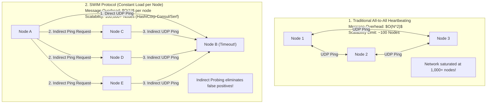
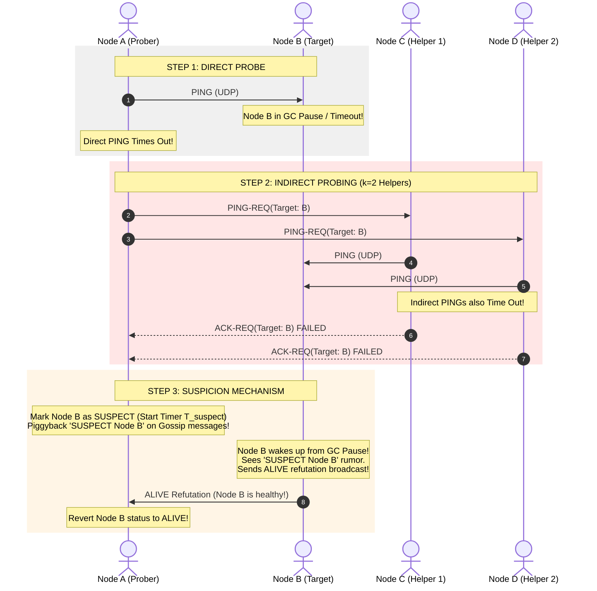

# SWIM Protocol — Scalable Weakly-Consistent Infection-Style Process Group Membership

## Mental Model

Think of the **SWIM Protocol (Structured Weakly-Consistent Infection-Style Process Group Membership)** as a high-efficiency health inspection team for a 10,000-node server cluster. 

Traditional heartbeating systems ($O(N^2)$ background network traffic) force every server to ping every other server, causing network congestion as cluster size scales. 

SWIM cuts network message overhead down to **$O(1)$ constant overhead per node**! A node periodically pings a single random peer via UDP (**Direct Probe**). If the peer fails to respond (due to a transient packet drop or local GC pause), instead of immediately declaring the peer dead (**False Positive Risk**), the node asks 3 intermediate peers to ping the target indirectly (**Indirect Probing**). If indirect probes also fail, the target enters a **Suspicion State** before being declared dead.

---

## 1. Traditional Heartbeating vs. SWIM Protocol Architecture

---

## 2. Step-by-Step SWIM Failure Detection & Suspicion Protocol

---

## 3. Key Mechanisms of SWIM

### A. Indirect Probing ($k$ Helpers)
If Node A's direct `PING` to Node B times out, Node A sends `PING-REQ(B)` to $k$ randomly chosen helper nodes (typically $k=3$). If ANY helper successfully reaches Node B and returns an `ACK` to Node A, Node B is marked **ALIVE**. This eliminates false positives caused by local network path degradation between Node A and Node B.

### B. Suspicion Mechanism (Self-Refutation)
Instead of transitioning directly from `ALIVE` to `DEAD`, SWIM introduces a **`SUSPECT`** state:
- When a node enters `SUSPECT`, a configurable timer $T_{\text{suspect}}$ begins.
- The `SUSPECT` state is gossiped across the cluster.
- If the target node is actually alive (e.g. just finished a GC pause), it receives the `SUSPECT` notification and broadcasts an **`ALIVE` Refutation** message, overriding the suspicion!
- If no `ALIVE` refutation is received before $T_{\text{suspect}}$ elapses, the node is marked **`DEAD`** and evicted.

### C. Piggybacking Dissemination
Rather than sending dedicated broadcast packets for membership changes, SWIM **piggybacks** membership updates (`JOIN`, `SUSPECT`, `DEAD`, `ALIVE`) onto standard `PING` and `ACK` packets, achieving zero extra network packet overhead!

---

## 4. Architectural Comparison: Traditional vs. Gossip vs. SWIM

| Property | All-to-All Heartbeat | Standard Gossip | SWIM Protocol |
|---|---|---|---|
| **Message Overhead / Node** | $O(N^2)$ (Heavy). | $O(k)$ per round. | **$O(1)$ Constant Overhead**. |
| **False-Positive Failure Rate** | High (Network jitter). | Moderate. | **Extremely Low** (Indirect Probing + Suspicion). |
| **Failure Detection Time** | Fast. | $O(\log N)$ rounds. | Expected $O(1)$ time ($O(\log N)$ worst case). |
| **Dissemination Mechanism** | Centralized / Multicast. | Epidemic Gossip. | **Piggybacked Opportunistic Gossip**. |
| **Industry Adoption** | Small legacy clusters. | Apache Cassandra. | **HashiCorp Consul, Serf, Nomad**. |

---

## 5. Failure Modes and Trade-offs

1. **Flapping Node Refutation Abuse** — A malfunctioning node intermittently crashes and wakes up every 10 seconds, constantly sending `ALIVE` refutations to override its `SUSPECT` state. The cluster never evicts the broken node. *Mitigation*: Track refutation counts; increase suspicion weight for nodes that refute repeatedly.
2. **Network Partition Split Membership** — A network switch cuts a 1,000-node cluster into two 500-node partitions. SWIM indirect probes fail across the boundary, causing both halves to mark the opposite 500 nodes as DEAD. *Mitigation*: Pair SWIM membership with **Consensus Quorum Engines (Raft/Etcd)** for cluster state mutations.
3. **Helper Node Co-location Failure** — All $k=3$ helper nodes selected for indirect probing happen to reside in the same failed rack as the target node. *Mitigation*: Enforce rack-aware/availability-zone-aware random helper selection.

---

## 6. Active-Recall Prompts

1. **How does SWIM achieve $O(1)$ constant message overhead per node compared to $O(N^2)$ all-to-all heartbeating?**
2. **Explain the 3 steps of SWIM Failure Detection (Direct Probe $\to$ Indirect Probing $\to$ Suspicion).**
3. **How does the Self-Refutation mechanism allow a node recovering from a GC pause to clear its own `SUSPECT` status?**
4. **What is Piggybacking in SWIM, and how does it disseminate membership updates with zero additional network packets?**

---

## Related Notes

- [[Gossip Protocol - Epidemic Dissemination and Peer-to-Peer Membership]]
- [[Byzantine Fault Tolerance - BFT, PBFT, and Nakamoto Consensus]]
- [[High Availability Architecture - SLAs, SLOs, Fault Tolerance, and High-9s Math]]
- [[User Datagram Protocol - UDP Architecture and Checksum]]

> **Interview Style Question:** *"Explain the SWIM Protocol (used in HashiCorp Consul/Serf) for scalable process group membership. Detail how Indirect Probing ($k$ helpers) eliminates false-positive node evictions, explain the Suspicion state self-refutation mechanism, prove $O(1)$ message overhead bounds, and demonstrate Piggybacked dissemination."*

---
