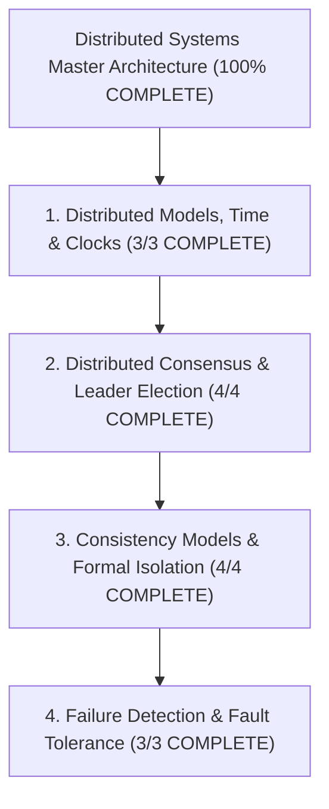

# Distributed Systems — Map of Content

> [!abstract] Architectural Mission
> This Map of Content organizes the complete **Distributed Systems** theory and protocols knowledge base. It covers logical clocks (Lamport Timestamps, Vector Clocks, Google TrueTime), distributed consensus algorithms (Paxos, Raft, Zab), formal consistency models (Linearizability, Serializability, PACELC Theorem), failure detection (Gossip Protocol, Swim), and Byzantine Fault Tolerance.

---

## 1. Distributed Models, Time & Clocks (3/3 COMPLETE)

- [x] [[Lamport Timestamps and Happened-Before Relation]]
- [x] [[Vector Clocks - Causal Ordering and Conflict Detection]]
- [x] [[Google TrueTime and Synchronized Atomic Clocks in Spanner]]

---

## 2. Distributed Consensus & Leader Election (4/4 COMPLETE)

- [x] [[Raft Consensus Algorithm - Leader Election, Log Replication, and Safety]]
- [x] [[Paxos Consensus Protocol - Basic Paxos, Multi-Paxos, and Proposers]]
- [x] [[ZooKeeper Atomic Broadcast (Zab) Protocol]]
- [x] [[Distributed Leader Election - Bully Algorithm and Ring Algorithm]]

---

## 3. Consistency Models & Formal Isolation (4/4 COMPLETE)

- [x] [[CAP Theorem vs. PACELC Theorem - Trade-offs and Proofs]]
- [x] [[Linearizability vs. Serializability - Formal Definitions and Differences]]
- [x] [[Eventual Consistency and Strong Eventual Consistency (CRDTs)]]
- [x] [[Causal Consistency and Read-Your-Writes Guarantees]]

---

## 4. Failure Detection & Fault Tolerance (3/3 COMPLETE)

- [x] [[Gossip Protocol - Epidemic Dissemination and Peer-to-Peer Membership]]
- [x] [[SWIM Protocol - Scalable Weakly-Consistent Infection-Style Process Group Membership]]
- [x] [[Byzantine Fault Tolerance - BFT, PBFT, and Nakamoto Consensus]]

---

*Last updated: 2026-08-18 | Status: COMPLETE (14 Canonical Notes + 1 MOC) | Subject 07 — Distributed Systems*
