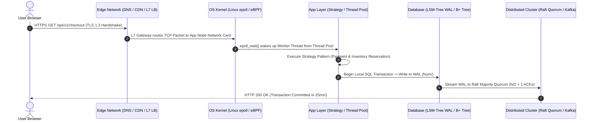
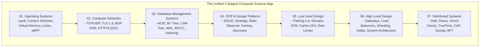

# Computer Science Master Cheat Sheet — Cross-Domain Engineering Synthesis

## Mental Model

Think of **Computer Science Cross-Domain Synthesis** as the master conductor of a 100-piece symphony orchestra. 

A junior developer sees software as isolated islands: an OS process here, a SQL query there, an HTTP packet over the wire, and a design pattern in code. 

A Principal Engineer understands the unified physical and logical thread linking all domains: when a user clicks a button in a browser, an HTTP/2 request (`Networking`) traverses L4/L7 load balancers and API gateways (`HLD`), triggers a thread context switch and non-blocking eBPF/epoll syscall (`Operating Systems`), executes a thread-safe Strategy pattern dispenser (`LLD`), modifies an LSM-tree WAL on disk (`DBMS`), publishes a Kafka event (`Messaging`), and achieves consensus via Raft majority quorums across atomic clock intervals (`Distributed Systems`).

---

## 1. The Full-Stack Execution Lifecycle (Click to Disk)

---

## 2. Universal Cross-Domain Trade-off Matrix

Every major decision in computer science is a trade-off across 4 fundamental axes: **Time (Latency)** vs. **Space (Memory)** vs. **Consistency** vs. **Complexity**.

| Architectural Problem | Trade-off Axis 1 | Trade-off Axis 2 | Dominant Solution & Industry Standard |
|---|---|---|---|
| **CPU Scheduling (OS)** | Process Context Switch Overhead | Thread Responsiveness & CPU Utilization | **Completely Fair Scheduler (CFS / Red-Black Tree)** |
| **I/O Multiplexing (OS)** | Blocking Thread-Per-Connection ($O(N)$ RAM) | Non-Blocking Event Loop ($O(1)$ Memory) | **epoll (Linux) / kqueue (BSD) / io_uring** |
| **Transport Reliability (CN)** | Connection Overhead & Latency (TCP 3-Way) | Raw Speed & Zero Retries (UDP) | **QUIC / HTTP/3 (UDP + TLS 1.3 + Multiplexing)** |
| **Database Storage (DBMS)** | Random Read Speed ($O(\log N)$ Point Read) | Sequential Write Ingestion Throughput | **B+ Tree (Reads) vs. LSM-Tree (Writes)** |
| **Design Patterns (LLD)** | Concrete Coupling & Monolithic `if/else` | Abstract Polymorphism & Extensibility | **Strategy / State / Factory Patterns** |
| **System Architecture (HLD)** | Real-Time Data Consistency (CP) | High Availability during Partitions (AP) | **CAP Theorem / PACELC Theorem** |
| **Distributed Consensus (DS)** | 2 RTT Consensus Overhead (Paxos) | 1 RTT Fast Log Replication | **Raft Consensus / Multi-Paxos** |

---

## 3. High-Frequency Interview Formula Cheat Sheet

### A. Capacity Estimation & Network Math
$$\text{Seconds in 1 Day} \approx \mathbf{10^5 \text{ (86,400)}}$$
$$\text{Average QPS} = \frac{\text{Daily Active Requests}}{10^5}$$
$$\text{Peak QPS} = \text{Average QPS} \times \mathbf{2 \text{ to } 5}$$
$$\text{Network Bandwidth (bits)} = \text{Bytes/sec} \times \mathbf{8}$$

### B. High Availability "Nines" Math
$$\text{Availability} = \frac{\text{MTBF}}{\text{MTBF} + \text{MTTR}}$$
- **99.9% (3 Nines):** Allowed Downtime = **8.76 hours / year**
- **99.99% (4 Nines):** Allowed Downtime = **52.6 minutes / year**
- **99.999% (5 Nines):** Allowed Downtime = **5.26 minutes / year**

### C. Quorum Consensus Math
$$\text{Read Quorum } (R) + \text{Write Quorum } (W) > \text{Replication Factor } (N) \implies \mathbf{\text{Strong Consistency!}}$$
$$\text{Majority Consensus } = \mathbf{\left\lfloor \frac{N}{2} \right\rfloor + 1} \quad (\text{Tolerates } f = \left\lfloor \frac{N-1}{2} \right\rfloor \text{ crash failures})$$
$$\text{Byzantine Quorum } = \mathbf{3f + 1} \quad (\text{Tolerates } f \text{ traitorous malicious nodes})$$

---

## 4. Architectural Pattern Mapping Across All 7 Subjects

---

## 5. Active-Recall Prompts

1. **Walk through the end-to-end full-stack lifecycle of an HTTP request from browser click to disk WAL flush.**
2. **What are the 3 Quorum Formulas ($R + W > N$, Majority $N/2+1$, Byzantine $3f+1$)?**
3. **Compare B+ Tree vs LSM-Tree storage engines across read latency and write ingestion throughput.**
4. **How do non-blocking OS I/O primitives (`epoll` / `io_uring`) power high-concurrency API Gateways (Envoy/Nginx)?**

---

## Related Notes

- [[System Design & Architecture Pattern Cheat Sheet]]
- [[Staff and Principal Engineer Interview Playbook - Leadership, Trade-offs, and Communication]]
- [[System Design Interview Framework - 4-Step Blueprint]]
- [[Computer Science Knowledge Base Master Index and Definition of Done Verification]]

> **Interview Style Question:** *"Demonstrate cross-domain engineering synthesis for a high-frequency trading platform handling 1,000,000 requests/sec. Trace the complete path across OS Kernel socket buffers (epoll), TCP/IP network tuning, zero-copy memory transfers, C++ thread-safe LLD concurrency patterns, LSM-Tree WAL disk persistence, Kafka message ingestion, and Raft consensus majority quorums."*

---
