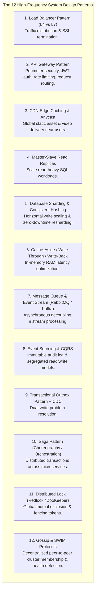

# System Design & Architecture Pattern Cheat Sheet

## Mental Model

Think of the **System Design & Architecture Pattern Cheat Sheet** as a master architect's structural engineering catalog. 

When presented with a high-level system design problem in a 45-minute interview, you do not invent architecture from scratch. Instead, you select and assemble proven, battle-tested architectural building blocks (**Load Balancers, API Gateways, Distributed Caching, Sharding, Message Queues, Event Sourcing, Consensus Rings**). 

Knowing the **exact trigger conditions, implementation mechanisms, and failure modes** for each architectural pattern allows you to design scalable, resilient systems with confidence under interview pressure.

---

## 1. Top 12 System Design Architectural Patterns



---

## 2. High-Frequency System Design Problem to Architectural Solution Matrix

| System Design Interview Problem | Core Architectural Building Blocks | Key Pattern Selection | Primary Failure Mode & Mitigation |
|---|---|---|---|
| **URL Shortener (TinyURL)** | API Gateway, Base62 Encoder, Distributed ID Generator, Redis Cache, NoSQL KV Store. | **Base62 over Snowflake ID + Cache-Aside** | Hash collision storm. *Fix*: Use Snowflake 64-bit integer IDs. |
| **Distributed Rate Limiter** | API Gateway, Redis Cluster, Atomic Lua Scripts, Consistent Hashing. | **Token Bucket / Sliding Window ZSET** | Race condition between `GET` and `INCR`. *Fix*: Execute atomic Redis Lua script. |
| **Web Crawler** | Seed URLs, URL Frontier, Bloom Filter, SimHash, Raw Storage. | **Priority & Politeness Queues + Bloom Filter** | Spider Traps & Infinite Redirects. *Fix*: Path depth limits (max 10) & length bounds. |
| **Notification Service** | API Gateway, Kafka Queues, Template Engine, Vendor Strategy Adapters, DLQ. | **Priority Queue Routing + Strategy Pattern** | Third-party vendor outage. *Fix*: Circuit Breakers & fallback backup vendors (Twilio $\to$ Plivo). |
| **Video Streaming (YouTube)** | Upload Gateway, AWS S3, Kafka, DAG Transcoding Cluster, CDN Edge Network. | **Adaptive Bitrate Streaming (HLS/DASH) + CDN Edge** | Thundering Herd Origin Collapse. *Fix*: Origin Shield & Request Collapsing. |
| **Ride-Sharing (Uber/Lyft)** | WebSocket Gateways, Kafka, Redis H3 Index, Match Engine, Surge Pricing Engine. | **Uber H3 Hexagonal Index + Redis Distributed Lock** | Double-booking drivers. *Fix*: Set atomic Redis lock key (`NX PX 15000`). |
| **News Feed (Twitter/X)** | API Gateway, Tweet DB, Kafka, Fanout Workers, Redis Timelines (`ZSET`). | **Hybrid Fanout (Push for regular, Pull for celebrities)** | Celebrity Fanout Avalanche. *Fix*: Bypass Push pipeline for users with $>10k$ followers. |
| **Real-Time Chat (WhatsApp)** | Stateful WebSocket Gateways, Redis Session Registry, Kafka, Cassandra DB, FCM/APNS. | **WebSockets + Cassandra LSM-Tree Log** | Disconnected session state desync. *Fix*: 30-second ping/pong heartbeats. |
| **Flash Sale (Amazon)** | CDN Edge, WAF, Virtual Waiting Room, Redis RAM Inventory, Kafka, SQL DB. | **Virtual Queue Ingress + Atomic Redis Lua Decrement** | Inventory Overselling & DB crash. *Fix*: Reserve stock strictly in Redis via Lua script. |
| **Collaborative Editor (Google Docs)** | WebSocket Gateways, Consistent Hashing Proxy, OT Server Engine, Redis Presence, Kafka. | **Operational Transformation (OT) / CRDTs** | Concurrent edit corruption. *Fix*: OT index transformation or CRDT positional IDs. |

---

## 3. The System Design Decision Flowchart

```mermaid
flowchart TD
    Start["New System Design Problem"] --> Q1{"Is the Workload Read-Heavy or Write-Heavy?"}
    
    Q1 -->|Read-Heavy (R:W >= 10:1)| ReadPath["1. Add Redis Distributed Cache (Cache-Aside)\n2. Add CDN Edge Caching for static assets\n3. Add Database Read Replicas"]
    
    Q1 -->|Write-Heavy (W:R >= 1:1)| WritePath["1. Use LSM-Tree Storage Engine (Cassandra/RocksDB)\n2. Implement Database Sharding (Consistent Hashing)\n3. Buffer Writes with Kafka Message Queues"]
    
    ReadPath & WritePath --> Q2{"Are Multi-Service Transactions Required?"}
    
    Q2 -->|YES| TxPath["Apply Saga Pattern (Orchestration) + Transactional Outbox Pattern"]
    Q2 -->|NO| SimplePath["Use Standard Local Database Transactions"]
    
    TxPath & SimplePath --> Q3{"Are Real-Time Bi-Directional Updates Needed?"}
    
    Q3 -->|YES| WSPath["Deploy Stateful WebSocket Gateways + Redis Session Registry"]
    Q3 -->|NO| RESTPath["Deploy Stateless REST / gRPC Microservices behind API Gateway"]
```

---

## 4. Active-Recall Prompts

1. **Which architectural patterns solve the Celebrity Fanout problem in Twitter/X feed generation?**
2. **How does an atomic Redis Lua script guarantee Zero Overselling in an E-Commerce Flash Sale?**
3. **What combination of storage engine (LSM-Tree) and protocol (WebSockets) is optimal for Real-Time Chat (WhatsApp)?**
4. **Compare Operational Transformation (OT) vs. CRDTs for real-time collaborative document editing.**

---

## Related Notes

- [[Computer Science Master Cheat Sheet - Cross-Domain Engineering Synthesis]]
- [[Staff and Principal Engineer Interview Playbook - Leadership, Trade-offs, and Communication]]
- [[System Design Interview Framework - 4-Step Blueprint]]
- [[Computer Science Knowledge Base Master Index and Definition of Done Verification]]

> **Interview Style Question:** *"Assemble a complete system architecture for a global food delivery platform (like DoorDash / UberEats). Select and justify your building blocks across API Gateway, Geohash Spatial Indexing, Master-Slave Read Replicas, Saga Orchestration for checkout, Redis Lua Rate Limiting, Kafka Notification Pipeline, and evaluate failure modes."*

---
