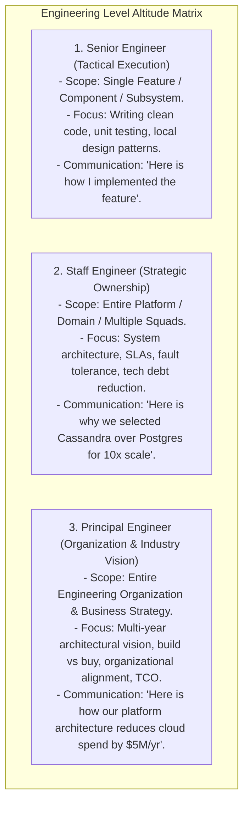
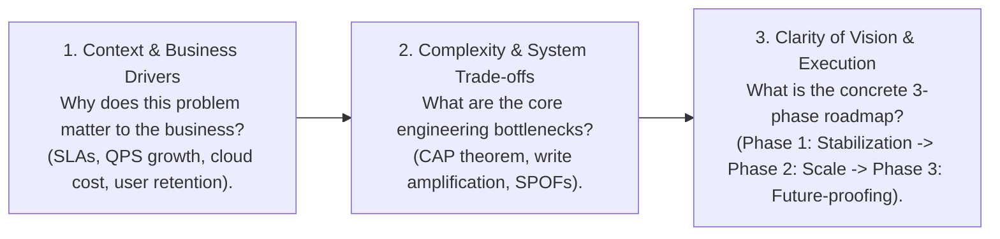

# Staff and Principal Engineer Interview Playbook — Leadership, Trade-offs, and Communication

## Mental Model

Think of a **Staff / Principal Engineer Interview** as a executive alignment meeting between a Chief Technology Officer and a newly hired VP of Engineering. 

A Senior Engineer focuses on **how** to write clean code, select design patterns, or draw database schemas. A Staff or Principal Engineer operates at a higher altitude, focusing on **why**: 

1. **Strategic Architecture:** Evaluating long-term business impact, engineering velocity, and total cost of ownership (TCO).
2. **Trade-off Rigor:** Uncompromisingly framing every decision as a explicit trade-off (CAP theorem, CAPEX vs OPEX, Build vs Buy).
3. **Cross-Functional Communication:** Translating complex technical risks into clear business metrics for non-technical executives.

---

## 1. The Senior vs. Staff vs. Principal Engineer Matrix



---

## 2. The Staff Engineer Communication Framework (The 3 Cs)

When answering architectural or system design questions at the Staff/Principal level, structure responses using **The 3 Cs Framework**:



---

## 3. Framing Architectural Decisions: Build vs. Buy & TCO Analysis

A Principal Engineer never reinvents the wheel without rigorous justification.

```mermaid
flowchart TD
    BuildBuy["Build vs. Buy Decision Engine"] --> Q1{"Is this technology a CORE COMPETITIVE ADVANTAGE for the business?"}
    
    Q1 -->|YES (e.g. Netflix Open Connect CDN)| Build["BUILD CUSTOM IN-HOUSE SOLUTION\n- Complete control over performance & cost.\n- High engineering maintenance overhead."]
    
    Q1 -->|NO (e.g. Identity Auth, Email Delivery)| Buy["BUY MANAGED SERVICE (SaaS / Cloud)\n- Rapid time-to-market, zero maintenance.\n- Higher unit cost (API subscription costs)."]
```

### Total Cost of Ownership (TCO) Formula
$$\mathbf{\text{TCO} = \text{Cloud Infrastructure Costs} + \text{Engineering Salary Maintenance Hours} + \text{Outage Downtime Risk Opportunity Cost}}$$

---

## 4. Driving Architectural Consensus & Managing Technical Debt

### The Technical Debt Quadrant (Fowler)
Staff Engineers categorize and remediate tech debt intentionally:

```text
                  RECKLESS                      PRUDENT
         +----------------------------+----------------------------+
         | "We don't have time for    | "We must ship now and      |
INADVERTENT| architecture or tests!"   | deal with consequences."   |
         +----------------------------+----------------------------+
         | "What is a design pattern?"| "Now we know how we should |
DELIBERATE |                            | have built it."            |
         +----------------------------+----------------------------+
```

### Remediating Technical Debt: The 20% Rule
Negotiate an explicit, non-negotiable **20% engineering capacity allocation** per sprint dedicated strictly to architectural refactoring, dependency upgrades, and tech debt remediation.

---

## 5. Failure Modes in Staff/Principal Interviews

1. **Jumping into Code Snippets Prematurely** — Starting to write Java code or raw SQL queries during an executive system design round instead of discussing high-level architecture, capacity math, and trade-offs. *Mitigation*: Remain at the architectural altitude (Step 1 & Step 2 of System Design Framework) unless explicitly asked for code.
2. **Dogmatic Architectural Bias** — Insisting that "NoSQL is always better than SQL" or "Microservices are always better than Monoliths". *Mitigation*: Demonstrate nuanced trade-offs (e.g., "Monoliths excel for early velocity; microservices solve organizational team coupling").
3. **Ignoring Cost and Operational Overhead** — Proposing a 500-node multi-region Spanner cluster for a startup handling 10 QPS, costing $100,000/month. *Mitigation*: Ground architectural proposals in realistic capacity estimations and TCO analysis.

---

## 6. Active-Recall Prompts

1. **Compare the altitude and scope of a Senior Engineer vs. a Staff Engineer vs. a Principal Engineer.**
2. **What are the 3 Cs of Staff Engineer communication (Context, Complexity, Clarity)?**
3. **Explain the Build vs. Buy decision framework and Total Cost of Ownership (TCO) formula.**
4. **How do you negotiate the 20% Engineering Capacity rule to remediate technical debt with product managers?**

---

## Related Notes

- [[System Design Interview Framework - 4-Step Blueprint]]
- [[Computer Science Master Cheat Sheet - Cross-Domain Engineering Synthesis]]
- [[System Design Incident Response and Disaster Recovery Framework]]
- [[Production Outage Case Studies - Post-Mortem Analysis & Lessons Learned]]

> **Interview Style Question:** *"You are interviewing for a Principal Architect role at an enterprise SaaS company. The CEO asks you to 'Migrate our 10-year-old monolithic relational database handling 500,000 QPS to a modern distributed microservices architecture'. Walk through your leadership playbook: state business context, execute Build vs Buy and TCO analysis, present a 3-phase zero-downtime migration roadmap (Strangler Fig Pattern), and remediate technical debt."*

---
