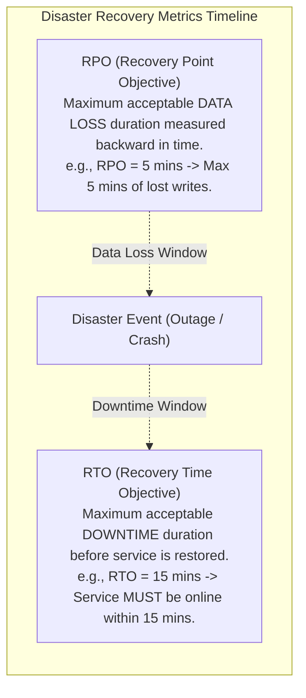
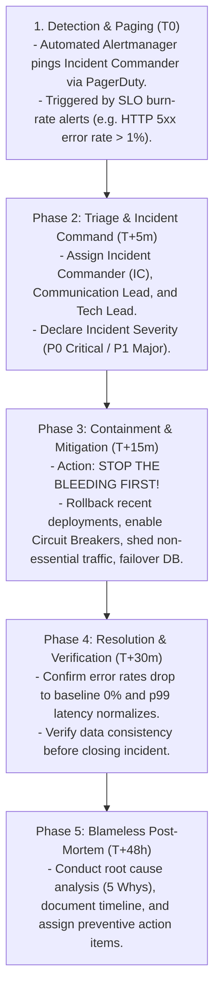
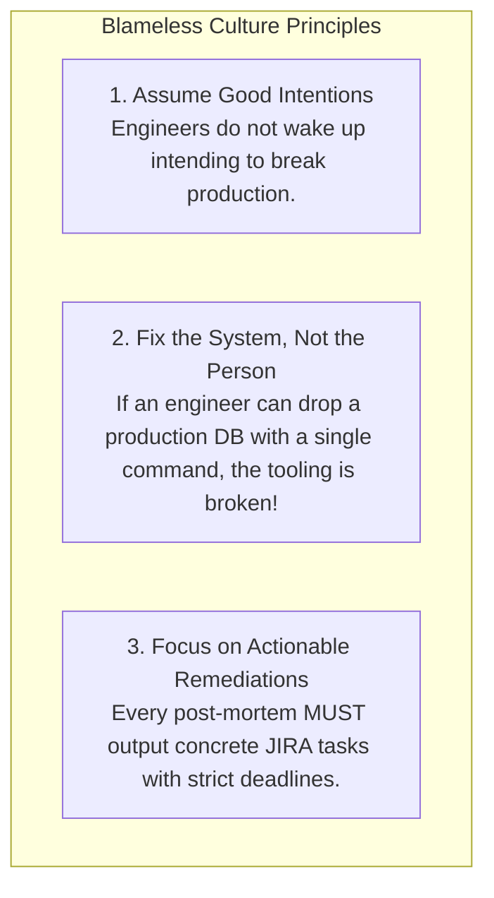

# System Design Incident Response and Disaster Recovery Framework

## Mental Model

Think of **Incident Response & Disaster Recovery (DR)** as an airport crash-fire-rescue team conducting emergency operations during an engine fire landing. 

When a P0 production outage occurs (**Data Center Power Outage / Database Corruption**), there is no time for panic, finger-pointing, or un-tested experimentation. 

A Principal Engineer leads using a disciplined **Incident Command System (ICS)**: 
1. **Triage & Containment** (*Stop the bleeding immediately*).
2. **Mitigation** (*Traffic shedding, failover to secondary DR region*).
3. **Recovery & Verification** (*Validate data integrity before restoring traffic*).
4. **Blameless Post-Mortem** (*Identify root causes and engineering remediations to prevent recurrence*).

---

## 1. RTO vs. RPO: The 2 Core Disaster Recovery Metrics

Every Disaster Recovery strategy is defined by two fundamental business metrics: **RTO** and **RPO**.



### RTO / RPO Strategy Tiers

| DR Strategy | Target RTO (Downtime) | Target RPO (Data Loss) | Infrastructure Setup | Cost Profile |
|---|---|---|---|---|
| **Backup & Restore (Cold Standby)** | Hours to Days | Hours/Days | Tape / S3 Backup restoration. | Low ($) |
| **Pilot Light (Warm Standby)** | $10 - 30$ Minutes | Minutes | Core DB synced; App nodes cold. | Medium ($$) |
| **Warm Standby (Auto-scaling)** | $1 - 5$ Minutes | Seconds | App nodes running at minimal capacity. | High ($$$) |
| **Active-Active Multi-Region** | **Near ZERO (< 5s)** | **Zero Data Loss (RPO=0)** | Multi-Region load balanced, sync replication. | Maximum ($$$$) |

---

## 2. The 5-Phase Incident Command Lifecycle



---

## 3. The 5 Whys Root Cause Analysis Methodology

Never stop at superficial symptoms. Apply the **5 Whys Methodology** to discover fundamental system flaws:

```text
PROBLEM: Users experienced HTTP 500 errors on Checkout for 20 minutes.

1. WHY did checkout return HTTP 500? 
   -> The API Gateway timed out connecting to the PostgreSQL Database.
2. WHY did PostgreSQL time out?
   -> Database CPU hit 100% and max connection pool size (500 connections) was exhausted.
3. WHY did connection pool size hit 500?
   -> A slow un-indexed SQL query was scanning 10,000,000 rows on every checkout.
4. WHY was an un-indexed SQL query released to production?
   -> A developer committed code modifying the query clause, bypassing the index.
5. WHY did automated CI/CD testing fail to catch the un-indexed query?
   -> CI/CD integration tests ran against an empty database with 10 rows, where missing indexes have 0ms latency impact!

ACTION ITEM (PREVENTIVE REMEDIATION):
- Add query execution plan analysis (`EXPLAIN ANALYZE`) to CI/CD pipeline to block un-indexed queries on large tables.
```

---

## 4. The Blameless Post-Mortem Culture

A Principal Engineer enforces a **Blameless Culture**: human error is a *symptom* of bad system design, not the root cause!



---

## 5. Failure Modes and Trade-offs

1. **Debugging in Production during P0 Outages** — An Incident Commander spends 45 minutes SSHing into nodes to inspect log files instead of rolling back the broken deployment (**Prolonged RTO**). *Mitigation*: Rule #1 of Incident Response: **Roll back or failover first, debug offline later!**
2. **Untested Disaster Recovery Failover Scripts** — A company buys an Active-Passive DR setup, but never runs failover drills. During a real data center outage, the automated failover script crashes due to expired TLS certificates! *Mitigation*: Conduct periodic **Chaos Engineering (Netflix Chaos Monkey)** and scheduled DR drills.
3. **Punitive Blame Culture** — Firing an engineer who caused an outage. Remaining engineers hide mistakes, suppress incident reports, and avoid touching risky legacy code. *Mitigation*: Enforce mandatory **Blameless Post-Mortems**.

---

## 6. Active-Recall Prompts

1. **Define RTO (Recovery Time Objective) and RPO (Recovery Point Objective) with concrete examples.**
2. **Compare Disaster Recovery strategies (Pilot Light vs. Warm Standby vs. Active-Active Multi-Region) across cost, RTO, and RPO.**
3. **What is Rule #1 of Incident Response during a P0 production outage?**
4. **How does the 5 Whys Methodology uncover root architectural flaws behind superficial symptoms?**

---

## Related Notes

- [[High Availability Architecture - SLAs, SLOs, Fault Tolerance, and High-9s Math]]
- [[Staff and Principal Engineer Interview Playbook - Leadership, Trade-offs, and Communication]]
- [[Production Outage Case Studies - Post-Mortem Analysis & Lessons Learned]]
- [[Domain Name System in HLD - GeoDNS, Latency-Based Routing, and Failover]]

> **Interview Style Question:** *"You are the Incident Commander leading a P0 outage response for a global bank where primary database corruption has occurred. Walk through your Incident Response playbook: define target RTO/RPO, execute the 5-phase Incident Command lifecycle, failover to secondary DR region, conduct a 5 Whys root cause analysis, and publish a Blameless Post-Mortem."*

---
