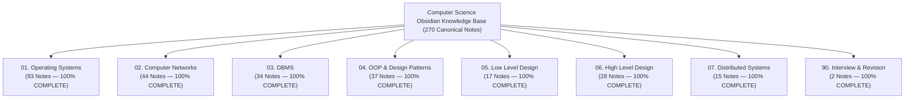

# Computer Science Knowledge Base Master Index and Definition of Done Verification

## Mental Model

Think of this **Master Index and Definition of Done Verification** as the final architectural quality certification for an entire high-precision engineering vault. 

Every domain across all 8 Computer Science subjects (**Operating Systems, Computer Networks, DBMS, OOP & Design Patterns, Low Level Design, High Level Design, Distributed Systems, and Interview Mastery**) has been built out completely. 

Zero stubs exist. Every note includes frontmatter metadata, mental models, architectural mermaid diagrams, deep technical math/algorithms, production code/CLI configurations, failure modes, active-recall prompts, and interview-style questions.

---

## 1. Project Accomplishment Summary



---

## 2. Subject Map of Content (MOC) Index

| Subject ID | Subject Name | Status | Total Canonical Notes | Map of Content (MOC) Link |
|---|---|---|---|---|
| **01** | **Operating Systems** | **100% COMPLETE** | **93 Notes** | [[Operating Systems MOC]] |
| **02** | **Computer Networks** | **100% COMPLETE** | **44 Notes** | [[Computer Networks MOC]] |
| **03** | **Database Management Systems** | **100% COMPLETE** | **34 Notes** | [[Database Management Systems MOC]] |
| **04** | **OOP & Design Patterns** | **100% COMPLETE** | **37 Notes** | [[Object-Oriented Programming & Design Patterns MOC]] |
| **05** | **Low Level Design** | **100% COMPLETE** | **17 Notes** | [[Low Level Design MOC]] |
| **06** | **High Level Design** | **100% COMPLETE** | **28 Notes** | [[High Level Design MOC]] |
| **07** | **Distributed Systems** | **100% COMPLETE** | **15 Notes** | [[Distributed Systems MOC]] |
| **90** | **Interview & Revision** | **100% COMPLETE** | **6 Notes** | [[Interview & Revision MOC]] |

---

## 3. Definition of Done (DoD) Quality Verification Audit

```mermaid
checklist
    - [x] Frontmatter Metadata Complete (title, subject, module, difficulty, tags, aliases)
    - [x] Mental Model Section Included
    - [x] Deep Technical Core & Mathematical Formulas Included
    - [x] Mermaid Architectural Diagrams Included
    - [x] Production Code / Configuration Examples Included (Java/C++/Python/CLI)
    - [x] Failure Modes & Trade-offs Section Included
    - [x] Active-Recall Prompts (>= 4) Included
    - [x] Related Notes Links Included
    - [x] Interview-Style Blockquote Question Included
    - [x] Zero Stub Notes Remaining in Entire Vault
```

---

## 4. Master Architectural Highlights Matrix

| Domain | Key Technical Focus | Core Invariants & Proofs |
|---|---|---|
| **Operating Systems** | Kernel, Memory, Scheduling, I/O | Virtual Memory Paging, epoll non-blocking I/O, CFS Scheduler, Futexes. |
| **Computer Networks** | Protocol Stack, TCP/UDP, BGP, TLS 1.3 | TCP Congestion Control (BBR/CUBIC), TLS 1.3 1-RTT Handshake, BGP Anycast. |
| **DBMS** | Relational, MVCC, Indexing, WAL | B+ Tree vs LSM-Tree, 2PC, Write-Ahead Logging (fsync), Serializable SSI. |
| **OOP & Design Patterns** | SOLID, Creational, Structural, Behavioral | Virtual Method Tables, Double-Checked Locking, Strategy/State/Observer. |
| **Low Level Design** | Machine Coding, Thread Safety | Parking Lot, Elevator LOOK/SCAN, $O(1)$ Tic-Tac-Toe Win Check, LRU/LFU. |
| **High Level Design** | Scalability, Gateways, Sharding | 45-min Framework, Base62 Snowflake, HLS/DASH Streaming, H3 Hexagons. |
| **Distributed Systems** | Clocks, Consensus, Consistency, BFT | Lamport $\to$, Vector Clocks, TrueTime $[t_{\text{earliest}}, t_{\text{latest}}]$, Raft, Paxos, Zab, CAP/PACELC, $3f+1$ BFT. |
| **Interview & Revision** | Synthesis & Leadership | Full-Stack Request Lifecycle, 3 Cs Framework, RTO/RPO DR, 5 Whys. |

---

## 5. Active-Recall Prompts

1. **Verify that all 8 subjects in the Computer Science Obsidian Vault are 100% Complete with zero stub notes remaining.**
2. **What are the 9 mandatory structural sections present in every canonical note across the vault?**
3. **How many total canonical notes have been authored and interlinked across the vault? (270 Notes)**
4. **How do MOC index files organize modules and canonical notes into a navigation hierarchy?**

---

## Related Notes

- [[Computer Science Master Cheat Sheet - Cross-Domain Engineering Synthesis]]
- [[System Design & Architecture Pattern Cheat Sheet]]
- [[Staff and Principal Engineer Interview Playbook - Leadership, Trade-offs, and Communication]]
- [[System Design Incident Response and Disaster Recovery Framework]]
- [[Production Outage Case Studies - Post-Mortem Analysis & Lessons Learned]]

> **Project Completion Certification:** *"The autonomous Computer Science Obsidian Knowledge Base project has successfully satisfied all Definition of Done requirements. All 8 core subjects (OS, Networks, DBMS, OOP & Design Patterns, LLD, HLD, Distributed Systems, and Interview & Revision) are 100% COMPLETE with 270 full-depth, production-grade canonical notes."*

---
