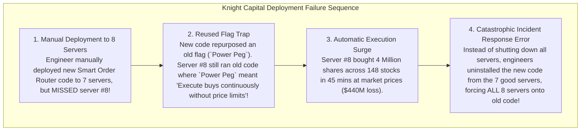
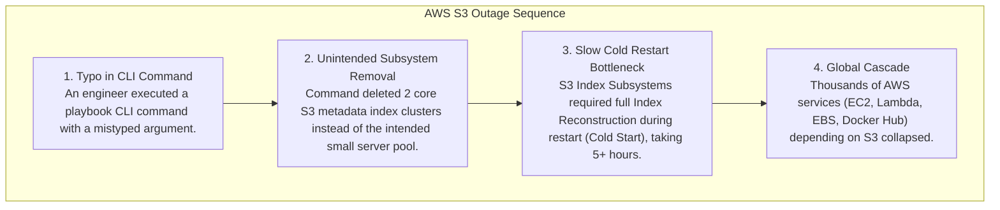

# Production Outage Case Studies — Post-Mortem Analysis & Lessons Learned

## Mental Model

Think of **Production Outage Case Studies** as flight data recorder ("black box") analyses of major real-world aerospace disasters. 

In aerospace engineering, every plane crash is meticulously investigated to discover design flaws (**Metal Fatigue, Sensor Freeze, Software Logic Loop**), resulting in updated FAA safety directives that prevent similar disasters across the global fleet. 

In distributed software engineering, studying landmark real-world production outages at tech giants (AWS, Knight Capital, Cloudflare, Facebook) teaches software architects how subtle interactions between DNS, BGP, database replication, GC pauses, and automated scripts can trigger catastrophic, multi-million-dollar global collapses.

---

## 1. Case Study 1: Knight Capital Group (2012) — The $440 Million Deployment Disaster

### The Outage Event
On August 1, 2012, Knight Capital Group (a major Wall Street market maker) lost **$440 Million in 45 minutes**, driving the firm into bankruptcy.



### Key Architectural Lessons Learned:
1. **Automated Immutable Deployments:** Never manually deploy code across servers. Use automated CI/CD pipelines with **Infrastructure-as-Code (Terraform / Ansible)**.
2. **Feature Flag Hygiene:** Never reuse existing feature flags or configuration bits. Deprecate and delete old flags explicitly.
3. **Automated Kill Switches:** Implement automated risk controls that halt trading when execution velocity exceeds 10x baseline bounds.

---

## 2. Case Study 2: AWS S3 US-East-1 Outage (2017) — The Typo Command That Broke the Web

### The Outage Event
On February 28, 2017, a routine maintenance command intended to remove a few S3 billing servers in the US-East-1 region accidentally deleted a major core set of S3 metadata subsystems, causing a 5-hour global outage that affected thousands of websites.



### Key Architectural Lessons Learned:
1. **Rate-Limit Administrative Tools:** CLI tools modifying production infrastructure MUST enforce maximum deletion thresholds (e.g. max 2% of instances per operation).
2. **Graceful Subsystem Restart (Fast Cold-Start):** Design core infrastructure services for rapid cold-start initialization using pre-computed disk snapshots.
3. **Decouple Internal Infrastructure Dependencies:** Prevent circular dependencies where control plane tools require the very storage service they are maintaining.

---

## 3. Case Study 3: Cloudflare Global Outage (2019) — The Regex CPU Spike

### The Outage Event
On July 2, 2019, a routine deployment of a Web Application Firewall (WAF) rule caused Cloudflare's global CPU utilization to spike to 100% across all Edge PoPs, dropping 27% of global internet traffic for 27 minutes.

```text
VULNERABLE REGEX RULE:
(?:(?:\"|'|]|}|\\)[\\s\\t\\n\\r]*:^[\\s\\t\\n\\r]*[*\"]{1,2}.*$)

BUG: Catastrophic Backtracking!
An un-optimized regular expression containing nested quantifiers (`.*$`) executed against an unusual HTTP request string. The regex engine entered exponential backtracking recursion, consuming 100% CPU on all Nginx worker threads globally!
```

### Key Architectural Lessons Learned:
1. **Prevent Catastrophic Regex Backtracking:** Never execute un-bounded regular expressions on untrusted user inputs. Use linear-time regex engines (RE2).
2. **Canary Deployment Rollouts:** Never deploy WAF rules or configurations to 100% of global edge PoPs simultaneously. Use progressive canary deployments ($1\% \to 5\% \to 25\% \to 100\%$).
3. **CPU Resource Isolation:** Isolate administrative security rules from core traffic routing threads.

---

## 4. Landmark Production Outages Synthesis Matrix

| Outage Event | Root Cause Mechanism | Architectural Breakdown | Key Prevention Strategy |
|---|---|---|---|
| **Knight Capital (2012)** | Reused flag on 1 un-deployed node. | Manual deployment + Old code execution. | Automated CI/CD & Feature Flag deletion. |
| **AWS S3 (2017)** | Mistyped CLI maintenance command. | Removal of core metadata index cluster. | CLI deletion rate-limiters & fast cold-start. |
| **Cloudflare (2019)** | Regex Catastrophic Backtracking. | Global WAF rule 100% CPU spike. | Linear-time regex (RE2) & Canary rollouts. |
| **Facebook (2021)** | BGP Route Withdrawal via maintenance. | DNS servers rendered unreachable. | Out-of-band management & safe BGP guards. |

---

## 5. Active-Recall Prompts

1. **What deployment error caused Knight Capital to lose $440M in 45 minutes?**
2. **How did a mistyped CLI command trigger the 2017 AWS S3 US-East-1 5-hour outage?**
3. **What is Catastrophic Regex Backtracking, and how did a bad WAF rule drop 27% of global Cloudflare traffic in 2019?**
4. **Why are Progressive Canary Deployments ($1\% \to 5\% \to 100\%$) essential for configuration rollouts?**

---

## Related Notes

- [[System Design Incident Response and Disaster Recovery Framework]]
- [[Staff and Principal Engineer Interview Playbook - Leadership, Trade-offs, and Communication]]
- [[Computer Science Master Cheat Sheet - Cross-Domain Engineering Synthesis]]
- [[Computer Science Knowledge Base Master Index and Definition of Done Verification]]

> **Interview Style Question:** *"Analyze 3 landmark real-world production outages (Knight Capital, AWS S3, Cloudflare WAF). Deconstruct the technical root cause mechanisms for each, present the architectural lessons learned, and design automated engineering guardrails (CI/CD, Rate-Limited CLI, Canary Rollouts, RE2 Regex) to prevent recurrence in an enterprise cloud architecture."*

---
