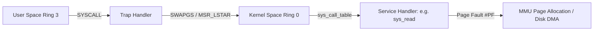
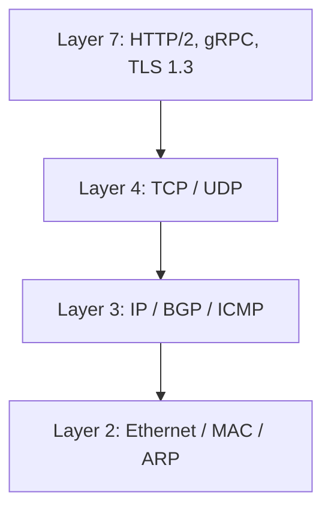
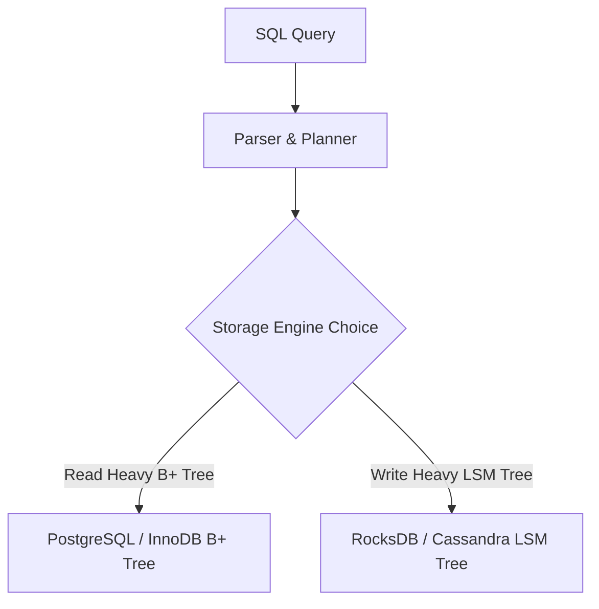
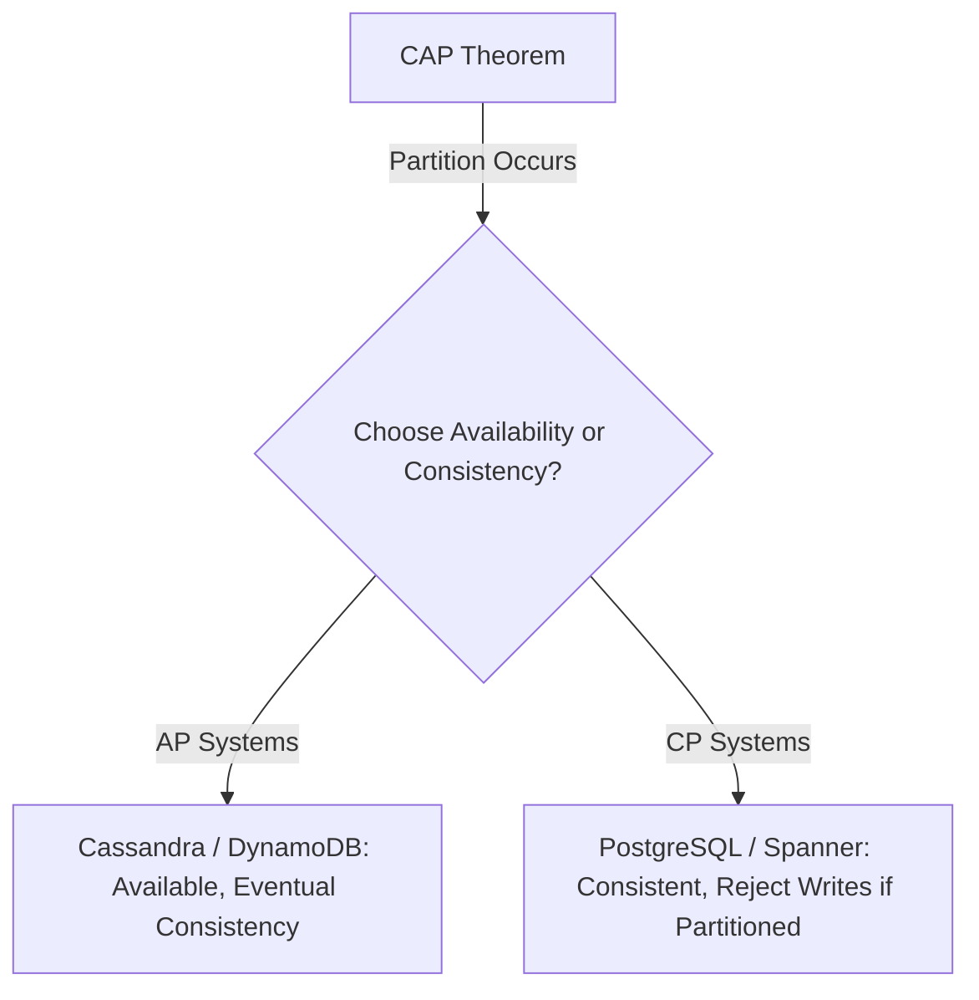

# Computer Science Rapid Revision Guide

> [!abstract] Mental Model
> The ultimate rapid review matrix for core computer science engineering concepts, consolidating key algorithms, data structure trade-offs, operating system primitives, networking protocol layers, database internals, low-level design patterns, and high-level distributed systems trade-offs into high-density reference tables.

---

## 1. Operating Systems & Kernel Core Cheat Sheet

### Essential OS Concepts Summary

| Concept | Key Mechanics | Trade-offs / Complexity | Core Production Keywords |
| :--- | :--- | :--- | :--- |
| **Process vs Thread** | Process has isolated Virtual Address Space (MMU page table); Threads share heap/data segment, have private stacks. | Process context switch incurs TLB flush (~1-2µs); Thread context switch keeps TLB active (~100ns). | `PCB`, `Task_struct`, `TLB Flush`, `Copy-on-Write` |
| **Mutex vs Spinlock** | Mutex puts waiting thread to sleep (`futex` schedule away); Spinlock busy-waits in a CPU loop (`PAUSE` instruction). | Spinlock low latency if lock held < 1µs, but burns 100% CPU; Mutex avoids CPU waste but has context switch overhead. | `Futex`, `CAS`, `Priority Inversion`, `RAII` |
| **Paging & TLB** | Virtual addresses translated to Physical frames via multi-level Page Tables (PML4); TLB caches translations. | TLB miss adds 4 memory references; Page faults incur disk I/O if page evicted to swap. | `CR3 Register`, `Page Fault #PF`, `Hugepages`, `CoW` |
| **CPU Scheduling** | Linux CFS (Completely Fair Scheduler) uses Red-Black Tree indexed by `vruntime`. | $O(\log N)$ task selection; prioritizes I/O bound interactive tasks over CPU bound tasks. | `vruntime`, `Nice Value`, `Preemption`, `Context Switch` |

---

## 2. Computer Networks & Protocols Cheat Sheet

### Networking Core Protocol Matrix

| Protocol / Layer | Primary Purpose | Key Features & Algorithms | Performance Benchmark |
| :--- | :--- | :--- | :--- |
| **TCP (Layer 4)** | Reliable, ordered, flow-controlled stream transport | 3-Way Handshake, Sliding Window, Congestion Control (CUBIC/BBR) | 1 RTT connection setup; head-of-line blocking on loss |
| **UDP (Layer 4)** | Connectionless, low-latency datagram transport | No handshake, no retransmission, header size only 8 bytes | 0 RTT setup; used by QUIC / HTTP/3, DNS, VoIP |
| **TLS 1.3 (Layer 7/Sec)** | Encrypted, authenticated end-to-end transport security | Diffie-Hellman (ECDHE) key exchange, AES-GCM symmetric encryption | 1 RTT handshake (0-RTT resumption supported) |
| **DNS (Layer 7)** | Hierarchical domain name to IP address mapping | UDP port 53, recursive vs iterative querying, Caching TTL | Typically 10-50ms query latency; cached locally |

---

## 3. Database Management Systems (DBMS) Cheat Sheet

### Storage Engines & Isolation Levels

| Component / Concept | Mechanics | Ideal Use Case | Failure / Anomaly Risks |
| :--- | :--- | :--- | :--- |
| **B+ Tree Index** | Balanced tree with data pointers in leaf nodes; fan-out 100-1000. | Range queries, exact point lookups ($O(\log_B N)$). | Write amplification, random disk writes |
| **LSM Tree** | Append-only MemTable (RAM) $\rightarrow$ WAL $\rightarrow$ SSTables (Disk) with Compaction. | Extremely high write throughput workloads. | Read amplification, compaction CPU spikes |
| **MVCC** | Tuple versioning (`xmin`, `xmax`); readers do not block writers. | High concurrency multi-user relational databases. | Dead tuples, VACUUM table bloat |
| **WAL & ARIES** | Append changes to WAL log before modifying RAM buffer pages. | Guarantees ACID Durability across crashes. | `fsync` disk I/O stalls |

---

## 4. High-Level System Design & Architecture Cheat Sheet

### Core Distributed Systems Theorems

| Pattern / Theorem | Core Principle | Popular Technologies | Key Trade-off |
| :--- | :--- | :--- | :--- |
| **CAP Theorem** | In a network partition (P), choose Availability (A) or Consistency (C). | Cassandra (AP), ZooKeeper (CP) | Strict consistency vs zero downtime |
| **PACELC Theorem** | Else (if no partition), trade off Latency (L) vs Consistency (C). | DynamoDB, Redis, Spanner | Read latency vs read freshness |
| **Consistent Hashing** | Map nodes & keys to $2^{32}-1$ ring using hash functions & virtual nodes. | DynamoDB, Ketama, Cassandra | Minimal key remapping during scale out ($1/N$) |
| **Distributed Consensus** | Raft / Paxos replicated state machine for leader election & log replication. | etcd, Consul, CockroachDB | Requires quorum majority ($2f+1$ nodes) |

---

## Active Recall Quick Fire

1. **OS**: What is the difference between a HardIRQ and a SoftIRQ?
   - *Answer*: HardIRQ interrupts CPU execution immediately to copy data from hardware into kernel memory; SoftIRQ handles deferred processing (like TCP stack execution) asynchronously.
2. **Networking**: What causes Head-of-Line (HoL) blocking in HTTP/2?
   - *Answer*: HTTP/2 multiplexes multiple streams over a single TCP connection. If one TCP packet is dropped, TCP halts all streams until the missing packet is retransmitted.
3. **DBMS**: What is the write amplification difference between B+ Trees and LSM Trees?
   - *Answer*: B+ Trees update whole 8KB/16KB pages on disk even for 1-byte edits; LSM Trees append sequential logs and compact SSTables in background, incurring lower initial write amplification.

---

## Related Notes
- [[00 - Computer Science MOC|Master MOC]]
- [[Operating Systems MOC|01 - Operating Systems]]
- [[Computer Networks MOC|02 - Computer Networks]]
- [[Database Management Systems MOC|03 - DBMS]]
- [[High Level Design MOC|06 - High Level Design]]
- [[System Design Interview Blueprint|System Design Interview Blueprint]]
