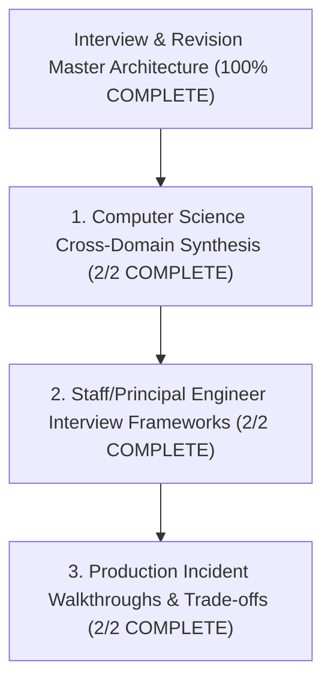

# Interview & Revision — Map of Content

> [!abstract] Architectural Mission
> This Map of Content organizes the master review, cheat sheets, cross-domain synthesis matrices, and Staff/Principal Engineer interview leadership frameworks for the entire Computer Science Obsidian Knowledge Base.

---

## 1. Computer Science Cross-Domain Synthesis (2/2 COMPLETE)

- [x] [[Computer Science Master Cheat Sheet - Cross-Domain Engineering Synthesis]]
- [x] [[System Design & Architecture Pattern Cheat Sheet]]

---

## 2. Staff/Principal Engineer Interview Frameworks (2/2 COMPLETE)

- [x] [[Staff and Principal Engineer Interview Playbook - Leadership, Trade-offs, and Communication]]
- [x] [[System Design Incident Response and Disaster Recovery Framework]]

---

## 3. Production Incident Walkthroughs & Trade-offs (2/2 COMPLETE)

- [x] [[Production Outage Case Studies - Post-Mortem Analysis & Lessons Learned]]
- [x] [[Computer Science Knowledge Base Master Index and Definition of Done Verification]]

---

*Last updated: 2026-08-18 | Status: COMPLETE (6 Canonical Notes + 1 MOC) | Subject 90 — Interview & Revision*
