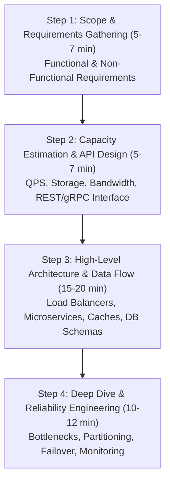
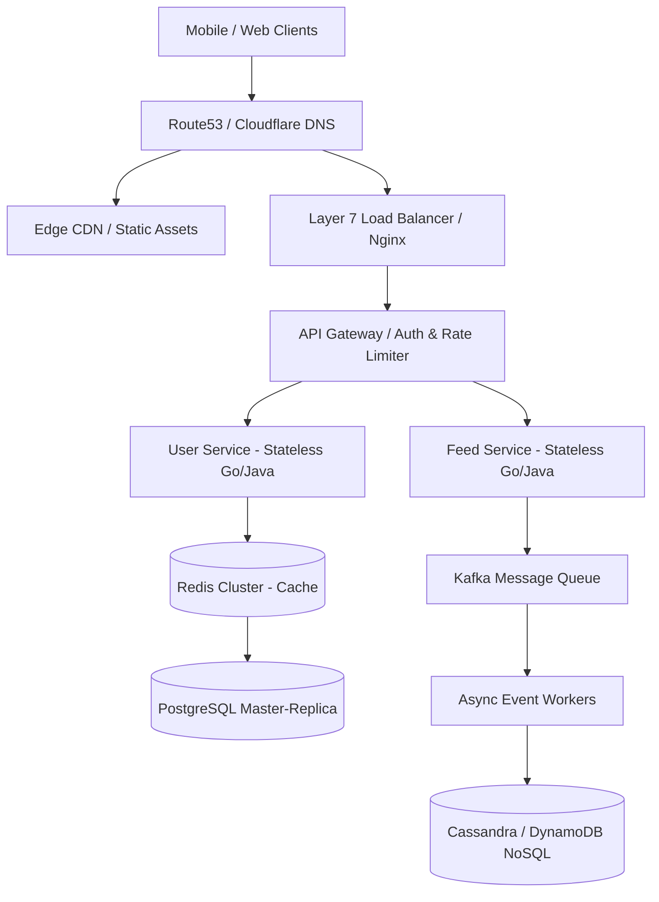
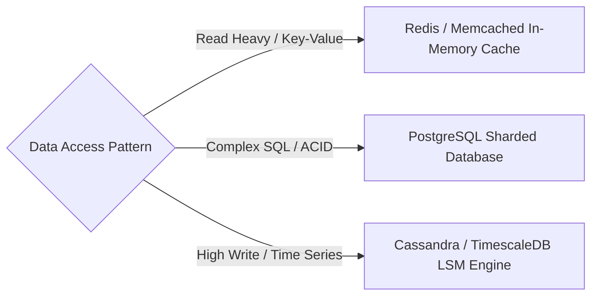

# System Design Interview Blueprint

> [!abstract] Mental Model
> The System Design Interview Blueprint is a 4-step structured framework used by Principal and Staff Engineers to break down ambiguous software architecture problems, perform back-of-the-envelope estimations, define clean API contracts, architect scalable component layouts, address single points of failure, and justify trade-offs under real-world operational constraints.

---

## 1. The 4-Step System Design Interview Framework

---

## 2. Step 1: Requirements & Scope Definition

### Functional Requirements (FRs)
- **Core User Actions**: What are the 3-5 critical actions the system must perform? (e.g. `Post Tweet`, `View Timeline`, `Search Tweets`).
- **Out of Scope**: Explicitly state what will NOT be built during the 45-minute session (e.g. user authentication, analytics dashboard).

### Non-Functional Requirements (NFRs)
- **Scalability**: Daily Active Users (DAU), Read-to-Write Ratio (e.g., $100:1$ read-heavy).
- **Availability**: $99.99\%$ SLA (52.6 minutes of downtime/year).
- **Latency**: $p99$ read latency $< 50\text{ ms}$, write latency $< 100\text{ ms}$.
- **Consistency**: Strong Consistency (e.g. payments/reservations) vs Eventual Consistency (e.g. social feeds).

---

## 3. Step 2: Back-of-the-Envelope Calculations & API Contracts

### Common Numbers Every Engineer Must Know

| Quantity / Operation | Value / Latency |
| :--- | :--- |
| **1 Day in Seconds** | $86,400\text{ seconds} \approx 10^5\text{ s}$ |
| **1 Million Requests / Day** | $\approx 12\text{ QPS}$ |
| **100 Million DAU (10 req/user/day)** | $10^9\text{ req/day} \approx 12,000\text{ QPS}$ ($Peak \approx 25,000\text{ QPS}$) |
| **L1 Cache Read** | $1\text{ ns}$ |
| **Main Memory (RAM) Read** | $100\text{ ns}$ |
| **Read 1 MB Sequentially from RAM** | $250\text{ }\mu\text{s}$ |
| **NVMe SSD Read** | $100\text{ }\mu\text{s}$ |
| **Network Read 1 MB (1 Gbps)** | $10\text{ ms}$ |
| **Cross-Country Roundtrip (US East to West)** | $150\text{ ms}$ |

### Quick Formula Rules
- $\text{Average QPS} = \frac{\text{Daily Active Users} \times \text{Requests per User}}{86,400}$
- $\text{Peak QPS} = \text{Average QPS} \times 2$
- $\text{Storage Requirement (5 Years)} = \text{Daily Writes} \times \text{Size per Write} \times 365 \times 5$

---

## 4. Step 3: High-Level Component Architecture

---

## 5. Step 4: Deep Dive & Production Trade-Offs

### Key Deep-Dive Topics & Decision Matrix

1. **Database Selection & Sharding**:
   - *Vertical Scaling* vs *Horizontal Sharding* (Sharding Key selection to avoid cross-shard joins).
2. **Caching Strategy**:
   - *Cache-Aside* vs *Write-Through* vs *Write-Behind*. Eviction policies (LRU, LFU). Mitigation for Cache Stampede (Probabilistic Early Expiration / Mutex Locks).
3. **Asynchronous Processing**:
   - Decouple slow write paths using Apache Kafka or RabbitMQ. At-least-once delivery requires idempotent consumers.

---

## Failure Modes & System Checklist

- [ ] **Single Point of Failure (SPOF)**: Are all services, databases, and load balancers deployed across multi-AZ (Availability Zones)?
- [ ] **Data Loss Mitigation**: Is Write-Ahead Logging (WAL) enabled? Are database read-replicas configured with automated failover?
- [ ] **Cascading Failures**: Are Circuit Breakers (Resilience4j) and Rate Limiters (Token Bucket) implemented to prevent backend server overload?

---

## Active Recall & Self-Assessment

1. **Question**: How do you handle a Cache Stampede (Thundering Herd) when a hot cache key expires?
   - *Answer*: Use distributed locks (Redis Redlock) so only one worker thread computes and updates the cache while others wait, or implement probabilistic early expiration (XFetch algorithm).
2. **Question**: Why is Consistent Hashing preferred over simple modulo hashing (`hash(key) % N`) for distributed caching?
   - *Answer*: Modulo hashing causes almost all keys ($N/(N+1)$) to remap when a server node is added or removed, whereas consistent hashing remaps only $1/N$ of keys.

---

## Related Notes
- [[High Level Design MOC|06 - High Level Design]]
- [[Computer Science Rapid Revision Guide|Computer Science Rapid Revision Guide]]
- [[Distributed Systems MOC|07 - Distributed Systems]]
- [[CAP Theorem vs. PACELC Theorem - Trade-offs and Proofs|CAP & PACELC Theorem]]
- [[Consistent Hashing - Hash Rings, Virtual Nodes, and Data Rebalancing|Consistent Hashing]]
