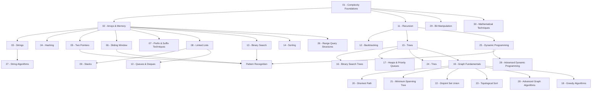

---
aliases:
  - DSA MOC
  - Data Structures and Algorithms MOC
tags:
  - dsa
  - moc
---

# Data Structures & Algorithms — Master MOC

> [!abstract] Master Algorithmic Knowledge Graph
> A first-principles, production-grade handbook for Data Structures, Algorithms, Competitive Programming, and Technical Interview Mastery. Designed for deep conceptual understanding, visual intuition, pattern recognition, and mathematical correctness.

---

## 📍 Current Position

- **Last completed**: [[Mathematical Techniques]]
- **Currently working on**: [[Pattern Recognition]]
- **Status**: ALL 30 TOPIC HANDBOOKS COMPLETE!

---

## 🗺️ Curriculum Architecture

---

## 📊 Learning Progress

### 1. Foundations & Complexity
- [x] [[Complexity Analysis]]
- [x] [[Recursion]]
- [x] [[Backtracking]]
- [x] [[Bit Manipulation]]
- [x] [[Mathematical Techniques]]

### 2. Arrays, Strings & Basic Patterns
- [x] [[Arrays]]
- [x] [[Strings]]
- [x] [[Hashing]]
- [x] [[Two Pointers]]
- [x] [[Sliding Window]]
- [x] [[Prefix Sum]]

### 3. Linear Data Structures
- [x] [[Linked Lists]]
- [x] [[Stacks]]
- [x] [[Queues]]
- [x] [[Deques]]

### 4. Searching & Sorting
- [x] [[Binary Search]]
- [x] [[Sorting Algorithms]]

### 5. Tree Data Structures
- [x] [[Binary Trees]]
- [x] [[Binary Search Trees]]
- [x] [[Tree Traversal]]
- [x] [[Lowest Common Ancestor]]

### 6. Heaps & Priority Queues
- [x] [[Heap]]
- [x] [[Priority Queue]]

### 7. Greedy Algorithms
- [x] [[Greedy Algorithms]]

### 8. Graphs
- [x] [[Graph Fundamentals]]
- [x] [[BFS]]
- [x] [[DFS]]
- [x] [[Topological Sort]]
- [x] [[Shortest Paths]]
- [x] [[Minimum Spanning Tree]]
- [x] [[Disjoint Set Union]]

### 9. Dynamic Programming
- [x] [[Dynamic Programming]]
- [x] [[Knapsack]]
- [x] [[Longest Common Subsequence]]
- [x] [[Longest Increasing Subsequence]]
- [x] [[Interval DP]]
- [x] [[Tree DP]]

### 10. Advanced Data Structures & Algorithms
- [x] [[Trie]]
- [x] [[Fenwick Tree]]
- [x] [[Segment Tree]]
- [x] [[Sparse Table]]
- [x] [[KMP Algorithm]]
- [x] [[Z Algorithm]]
- [x] [[Rolling Hash]]

### 11. Meta & Pattern Frameworks
- [x] [[Pattern Recognition]]

---

## ⏳ Learning Queue

### Current
- [[Binary Search]]

### Next Candidates
1. [[Sorting Algorithms]]
2. [[Binary Trees]]
3. [[Heap]]
4. [[Graph Fundamentals]]
5. [[Dynamic Programming]]

---

## 🧠 Pattern Index & Decision Framework
- [[Pattern Recognition]]

---
