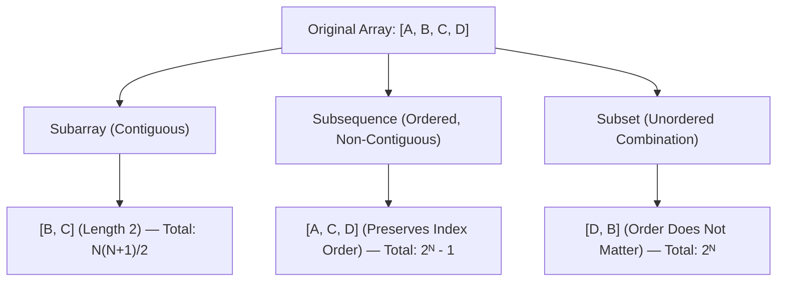

# Arrays, Memory Representation & Subarray Patterns

## TL;DR

An **Array** is a linear data structure storing elements of identical types in contiguous memory locations. Because memory addresses are contiguous, any element can be accessed in $O(1)$ constant time using its index calculation:

$$\text{Address}(A[i]) = \text{Base Address} + (i \times \text{Element Size})$$

---

## 1. What is an Array? Memory Layout & Hardware Intuition

Unlike linked data structures (where nodes are scattered across heap memory connected via pointers), arrays are packed sequentially in memory.

### Contiguous Physical Layout

```text
Memory Address:  0x1000   0x1004   0x1008   0x100C   0x1010
                ┌────────┬────────┬────────┬────────┬────────┐
Array Elements: │ A[0]=4 │ A[1]=7 │ A[2]=1 │ A[3]=9 │ A[4]=3 │
                └────────┴────────┴────────┴────────┴────────┘
Index:              0        1        2        3        4
```

### CPU Cache Locality (Spatial Locality)

When the CPU accesses `A[0]`, the hardware memory controller fetches a whole **Cache Line** (typically 64 bytes) from RAM into L1/L2 cache. Because elements `A[1]`, `A[2]`, `A[3]` reside inside the same cache line, subsequent reads achieve immediate **Cache Hits**, operating orders of magnitude faster than random pointer-chasing structures (like Linked Lists).

```text
RAM Load ──► [ Cache Line (64 Bytes): A[0] | A[1] | A[2] | A[3] | A[4] | ... ] ──► L1 CPU Cache
```

---

## 2. Core Concepts: Subarray vs Subsequence vs Subset

Understanding these definitions prevents incorrect pattern selection:

```text
Original Array: [A, B, C, D]
```



| Structure | Contiguous? | Order Preserved? | Total Count for Size $N$ | Primary Technique |
|---|---|---|---|---|
| **Subarray** | **Yes** | **Yes** | $\frac{N(N+1)}{2} = O(N^2)$ | Sliding Window, Prefix Sum, Kadane |
| **Subsequence** | **No** | **Yes** | $2^N - 1 = O(2^N)$ | Dynamic Programming, Recursion |
| **Subset** | **No** | **No** | $2^N = O(2^N)$ | Backtracking, Bitmasking |

---

## 3. Static vs Dynamic Arrays

| Feature | Static Array (`int arr[N]`) | Dynamic Array (`std::vector` / Python `list`) |
|---|---|---|
| **Size Determination** | Fixed at compile-time/allocation | Grows/shrinks dynamically at runtime |
| **Memory Allocation** | Stack or fixed heap block | Dynamic heap block |
| **Capacity Doubling** | N/A | When size == capacity, allocates $2 \times$ capacity |
| **Amortized Append** | N/A | $O(1)$ amortized ($O(N)$ worst-case resize) |

---

## 4. Fundamental Operations & Complexity Analysis

| Operation | Best Case | Worst Case | Space | Notes |
|---|---|---|---|---|
| **Access by Index (`A[i]`)** | $O(1)$ | $O(1)$ | $O(1)$ | Direct pointer offset calculation |
| **Search (Unsorted)** | $O(1)$ | $O(N)$ | $O(1)$ | Linear scan required |
| **Search (Sorted)** | $O(1)$ | $O(\log N)$ | $O(1)$ | Binary Search |
| **Insertion at Tail** | $O(1)$ | $O(N)$ | $O(1)$ | $O(N)$ only when dynamic array resizes |
| **Insertion at Head / Middle** | $O(N)$ | $O(N)$ | $O(1)$ | Requires shifting existing elements right |
| **Deletion at Head / Middle** | $O(N)$ | $O(N)$ | $O(1)$ | Requires shifting remaining elements left |

```text
Deletion at Index 1 (Value '7'):

Initial:  [ 4 , 7 , 1 , 9 , 3 ]
                x ◄── Shift Left ──
Step 1:   [ 4 , 1 , 1 , 9 , 3 ]
                    x ◄── Shift Left ──
Step 2:   [ 4 , 1 , 9 , 9 , 3 ]
                        x ◄── Shift Left ──
Final:    [ 4 , 1 , 9 , 3 ]  (Size reduced to 4)
```

---

## 5. Multidimensional Arrays & Matrix Transformations

In 2D arrays (`Matrix[R][C]`), physical RAM is still a 1D sequence. Memory is mapped using **Row-Major Order**:

$$\text{Index}_{1D}(\text{row}, \text{col}) = \text{row} \times \text{Cols} + \text{col}$$

```text
2D Matrix (2x3):
[ [1, 2, 3],
  [4, 5, 6] ]

Row-Major 1D RAM Layout:
[ 1 , 2 , 3 , 4 , 5 , 6 ]
  ├── Row 0 ┤   ├── Row 1 ┤
```

### Common Matrix Operations

- **In-Place Transpose (Square Matrix $N \times N$)**: Swap $\text{Matrix}[i][j]$ with $\text{Matrix}[j][i]$ for all $j > i$.
- **Rotate Matrix $90^\circ$ Clockwise**:
  1. Transpose the matrix.
  2. Reverse each row.

```python
def rotate_matrix_clockwise(matrix: list[list[int]]) -> None:
    n = len(matrix)
    # 1. Transpose in-place
    for i in range(n):
        for j in range(i + 1, n):
            matrix[i][j], matrix[j][i] = matrix[j][i], matrix[i][j]
    # 2. Reverse each row
    for i in range(n):
        matrix[i].reverse()
```

---

## 6. Essential Array Algorithms

### Pattern A: Kadane's Algorithm (Maximum Subarray Sum)

Given an integer array `nums`, find the contiguous subarray with the largest sum.

#### Problem Evolution: Brute Force to Optimal

```text
Brute Force: Test all N(N+1)/2 subarrays, sum each -> O(N³)
Optimization 1: Use running sum for subarray sums -> O(N²)
Optimal Insight: At index i, the max subarray ending at i is either:
                 1. nums[i] alone (starting new subarray)
                 2. current_sum + nums[i] (extending previous subarray)
```

#### Mathematical Recurrence

$$\text{dp}[i] = \max(\text{nums}[i], \; \text{dp}[i-1] + \text{nums}[i])$$

$$\text{Global Max} = \max_{0 \le i < N} (\text{dp}[i])$$

#### Dry Run Snapshot

```text
Input: nums = [-2, 1, -3, 4, -1, 2, 1, -5, 4]

i | num | max_ending_here          | max_so_far | Action
--+-----+--------------------------+------------+---------------------------
0 | -2  | -2                       | -2         | Start
1 |  1  | max(1, -2 + 1) = 1       |  1         | Reset subarray to [1]
2 | -3  | max(-3, 1 + (-3)) = -2   |  1         | Extend
3 |  4  | max(4, -2 + 4) = 4       |  4         | Reset subarray to [4]
4 | -1  | max(-1, 4 + (-1)) = 3    |  4         | Extend
5 |  2  | max(2, 3 + 2) = 5        |  5         | Extend
6 |  1  | max(1, 5 + 1) = 6        |  6         | Extend ([4, -1, 2, 1])
7 | -5  | max(-5, 6 + (-5)) = 1    |  6         | Extend
8 |  4  | max(4, 1 + 4) = 5        |  6         | Extend

Result: 6 (Subarray: [4, -1, 2, 1])
```

#### Python Implementation

```python
def max_sub_array(nums: list[int]) -> int:
    """
    Kadane's Algorithm for Maximum Subarray Sum.
    Time Complexity: O(N)
    Auxiliary Space: O(1)
    """
    if not nums:
        return 0
        
    max_so_far = nums[0]
    current_max = nums[0]
    
    for i in range(1, len(nums)):
        current_max = max(nums[i], current_max + nums[i])
        max_so_far = max(max_so_far, current_max)
        
    return max_so_far
```

---

### Pattern B: Dutch National Flag Algorithm (3-Way Partitioning)

Given an array of 0s, 1s, and 2s, sort them in-place in $O(N)$ time and $O(1)$ auxiliary space.

#### Pointer Intuition

Maintain 3 pointers (`low`, `mid`, `high`):
- `[0 ... low-1]`: Region of `0`s
- `[low ... mid-1]`: Region of `1`s
- `[mid ... high]`: Unexamined elements
- `[high+1 ... N-1]`: Region of `2`s

```text
State Snapshot:
┌──────────────┬──────────────┬──────────────────┬──────────────┐
│  All 0s      │  All 1s      │  Unexamined      │  All 2s      │
└──────────────┴──────────────┴──────────────────┴──────────────┘
0            low-1          mid-1              high          N-1
               ▲              ▲                  ▲
```

#### Python Implementation

```python
def sort_colors(nums: list[int]) -> None:
    """
    Dutch National Flag Algorithm (Sort 0s, 1s, 2s in-place).
    Time Complexity: O(N)
    Auxiliary Space: O(1)
    """
    low, mid = 0, 0
    high = len(nums) - 1
    
    while mid <= high:
        if nums[mid] == 0:
            nums[low], nums[mid] = nums[mid], nums[low]
            low += 1
            mid += 1
        elif nums[mid] == 1:
            mid += 1
        else: # nums[mid] == 2
            nums[mid], nums[high] = nums[high], nums[mid]
            high -= 1
```

---

## 7. Common Pitfalls & Edge Cases

1. **Off-By-One Index Errors**: Index bounds range from `0` to `N - 1`. Accessing `A[N]` causes an `IndexOutOfBoundsException`.
2. **Integer Overflow on Sums**: Accumulating sums of large integers in 32-bit environments can overflow. Use 64-bit integers (`long long` in C++ / Java `long`).
3. **Modifying Array During Iteration**: Deleting items while iterating forward skips elements due to index shifting. Iterate backward or use two-pointer overwriting.

---

## 8. Practice Problems

### Foundation
- [LeetCode 1929: Concatenation of Array](https://leetcode.com/problems/concatenation-of-array/)
- [LeetCode 26: Remove Duplicates from Sorted Array](https://leetcode.com/problems/remove-duplicates-from-sorted-array/)

### Intermediate
- [LeetCode 53: Maximum Subarray](https://leetcode.com/problems/maximum-subarray/)
- [LeetCode 75: Sort Colors](https://leetcode.com/problems/sort-colors/)
- [LeetCode 48: Rotate Image](https://leetcode.com/problems/rotate-image/)

### Advanced
- [LeetCode 41: First Missing Positive](https://leetcode.com/problems/first-missing-positive/)
- [LeetCode 238: Product of Array Except Self](https://leetcode.com/problems/product-of-array-except-self/)

---

## Related Concepts
- [[00 - DSA MOC|Master DSA MOC]]
- [[Complexity Analysis]]
- [[Two Pointers]]
- [[Prefix Sum]]
- [[Sliding Window]]
