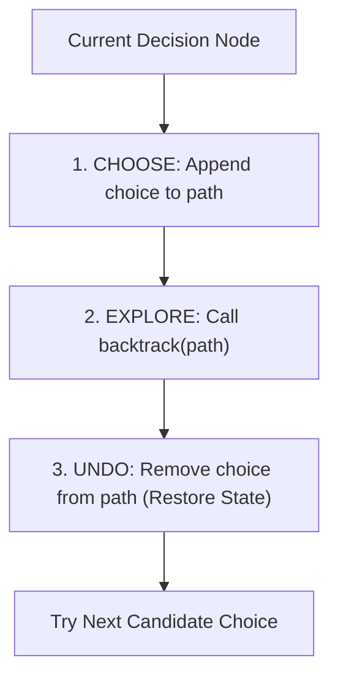

# Backtracking, Decision Trees & Pruning Strategies

## TL;DR

**Backtracking** is a systematic algorithmic technique for solving combinatorial search problems by incrementally building candidate solutions along a **Decision Tree**. At each step, if a candidate path violates problem constraints, the algorithm **prunes** the branch and **backtracks** (undoes the last choice) to explore alternative choices.

---

## 1. The 3 Pillars of Backtracking

Every backtracking function follows this strict Execution Invariant:

$$\text{CHOOSE} \quad \implies \quad \text{EXPLORE (Recurse)} \quad \implies \quad \text{UNDO (Backtrack)}$$



---

## 2. Dynamic Programming vs Backtracking vs Brute Force

| Dimension | Brute Force (Generate All) | Backtracking (Pruned Search) | Dynamic Programming |
|---|---|---|---|
| **Approach** | Evaluates every leaves regardless of validity | Cuts off invalid subtrees early (**Pruning**) | Reuses overlapping subproblems |
| **State Tree** | Complete Tree | Pruned Tree | Directed Acyclic Graph (DAG) |
| **Time Complexity** | $O(2^N)$ or $O(N!)$ | $O(\text{Valid Paths}) \ll O(N!)$ | $O(\text{Unique States})$ |
| **Primary Goal** | Count/list all configurations | Find valid configuration(s) or list subsets | Optimize metric (Min/Max/Count) |

---

## 3. The Universal Backtracking Code Template

```python
def backtrack(candidate_path, choices, result):
    if is_solution(candidate_path):
        result.append(list(candidate_path)) # Deep copy snapshot!
        return

    for choice in choices:
        if is_valid(choice, candidate_path):
            # 1. CHOOSE
            candidate_path.append(choice)
            
            # 2. EXPLORE
            backtrack(candidate_path, choices, result)
            
            # 3. UNDO (Backtrack)
            candidate_path.pop()
```

---

## 4. Primary Problem Canonical Patterns

### Pattern A: Subsets (Power Set Generation $O(2^N)$)

Given an integer array `nums` of unique elements, return all possible **Subsets** (the power set).

#### State Space Tree Visual

```text
                                    []
                    /               |               \
                [1]                [2]              [3]
               /   \                |
          [1, 2]   [1, 3]        [2, 3]
            |
        [1, 2, 3]
```

#### Python Implementation

```python
def subsets(nums: list[int]) -> list[list[int]]:
    """
    Subsets Generation via Backtracking.
    Time Complexity: O(N · 2ⁿ)
    Auxiliary Space: O(N) recursion stack
    """
    result = []
    
    def backtrack(start_index: int, current_path: list[int]):
        # Every node in the decision tree is a valid subset
        result.append(list(current_path))
        
        for i in range(start_index, len(nums)):
            # 1. CHOOSE
            current_path.append(nums[i])
            # 2. EXPLORE (start from i + 1 to avoid duplicates)
            backtrack(i + 1, current_path)
            # 3. UNDO
            current_path.pop()

    backtrack(0, [])
    return result
```

---

### Pattern B: Permutations ($O(N!)$ Search)

Given an array `nums` of distinct integers, return all possible **Permutations**.

#### Decision Tree & Visited Tracking

Unlike subsets (where element order does not matter and index moves forward), permutations allow picking any unvisited element at each depth level.

```text
                                    []
                    /               |               \
                [1]                [2]              [3]
               /   \              /   \            /   \
          [1,2]    [1,3]      [2,1]   [2,3]    [3,1]   [3,2]
            |        |          |       |        |       |
        [1,2,3]  [1,3,2]    [2,1,3] [2,3,1]  [3,1,2] [3,2,1]
```

#### Python Implementation

```python
def permute(nums: list[int]) -> list[list[int]]:
    """
    Permutations Generation using Visited Set.
    Time Complexity: O(N · N!)
    Auxiliary Space: O(N)
    """
    result = []
    used = [False] * len(nums)
    
    def backtrack(current_path: list[int]):
        if len(current_path) == len(nums):
            result.append(list(current_path))
            return
            
        for i in range(len(nums)):
            if not used[i]:
                # 1. CHOOSE
                used[i] = True
                current_path.append(nums[i])
                
                # 2. EXPLORE
                backtrack(current_path)
                
                # 3. UNDO
                current_path.pop()
                used[i] = False

    backtrack([])
    return result
```

---

### Pattern C: Constraint Satisfaction (N-Queens Problem)

Place $N$ chess queens on an $N \times N$ chessboard such that no two queens attack each other.

#### Pruning Optimization via Sets ($O(1)$ Collision Check)
A queen at $(r, c)$ attacks:
1. Column `c`
2. Positive Diagonal `r + c`
3. Negative Diagonal `r - c`

```text
Board Coordinates & Diagonal Keys:
Column Key: c
Positive Diagonal (r + c):    Negative Diagonal (r - c):
[ 0, 1, 2 ]                   [  0, -1, -2 ]
[ 1, 2, 3 ]                   [  1,  0, -1 ]
[ 2, 3, 4 ]                   [  2,  1,  0 ]
```

#### Python Implementation

```python
def solve_n_queens(n: int) -> list[list[str]]:
    """
    N-Queens Solution using Backtracking with Set Pruning.
    Time Complexity: O(N!)
    Auxiliary Space: O(N)
    """
    result = []
    cols = set()
    pos_diag = set() # (r + c)
    neg_diag = set() # (r - c)
    
    board = [["."] * n for _ in range(n)]
    
    def backtrack(r: int):
        if r == n:
            copy = ["".join(row) for row in board]
            result.append(copy)
            return
            
        for c in range(n):
            if c in cols or (r + c) in pos_diag or (r - c) in neg_diag:
                continue # PRUNE invalid branch!
                
            # 1. CHOOSE
            cols.add(c)
            pos_diag.add(r + c)
            neg_diag.add(r - c)
            board[r][c] = "Q"
            
            # 2. EXPLORE
            backtrack(r + 1)
            
            # 3. UNDO
            cols.remove(c)
            pos_diag.remove(r + c)
            neg_diag.remove(r - c)
            board[r][c] = "."

    backtrack(0)
    return result
```

---

## 5. Common Pitfalls & Edge Cases

1. **Forgetting Shallow vs Deep Copy**: In Python, doing `result.append(path)` stores a reference to `path`. As `path.pop()` executes during backtracking, stored items in `result` mutate to empty lists! Always store a copy: `result.append(list(path))` or `result.append(path[:])`.
2. **Missing State Restoration (UNDO)**: Forgetting to remove items from `current_path` or `used` array after returning from recursive call corrupts subsequent decision branches.
3. **Duplicate Subsets with Input Duplicates**: When input array contains duplicates (e.g. `[1, 2, 2]`), sort the input first and skip `if i > start_index and nums[i] == nums[i-1]: continue`.

---

## 6. Practice Problems

### Foundation
- [LeetCode 78: Subsets](https://leetcode.com/problems/subsets/)
- [LeetCode 46: Permutations](https://leetcode.com/problems/permutations/)
- [LeetCode 77: Combinations](https://leetcode.com/problems/combinations/)

### Intermediate
- [LeetCode 39: Combination Sum](https://leetcode.com/problems/combination-sum/)
- [LeetCode 90: Subsets II](https://leetcode.com/problems/subsets-ii/) (With Duplicates)
- [LeetCode 79: Word Search](https://leetcode.com/problems/word-search/)

### Advanced
- [LeetCode 51: N-Queens](https://leetcode.com/problems/n-queens/)
- [LeetCode 37: Sudoku Solver](https://leetcode.com/problems/sudoku-solver/)

---

## Related Concepts
- [[00 - DSA MOC|Master DSA MOC]]
- [[Recursion]]
- [[Complexity Analysis]]
- [[Trees]]
- [[DFS]]
- [[Dynamic Programming]]
