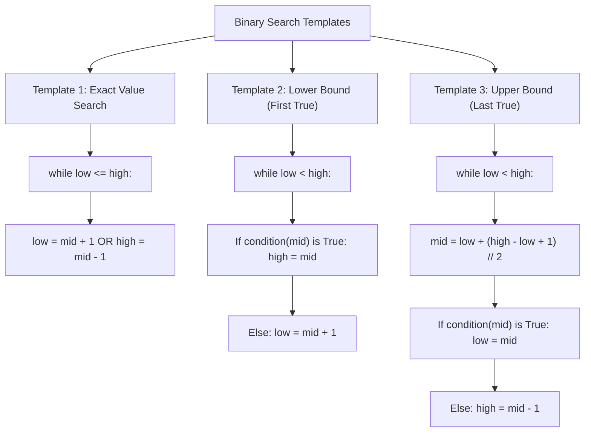

# Binary Search & Monotonic Predicate Optimization

## TL;DR

**Binary Search** is an $O(\log N)$ search algorithm that operates on any **monotonic** (sorted or partitioned) search space. By inspecting the midpoint `mid`, it evaluates whether the target lies in the left or right half, discarding $\approx 50\%$ of the remaining search space at every step.

$$\text{Search Space Size after } k \text{ steps} = \frac{N}{2^k} = 1 \quad \implies \quad k = \log_2 N$$

---

## 1. The Core Principle: Monotonicity

Binary Search does NOT strictly require a sorted array. It requires a **Monotonic Property** over a search range:

```text
Monotonic Boolean Predicate P(x):
Index:   0    1    2    3    4    5    6    7
P(x):  [ F  , F  , F  , F  , T  , T  , T  , T ]
                         ▲
                         First 'True' Index (Boundary)
```

Binary Search locates the exact transition point between `False` and `True` in $O(\log N)$ evaluations of $P(x)$.

---

## 2. Integer Overflow Bug & Midpoint Calculation

### The Bug
In languages with bounded 32-bit signed integers (C++, Java, C#), `mid = (low + high) // 2` can overflow if `low + high > 2,147,483,647`, wrapping around to a negative integer and throwing an `IndexOutOfBoundsException`.

### The Fix

$$\text{mid} = \text{low} + \frac{\text{high} - \text{low}}{2}$$

In Python, integers have arbitrary precision so overflow doesn't occur, but using `low + (high - low) // 2` is standard production practice.

---

## 3. The 3 Fundamental Binary Search Templates



---

## 4. Code Implementations & Tracing

### Template 1: Classic Exact Search ($O(\log N)$ Time, $O(1)$ Space)

```python
def binary_search(nums: list[int], target: int) -> int:
    """
    Exact Match Binary Search.
    Returns index of target if found, else -1.
    """
    low, high = 0, len(nums) - 1
    
    while low <= high:
        mid = low + (high - low) // 2
        
        if nums[mid] == target:
            return mid
        elif nums[mid] < target:
            low = mid + 1  # Discard left half
        else:
            high = mid - 1 # Discard right half
            
    return -1
```

---

### Template 2: Lower Bound / First Occurrence ($O(\log N)$ Time, $O(1)$ Space)

Find the index of the **first element $\ge \text{target}$** (equivalent to C++ `std::lower_bound`).

#### ASCII Pointer Tracing for `nums = [1, 2, 4, 4, 4, 6, 7]`, `target = 4`

```text
Step 1: low = 0, high = 6 -> mid = 3 (val 4).
        Condition (val >= 4) is True -> high = mid = 3.

Step 2: low = 0, high = 3 -> mid = 1 (val 2).
        Condition (val >= 4) is False -> low = mid + 1 = 2.

Step 3: low = 2, high = 3 -> mid = 2 (val 4).
        Condition (val >= 4) is True -> high = mid = 2.

Step 4: low = 2, high = 2 -> Loop terminates (low == high).
        Returns index 2 (First occurrence of 4).
```

#### Python Implementation

```python
def lower_bound(nums: list[int], target: int) -> int:
    """
    Finds index of the first element >= target.
    If target is greater than all elements, returns len(nums).
    """
    low, high = 0, len(nums)
    
    while low < high:
        mid = low + (high - low) // 2
        if nums[mid] >= target:
            high = mid     # Target could be at mid or to the left
        else:
            low = mid + 1  # Target is strictly to the right
            
    return low
```

---

### Advanced Variant: Rotated Sorted Array Search

Given a sorted array rotated at an unknown pivot (e.g., `[4, 5, 6, 7, 0, 1, 2]`), find the target in $O(\log N)$ time.

#### Key Observation
In any rotated sorted array, **at least one half (left or right of `mid`) is guaranteed to be strictly sorted**!

```text
Array: [4, 5, 6, 7, 0, 1, 2], mid = 3 (val 7)
Left Half:  [4, 5, 6, 7] -> Strictly Sorted! (nums[low] <= nums[mid])
Right Half: [7, 0, 1, 2] -> Contains Pivot.
```

#### Python Implementation

```python
def search_rotated(nums: list[int], target: int) -> int:
    """
    Binary Search in Rotated Sorted Array.
    Time Complexity: O(log N)
    Auxiliary Space: O(1)
    """
    low, high = 0, len(nums) - 1
    
    while low <= high:
        mid = low + (high - low) // 2
        
        if nums[mid] == target:
            return mid
            
        # Determine which half is sorted
        if nums[low] <= nums[mid]:
            # Left half is sorted
            if nums[low] <= target < nums[mid]:
                high = mid - 1 # Target lies in left sorted half
            else:
                low = mid + 1  # Target lies in right half
        else:
            # Right half is sorted
            if nums[mid] < target <= nums[high]:
                low = mid + 1  # Target lies in right sorted half
            else:
                high = mid - 1 # Target lies in left half
                
    return -1
```

---

## 5. Binary Search on Answer (Predicate Pattern)

Instead of searching an array, we binary search over a **range of potential answers** `[min_possible, max_possible]`.

### Framework: Koko Eating Bananas

Koko eats at speed $K$ (bananas/hour). Find the minimum integer speed $K$ to eat all piles within $H$ hours.

#### Feasibility Predicate $P(K)$
- Can Koko finish eating all piles at speed $K$ in $\le H$ hours?
- $P(K)$ is monotonic: If speed $K$ works, any speed $> K$ also works! (`[F, F, F, T, T, T]`).

```python
import math

def min_eating_speed(piles: list[int], h: int) -> int:
    """
    Binary Search on Answer Space [1, max(piles)].
    Time Complexity: O(N log(max(piles)))
    Auxiliary Space: O(1)
    """
    def can_finish(speed: int) -> bool:
        hours = sum(math.ceil(pile / speed) for pile in piles)
        return hours <= h

    low = 1
    high = max(piles)
    
    while low < high:
        mid = low + (high - low) // 2
        if can_finish(mid):
            high = mid     # Try smaller speed to minimize K
        else:
            low = mid + 1  # Speed too slow, increase K
            
    return low
```

---

## 6. Common Pitfalls & Edge Cases

1. **Infinite Loop in Template 3**: When setting `low = mid`, if `mid` is calculated using `(low + high) // 2`, for 2 elements (`low=0, high=1`), `mid = 0`, resulting in `low = 0` (no progress!). Fix: Use `mid = low + (high - low + 1) // 2`.
2. **Off-by-One Range Bounds**: Ensure `high` is set to `len(nums)` for lower bound search when the target could be inserted after the last element.
3. **Float Precision in Continuous Search**: For floating-point binary search (e.g. finding square root), loop while `high - low > 1e-7` or use a fixed iteration count (e.g. 100 loops).

---

## 7. Practice Problems

### Foundation
- [LeetCode 704: Binary Search](https://leetcode.com/problems/binary-search/)
- [LeetCode 35: Search Insert Position](https://leetcode.com/problems/search-insert-position/)

### Intermediate
- [LeetCode 34: Find First and Last Position of Element in Sorted Array](https://leetcode.com/problems/find-first-and-last-position-of-element-in-sorted-array/)
- [LeetCode 33: Search in Rotated Sorted Array](https://leetcode.com/problems/search-in-rotated-sorted-array/)
- [LeetCode 875: Koko Eating Bananas](https://leetcode.com/problems/koko-eating-bananas/)

### Advanced
- [LeetCode 4: Median of Two Sorted Arrays](https://leetcode.com/problems/median-of-two-sorted-arrays/) ($O(\log(\min(M, N)))$)
- [LeetCode 410: Split Array Largest Sum](https://leetcode.com/problems/split-array-largest-sum/)

---

## Related Concepts
- [[00 - DSA MOC|Master DSA MOC]]
- [[Arrays]]
- [[Two Pointers]]
- [[Sorting Algorithms]]
- [[Pattern Recognition]]
