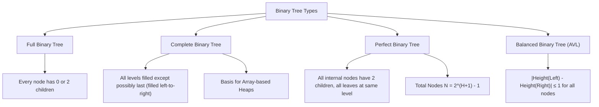

# Binary Trees, Traversals & Tree Recursion Patterns

## TL;DR

A **Tree** is a non-linear, hierarchical data structure consisting of nodes connected by directed or undirected edges, with no cycles. A **Binary Tree** restricts every node to at most two children (`left` and `right`). Tree algorithms heavily leverage **Recursion (DFS)** or **Queue-based BFS (Level Order)**.

---

## 1. Core Terminology & Properties

```text
                  1 (Root)               ──► Depth = 0, Height = 2
                /   \
               2     3                 ──► Depth = 1, Height = 1
              / \     \
             4   5     6               ──► Depth = 2, Height = 0 (Leaves)
```

- **Root**: The top node with no parent (Node `1`).
- **Leaf**: A node with zero children (Nodes `4`, `5`, `6`).
- **Height of Node**: Max edge distance from the node down to a leaf. Height of root = 2.
- **Depth of Node**: Edge distance from root down to the node. Depth of `4` = 2.
- **Subtree**: A node and all of its descendants.

---

## 2. Taxonomy of Binary Tree Types



---

## 3. Tree Traversals (DFS vs BFS)

```text
Sample Tree for Traversals:
        F
      /   \
     B     G
    / \     \
   A   D     I
```

### Depth-First Traversals (DFS)

| Traversal | Order | Sequence Output | Primary Application |
|---|---|---|---|
| **Preorder** | **Root** $\to$ Left $\to$ Right | `F, B, A, D, G, I` | Copying/cloning a tree, expression prefix trees |
| **Inorder** | Left $\to$ **Root** $\to$ Right | `A, B, D, F, G, I` | Yields sorted order for Binary Search Trees (BST) |
| **Postorder** | Left $\to$ Right $\to$ **Root** | `A, D, B, I, G, F` | Bottom-up evaluation, deleting tree, height calculation |

### Breadth-First Traversal (BFS / Level Order)
- Order: Level 0 $\to$ Level 1 $\to$ Level 2 (`F, B, G, A, D, I`).
- Implemented using a FIFO **Queue**.

---

## 4. Fundamental Code Implementations & Algorithms

```python
class TreeNode:
    def __init__(self, val=0, left=None, right=None):
        self.val = val
        self.left = left
        self.right = right
```

### Pattern A: Level Order Traversal (BFS)

```python
from collections import deque

def level_order(root: TreeNode | None) -> list[list[int]]:
    """
    Breadth-First Search Level Order Traversal.
    Time Complexity: O(N)
    Auxiliary Space: O(W) where W is max tree width (up to N/2)
    """
    if not root:
        return []
        
    result = []
    queue = deque([root])
    
    while queue:
        level_size = len(queue)
        current_level = []
        
        for _ in range(level_size):
            node = queue.popleft()
            current_level.append(node.val)
            
            if node.left:
                queue.append(node.left)
            if node.right:
                queue.append(node.right)
                
        result.append(current_level)
        
    return result
```

---

### Pattern B: Maximum Depth & Diameter of Binary Tree ($O(N)$ Bottom-Up DFS)

The **Diameter** of a binary tree is the length of the longest path between any two nodes. The path may or may not pass through the root.

#### Key Postorder Observation

At any node `curr`:
- Max path passing through `curr` = `height(curr.left) + height(curr.right)`.
- Return height to parent = `1 + max(height(curr.left), height(curr.right))`.

```text
Diameter Calculation Snapshot:
            1
          /   \
         2     3
        / \
       4   5

At Node 2: Height(Left)=1, Height(Right)=1 -> Path through Node 2 = 1 + 1 = 2.
At Node 1: Height(Left)=2, Height(Right)=1 -> Path through Node 1 = 2 + 1 = 3.
Max Diameter = 3 (Path: 4 -> 2 -> 1 -> 3).
```

#### Python Implementation

```python
def diameter_of_binary_tree(root: TreeNode | None) -> int:
    """
    Calculates Diameter of Binary Tree using Bottom-Up Postorder DFS.
    Time Complexity: O(N)
    Auxiliary Space: O(H) where H is tree height
    """
    max_diameter = 0
    
    def get_height(node: TreeNode | None) -> int:
        nonlocal max_diameter
        if not node:
            return 0
            
        left_height = get_height(node.left)
        right_height = get_height(node.right)
        
        # Diameter at current node is left_height + right_height
        max_diameter = max(max_diameter, left_height + right_height)
        
        # Return height of subtree to parent
        return 1 + max(left_height, right_height)

    get_height(root)
    return max_diameter
```

---

### Pattern C: Lowest Common Ancestor (LCA of Binary Tree)

Find the lowest node in $T$ that has both $p$ and $q$ as descendants.

#### Bottom-Up DFS Postorder Rule
- If current node is $p$ or $q$, return current node.
- Recurse on left and right subtrees.
- If both left and right return non-null pointers, current node IS the LCA!
- Otherwise, return whichever child returned a non-null pointer.

#### Python Implementation

```python
def lowest_common_ancestor(root: TreeNode | None, p: TreeNode, q: TreeNode) -> TreeNode | None:
    """
    Lowest Common Ancestor in a Binary Tree.
    Time Complexity: O(N)
    Auxiliary Space: O(H)
    """
    # Base Case: empty node or found target p/q
    if not root or root == p or root == q:
        return root
        
    left_lca = lowest_common_ancestor(root.left, p, q)
    right_lca = lowest_common_ancestor(root.right, p, q)
    
    # If both left and right return non-null, root is LCA!
    if left_lca and right_lca:
        return root
        
    # Otherwise return non-null child
    return left_lca if left_lca else right_lca
```

---

## 5. Common Pitfalls & Edge Cases

1. **Degenerate / Skewed Tree Stack Overflow**: In a skewed tree (e.g. `1 -> 2 -> 3 -> 4`), recursion depth reaches $O(N)$, causing stack overflow for large $N$.
2. **Global Variable Mutation**: When finding max path sum or diameter, pass mutable state object or use `nonlocal` in Python to avoid stale state across test cases.
3. **Null Node Children Check**: Always check `if not root:` as the first line of recursive tree helpers.

---

## 6. Practice Problems

### Foundation
- [LeetCode 104: Maximum Depth of Binary Tree](https://leetcode.com/problems/maximum-depth-of-binary-tree/)
- [LeetCode 226: Invert Binary Tree](https://leetcode.com/problems/invert-binary-tree/)
- [LeetCode 102: Binary Tree Level Order Traversal](https://leetcode.com/problems/binary-tree-level-order-traversal/)

### Intermediate
- [LeetCode 543: Diameter of Binary Tree](https://leetcode.com/problems/diameter-of-binary-tree/)
- [LeetCode 236: Lowest Common Ancestor of a Binary Tree](https://leetcode.com/problems/lowest-common-ancestor-of-a-binary-tree/)
- [LeetCode 105: Construct Binary Tree from Preorder and Inorder Traversal](https://leetcode.com/problems/construct-binary-tree-from-preorder-and-inorder-traversal/)

### Advanced
- [LeetCode 124: Binary Tree Maximum Path Sum](https://leetcode.com/problems/binary-tree-maximum-path-sum/)
- [LeetCode 297: Serialize and Deserialize Binary Tree](https://leetcode.com/problems/serialize-and-deserialize-binary-tree/)

---

## Related Concepts
- [[00 - DSA MOC|Master DSA MOC]]
- [[Recursion]]
- [[Stacks]]
- [[Queues]]
- [[Binary Search Trees]]
- [[DFS]]
- [[BFS]]
