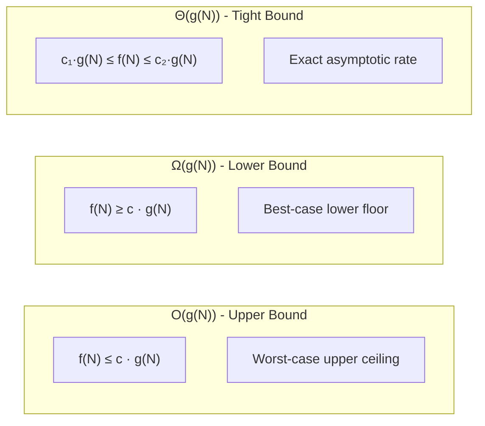
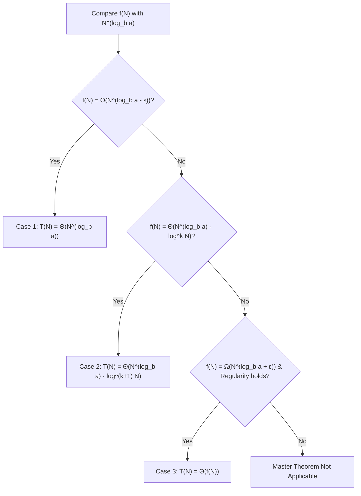

# Complexity Analysis & Asymptotic Theory

## TL;DR

Complexity analysis provides a hardware-independent mathematical framework to measure how an algorithm's resource consumption (time and memory) scales as the input size $N$ grows toward infinity. Rather than measuring absolute wall-clock runtime in milliseconds—which fluctuates across hardware, compilers, and operating systems—we quantify performance via asymptotic notation ($O, \Omega, \Theta$).

---

## Why Do We Need This?

Consider testing two sorting algorithms on a machine:

```text
Algorithm A (O(N²)):  Runs on a 4.0 GHz Supercomputer
Algorithm B (O(N log N)): Runs on a 1.0 GHz Old Laptop
```

For $N = 100$, Algorithm A finishes faster because of raw clock speed. But for $N = 1,000,000$, Algorithm A takes weeks, while Algorithm B finishes in seconds.

Without asymptotic complexity analysis:
1. We cannot predict whether an algorithm will scale to production-level inputs.
2. We cannot separate algorithm design efficiency from hardware capabilities.
3. We cannot evaluate algorithmic trade-offs (e.g., trading memory for speed).

---

## Real-World Analogy

Imagine transferring a file of size $N$ gigabytes across a network versus delivering a physical hard drive by car:

```text
Data Size (N) | Network Transfer Time  | Physical Delivery Time (Car)
--------------+------------------------+-----------------------------
1 GB          | 2 minutes              | 1 hour
100 GB        | 3.3 hours              | 1 hour
10,000 GB     | 14 days                | 1 hour
```

- **Network Transfer**: Time grows linearly with data size ($O(N)$).
- **Physical Delivery**: Time remains constant regardless of data size ($O(1)$).

For small datasets, $O(N)$ is faster. But as $N \to \infty$, $O(1)$ inevitably wins.

---

## Visual Growth Intuition

```text
Input Size (N) ──►
N      │ O(1)    O(log N)   O(N)      O(N log N)   O(N²)        O(2ⁿ)
───────┼───────────────────────────────────────────────────────────────────
1      │ 1       0          1         0            1            2
10     │ 1       3.32       10        33.2         100          1,024
100    │ 1       6.64       100       664          10,000       1.26 × 10³⁰
1,000  │ 1       9.97       1,000     9,965        1,000,000    🚨 Overflow
```

### Visual Asymptotic Comparison Chart

```text
Execution Time T(N)
  ▲
  │                                           🚨 O(2ⁿ) Exponential
  │                                         /
  │                                        /   O(N²) Quadratic
  │                                       /   /
  │                                      /   /    O(N log N) Linearithmic
  │                                     /   /    /
  │                                    /   /    /   O(N) Linear
  │                                   /   /    /   /
  │                                  /   /    /   /     O(log N) Logarithmic
  │                                 /   /    /   /     /
  │                                /   /    /   /     /      O(1) Constant
  │────────────────────────────────┴───┴───┴───┴─────┴───────► Input Size (N)
```

---

## Formal Asymptotic Notations

Asymptotic notation bounds the growth rate of a function $f(N)$ using a simpler target function $g(N)$ as $N \to \infty$.



### 1. Big-O ($O$): Asymptotic Upper Bound

$$f(N) = O(g(N)) \iff \exists \; c > 0, N_0 > 0 \quad \text{such that} \quad \forall N \ge N_0, \quad 0 \le f(N) \le c \cdot g(N)$$

- **Meaning**: $f(N)$ grows **no faster than** $g(N)$.
- **Engineering Use**: Guarantees worst-case ceiling.

### 2. Big-Omega ($\Omega$): Asymptotic Lower Bound

$$f(N) = \Omega(g(N)) \iff \exists \; c > 0, N_0 > 0 \quad \text{such that} \quad \forall N \ge N_0, \quad 0 \le c \cdot g(N) \le f(N)$$

- **Meaning**: $f(N)$ grows **at least as fast as** $g(N)$.
- **Engineering Use**: Sets fundamental lower limits (e.g., comparison sorting is $\Omega(N \log N)$).

### 3. Big-Theta ($\Theta$): Asymptotic Tight Bound

$$f(N) = \Theta(g(N)) \iff f(N) = O(g(N)) \quad \text{and} \quad f(N) = \Omega(g(N))$$

- **Meaning**: $f(N)$ grows at **exactly the same rate** as $g(N)$.

### 4. Little-o ($o$) and Little-omega ($\omega$)

- $f(N) = o(g(N))$: Strict upper bound ($\lim_{N \to \infty} \frac{f(N)}{g(N)} = 0$).
- $f(N) = \omega(g(N))$: Strict lower bound ($\lim_{N \to \infty} \frac{f(N)}{g(N)} = \infty$).

---

## Time vs Space Complexity Definitions

### Time Complexity
Quantifies the total number of elementary operations (arithmetic, comparisons, assignments) executed as a function of input size $N$.

### Space Complexity
Quantifies the total memory allocated during execution.

$$\text{Total Space Complexity} = \text{Auxiliary Space} + \text{Input Space}$$

- **Auxiliary Space**: Extra memory consumed by the algorithm itself (temporary variables, dynamically allocated memory, recursion stack frames).
- **Input Space**: Memory occupied by the input data structures.

---

## Step-by-Step Code Analysis Examples

### Example 1: Nested Loops with Dependent Bounds

```python
def analyze_dependent_loops(n: int) -> int:
    total_ops = 0
    for i in range(n):
        for j in range(i, n):
            total_ops += 1
    return total_ops
```

#### Derivation

- Outer loop $i$ runs from $0$ to $n - 1$.
- Inner loop $j$ runs from $i$ to $n - 1$, executing $(n - i)$ times.
- Total executions:

$$T(n) = \sum_{i=0}^{n-1} (n - i) = n + (n-1) + (n-2) + \dots + 1 = \frac{n(n + 1)}{2} = \frac{n^2}{2} + \frac{n}{2}$$

Dropping low-order terms and constant coefficients:

$$\text{Time Complexity}: \Theta(n^2), \quad \text{Auxiliary Space}: \Theta(1)$$

---

### Example 2: Logarithmic Iteration

```python
def logarithmic_loop(n: int) -> int:
    ops = 0
    i = 1
    while i < n:
        ops += 1
        i *= 2
    return ops
```

#### Derivation

In iteration $k$, $i = 2^k$. The loop terminates when $2^k \ge n \implies k = \lceil \log_2 n \rceil$.

$$\text{Time Complexity}: \Theta(\log n), \quad \text{Auxiliary Space}: \Theta(1)$$

---

## Amortized Analysis

Amortized analysis averages the time taken by a sequence of operations over all operations performed. It guarantees the average performance per operation in the worst-case sequence.

### Classic Example: Dynamic Array Resizing (`std::vector` / Python `list`)

A dynamic array doubles its capacity when full.

```text
Array Capacity Expansion Snapshot:

Index:     0   1   2   3   4   5   6   7   8
Capacity: 1 ──► 2 ──────► 4 ──────────────► 8 ──────────────────► 16

Push 1: [A]                       (Cost 1, Cap 1)
Push 2: [A, B]                    (Cost 1 copy + 1 insert = 2, Cap 2)
Push 3: [A, B, C, _]              (Cost 2 copies + 1 insert = 3, Cap 4)
Push 4: [A, B, C, D]              (Cost 1 insert = 1, Cap 4)
Push 5: [A, B, C, D, E, _, _, _]  (Cost 4 copies + 1 insert = 5, Cap 8)
```

#### Amortized Derivation (Aggregate Method)

- For $N$ insertions, resizing occurs at insertions $1, 2, 4, 8, \dots, 2^k$.
- Total copy operations:

$$\text{Total Copies} = 1 + 2 + 4 + 8 + \dots + 2^k < 2N$$

- Total raw insertion operations = $N$.
- Total cost for $N$ pushes = $N + 2N = 3N$.

$$\text{Amortized Cost per Push} = \frac{3N}{N} = O(1)$$

---

## Recurrence Relations & Recursion Trees

For recursive algorithms, complexity is expressed as a recurrence relation.

### 1. Merge Sort

$$T(N) = 2T\left(\frac{N}{2}\right) + O(N)$$

```text
Recursion Tree Expansion for Merge Sort:

Level 0:                 N                   ────► Cost: N
                       /   \
Level 1:           N/2       N/2             ────► Cost: 2 × (N/2) = N
                  /   \     /   \
Level 2:       N/4    N/4 N/4   N/4          ────► Cost: 4 × (N/4) = N
               ...    ... ...   ...
Level log₂N:   1   1   1   1   1   1 ... 1   ────► Cost: N × 1 = N

Total Levels: log₂N + 1
Total Work:   N × (log₂N + 1) = N log₂N + N
```

$$\text{Time Complexity}: \Theta(N \log N)$$

---

## The Master Theorem

For recurrences of the form:

$$T(N) = a T\left(\frac{N}{b}\right) + f(N) \quad \text{where } a \ge 1, b > 1$$

Compare $f(N)$ with $N^{\log_b a}$:



### Summary Table of Master Theorem Cases

| Recurrence | $a$ | $b$ | $f(N)$ | $N^{\log_b a}$ | Case | Result Complexity |
|---|---:|---:|---|---|---|---|
| $T(N) = 2T(N/2) + O(1)$ | $2$ | $2$ | $O(1)$ | $N^1$ | Case 1 | $\Theta(N)$ |
| $T(N) = 2T(N/2) + O(N)$ | $2$ | $2$ | $O(N)$ | $N^1$ | Case 2 ($k=0$) | $\Theta(N \log N)$ |
| $T(N) = 4T(N/2) + O(N^3)$ | $4$ | $2$ | $O(N^3)$ | $N^2$ | Case 3 | $\Theta(N^3)$ |
| $T(N) = 8T(N/2) + O(N^2)$ | $8$ | $2$ | $O(N^2)$ | $N^3$ | Case 1 | $\Theta(N^3)$ |

---

## Common Pitfalls & Edge Cases

### 1. Misinterpreting Auxiliary Space vs Stack Space
In recursive calls (e.g., DFS or Binary Tree traversal), call stack frames occupy memory.
- A skewed binary tree of depth $N$ has **$O(N)$ auxiliary stack space**.
- A balanced binary tree of depth $\log N$ has **$O(\log N)$ auxiliary stack space**.

### 2. Multi-Variable Complexities
If an algorithm depends on two independent inputs $V$ (vertices) and $E$ (edges):
$$\text{Correct}: O(V + E) \quad \neq \quad \text{Incorrect}: O(N)$$

### 3. Hidden Constants and Operations
String concatenation `s = s + char` in a loop takes $O(N)$ per step in immutable languages (e.g., Python/Java), turning an $O(N)$ loop into $O(N^2)$. Use a `StringBuilder` or list append + join.

---

## Practice Problems

### Foundation
- Derive time & space complexity for recursive Fibonacci without memoization vs with memoization.
- Analyze complexity of Matrix Multiplication (Naive $O(N^3)$ vs Strassen's $O(N^{2.807})$).

### Intermediate
- Analyze amortized complexity of a Queue implemented using two Stacks.
- Derive the recurrence relation for Binary Search: $T(N) = T(N/2) + O(1)$.

### Advanced
- Derive complexity of Median-of-Medians selection algorithm ($T(N) = T(N/5) + T(7N/10) + O(N) \implies O(N)$).
- Analyze Disjoint Set Union (DSU) with Path Compression and Union by Rank ($\alpha(N)$ Inverse Ackermann Function).

---

## Practice Problem & Verification

### Problem: Two Sum Complexity Verification

Given an array of size $N$:

```python
def two_sum_brute_force(nums: list[int], target: int) -> list[int]:
    n = len(nums)
    for i in range(n):
        for j in range(i + 1, n):
            if nums[i] + nums[j] == target:
                return [i, j]
    return []

def two_sum_hash_map(nums: list[int], target: int) -> list[int]:
    seen = {}
    for i, num in enumerate(nums):
        complement = target - num
        if complement in seen:
            return [seen[complement], i]
        seen[num] = i
    return []
```

#### Dry Run & Complexity Shift

```text
Input: nums = [2, 7, 11, 15], target = 9

Brute Force Execution:
- i = 0 (val 2), j = 1 (val 7): 2 + 7 == 9 -> Match! (1 check)
- Worst case checks: N(N-1)/2 -> O(N²) Time, O(1) Space.

Optimized Hash Map Execution:
- i = 0 (val 2): comp = 7. 7 in seen? No. seen[2] = 0
- i = 1 (val 7): comp = 2. 2 in seen? Yes! Return [seen[2], 1] -> [0, 1]
- Single pass: N iterations, O(1) avg lookup -> O(N) Time, O(N) Space.
```

---

## Related Concepts
- [[00 - DSA MOC|Master DSA MOC]]
- [[Pattern Recognition]]
- [[Arrays]]
- [[Recursion]]
