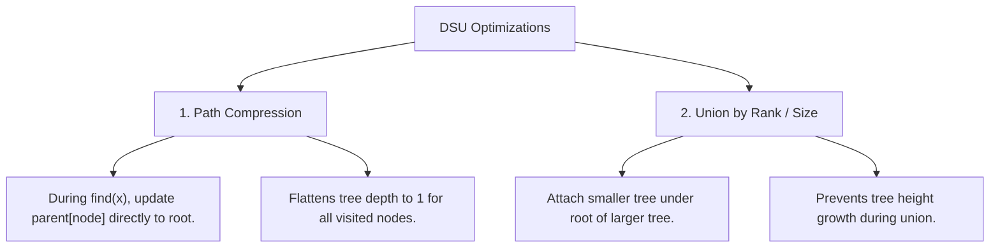

# Disjoint Set Union (DSU), Path Compression & Inverse Ackermann

## TL;DR

The **Disjoint Set Union (DSU)** (or **Union-Find**) data structure maintains a collection of disjoint (non-overlapping) sets over $N$ elements. It supports two primary operations in **near-constant $O(\alpha(N)) \approx O(1)$ amortized time**:
1. **`find(x)`**: Determine which set element $x$ belongs to (returning its root representative).
2. **`union(x, y)`**: Join the sets containing element $x$ and element $y$ into a single set.

---

## 1. Internal Representation: Parent Pointer Forest

DSU represents each set as a **Tree**, where every node points to its `parent`. The **Root** of the tree (where `parent[root] == root`) serves as the unique identifier for the entire set.

```text
Initial Disjoint Sets (N = 5):
Node:   0   1   2   3   4
Parent: 0   1   2   3   4  (Each node is its own parent root)

After Union(0, 1) and Union(2, 3):
    0       2       4
    │       │
    1       3
```

---

## 2. Two Fundamental Optimizations

Without optimization, a sequence of unions can degrade the parent tree into a **linear linked list of height $O(N)$**, causing `find(x)` to run in $O(N)$ time.



---

### Optimization 1: Path Compression

When calling `find(x)`, we recursively follow parent pointers to find the root. On the way back, we update `parent[node] = root` for every node along the path!

```text
Before Path Compression (find(4)):
       0 (Root)
       │
       1
       │
       2
       │
       3
       │
       4

After Path Compression (find(4)):
          0 (Root)
       ┌──┬──┬──┐
       1  2  3  4   (Tree height reduced to 1! All nodes point directly to 0)
```

---

### Optimization 2: Union by Rank / Size

Instead of arbitrarily making node $u$'s root point to node $v$'s root, we compare the **rank** (tree height bound) or **size** (node count) of both trees, attaching the smaller tree under the larger tree.

```text
Union(Root A, Root B):
If size[A] >= size[B]:
   parent[B] = A
   size[A] += size[B]
Else:
   parent[A] = B
   size[B] += size[A]
```

---

## 3. Amortized Complexity & Inverse Ackermann ($\alpha(N)$)

When both **Path Compression** and **Union by Rank/Size** are combined:

$$\text{Time Complexity per Operation} = O(\alpha(N))$$

Where $\alpha(N)$ is the **Inverse Ackermann Function**.

### Growth Rate of Inverse Ackermann $\alpha(N)$
The Ackermann function $A(m, n)$ grows extraordinarily fast:
- $A(4, 2) = 2^{65536} \approx 10^{19729}$ (far exceeds the total number of atoms in the observable universe $\approx 10^{80}$).
- For all practical values of $N$ up to $10^{600}$, $\alpha(N) \le 4$.

$$\text{Practical Engineering Complexity}: O(\alpha(N)) \approx O(1) \text{ Constant Amortized Time!}$$

---

## 4. Complete Production DSU Class Implementation

```python
class UnionFind:
    """
    Disjoint Set Union (DSU) with Path Compression and Union by Rank.
    Amortized Time Complexity: O(α(N)) per operation ≈ O(1)
    Space Complexity: O(N)
    """
    def __init__(self, n: int):
        self.parent = list(range(n))
        self.rank = [0] * n
        self.num_components = n

    def find(self, i: int) -> int:
        """Find root representative with Path Compression."""
        if self.parent[i] != i:
            self.parent[i] = self.find(self.parent[i]) # Path Compression!
        return self.parent[i]

    def union(self, i: int, j: int) -> bool:
        """
        Unifies sets containing i and j using Union by Rank.
        Returns True if a merge occurred, False if i and j were already connected.
        """
        root_i = self.find(i)
        root_j = self.find(j)

        if root_i == root_j:
            return False # Already in the same component!

        # Union by Rank: Attach smaller tree under higher rank tree
        if self.rank[root_i] < self.rank[root_j]:
            self.parent[root_i] = root_j
        elif self.rank[root_i] > self.rank[root_j]:
            self.parent[root_j] = root_i
        else:
            self.parent[root_j] = root_i
            self.rank[root_i] += 1

        self.num_components -= 1
        return True

    def is_connected(self, i: int, j: int) -> bool:
        """Check if i and j belong to the same component."""
        return self.find(i) == self.find(j)
```

---

## 5. Core Algorithmic Applications

### Pattern A: Cycle Detection in Undirected Graph ($O(E \cdot \alpha(V))$)

Process edges one by one. If an edge $(u, v)$ connects two nodes that ALREADY share the same DSU root (`find(u) == find(v)`), adding edge $(u, v)$ creates a **Cycle**!

```python
def has_cycle_undirected(num_nodes: int, edges: list[list[int]]) -> bool:
    dsu = UnionFind(num_nodes)
    for u, v in edges:
        if not dsu.union(u, v):
            return True # Cycle detected!
    return False
```

---

### Pattern B: Redundant Connection (LeetCode 684)

Find the edge that can be removed so that the resulting graph is a tree of $N$ nodes.

```python
def find_redundant_connection(edges: list[list[int]]) -> list[int]:
    n = len(edges)
    dsu = UnionFind(n + 1)
    
    for u, v in edges:
        if not dsu.union(u, v):
            return [u, v] # Redundant cycle-forming edge!
            
    return []
```

---

## 6. Common Pitfalls & Edge Cases

1. **Forgetting Path Compression Assignment**: Writing `find(parent[i])` without reassigning `parent[i] = find(parent[i])` omits path compression, degrading runtime to $O(N)$!
2. **Comparing Node Values Instead of Roots**: In `union(u, v)`, doing `parent[u] = v` instead of `parent[find(u)] = find(v)` corrupts component trees. Always unify **roots**, not raw nodes!
3. **1-Based vs 0-Based Node Indexing**: Make sure DSU array size is allocated as `N + 1` if input node IDs range from `1` to `N`.

---

## 7. Practice Problems

### Foundation
- [LeetCode 547: Number of Provinces](https://leetcode.com/problems/number-of-provinces/)
- [LeetCode 684: Redundant Connection](https://leetcode.com/problems/redundant-connection/)

### Intermediate
- [LeetCode 721: Accounts Merge](https://leetcode.com/problems/accounts-merge/) (String String DSU)
- [LeetCode 1319: Number of Operations to Make Network Connected](https://leetcode.com/problems/number-of-operations-to-make-network-connected/)
- [LeetCode 990: Satisfiability of Equality Equations](https://leetcode.com/problems/satisfiability-of-equality-equations/)

### Advanced
- [LeetCode 839: Similar String Groups](https://leetcode.com/problems/similar-string-groups/)
- [LeetCode 1579: Remove Max Number of Edges to Keep Graph Fully Traversable](https://leetcode.com/problems/remove-max-number-of-edges-to-keep-graph-fully-traversable/)

---

## Related Concepts
- [[00 - DSA MOC|Master DSA MOC]]
- [[Graph Fundamentals]]
- [[Minimum Spanning Tree]]
- [[BFS]]
