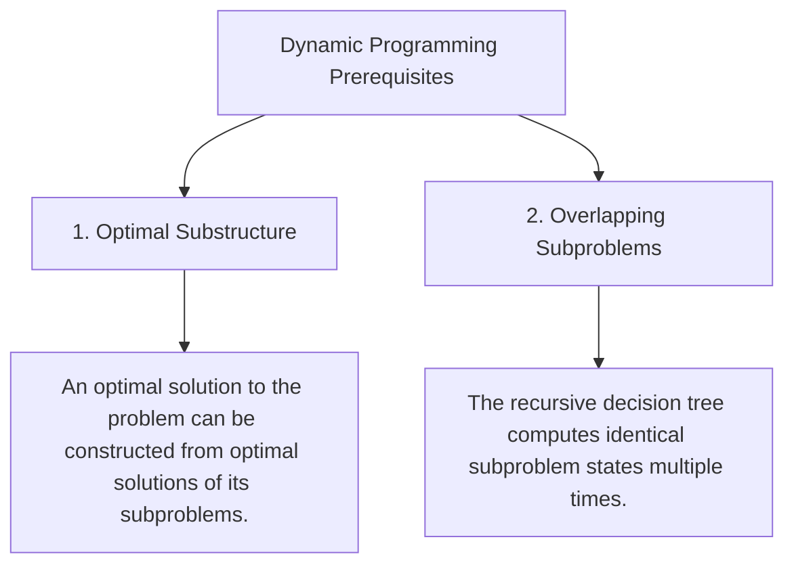
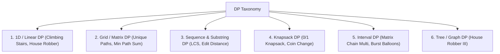

# Dynamic Programming, Recurrence Relations & State Optimization

## TL;DR

**Dynamic Programming (DP)** is an optimization technique that solves complex problems by breaking them down into simpler, overlapping subproblems. By storing the results of subproblems in a memory table (via **Memoization** or **Tabulation**), DP transforms exponential $O(2^N)$ recursive searches into polynomial time ($O(N)$, $O(N^2)$, or $O(N \cdot W)$).

$$\text{DP} = \text{Recursion} + \text{Memoization (Remembering Subproblems)}$$

---

## 1. The 2 Core Prerequisites for DP



---

## 2. Top-Down (Memoization) vs Bottom-Up (Tabulation)

| Dimension | Top-Down (Memoization) | Bottom-Up (Tabulation) |
|---|---|---|
| **Direction** | Starts at original target $N$, recurses down to base cases | Starts at base cases $0, 1$, builds up iteratively to $N$ |
| **Control Flow** | Recursive Call Stack + Hash Map / Array Cache | Iterative Nested Loops + 1D/2D DP Array |
| **Subproblem Computation**| Computes **only required** states (Lazy evaluation) | Computes **all** subproblem states in table |
| **Memory Overhead** | Table Space + Call Stack Depth $O(N)$ | Table Space $O(N)$ (Can optimize to $O(1)$ space!) |
| **Recursion Risk** | Risk of Stack Overflow if depth $> 1000$ | No stack overflow risk |

---

## 3. The 5-Step Universal DP Solving Framework

```text
┌────────────────────────────────────────────────────────┐
│ Step 1: Define the State in Plain English              │
│ e.g., dp[i] = "Max value attainable using first i items"│
├────────────────────────────────────────────────────────┤
│ Step 2: Formulate the Recurrence Relation (Transition)  │
│ e.g., dp[i] = max(dp[i-1], nums[i] + dp[i-2])           │
├────────────────────────────────────────────────────────┤
│ Step 3: Identify Base Cases                            │
│ e.g., dp[0] = 0, dp[1] = nums[0]                        │
├────────────────────────────────────────────────────────┤
│ Step 4: Determine Loop Evaluation Order                │
│ (Ensure state dp[i] depends ONLY on already computed states)│
├────────────────────────────────────────────────────────┤
│ Step 5: Apply Space Optimization                       │
│ (e.g., if dp[i] depends only on dp[i-1], keep 2 variables!)│
└────────────────────────────────────────────────────────┘
```

---

## 4. Master Taxonomy of DP Categories



---

## 5. Comprehensive Problem Walkthroughs & Space Optimizations

### Pattern 1: Linear DP (House Robber - LeetCode 198)

A robber wants to rob houses along a street. Adjacent houses have security systems connected; cannot rob two adjacent houses. Find max money.

#### Step 1: State Definition
`dp[i]` = Maximum money robbed from the first `i` houses.

#### Step 2: Recurrence Relation
For house `i`, the robber has 2 choices:
1. **Rob house `i`**: Earn `nums[i]` + max money from first `i - 2` houses (`dp[i-2]`).
2. **Skip house `i`**: Max money remains `dp[i-1]`.

$$\text{dp}[i] = \max(\text{dp}[i-1], \; \text{nums}[i] + \text{dp}[i-2])$$

#### Code & $O(1)$ Space Optimization

```python
def rob_space_optimized(nums: list[int]) -> int:
    """
    House Robber Problem (Linear DP).
    Time Complexity: O(N)
    Auxiliary Space: O(1) space optimization
    """
    if not nums:
        return 0
    if len(nums) == 1:
        return nums[0]
        
    prev2 = 0 # dp[i-2]
    prev1 = 0 # dp[i-1]
    
    for num in nums:
        curr = max(prev1, num + prev2)
        prev2 = prev1
        prev1 = curr
        
    return prev1
```

---

### Pattern 2: Grid DP (Unique Paths - LeetCode 62)

Find total unique paths from top-left $(0, 0)$ to bottom-right $(M-1, N-1)$ moving only Right or Down.

#### Recurrence & Transition Matrix

$$\text{dp}[r][c] = \text{dp}[r-1][c] + \text{dp}[r][c-1]$$

```text
Grid DP Matrix (3x3):
  [ 1 ,  1 ,  1 ]
  [ 1 ,  2 ,  3 ]
  [ 1 ,  3 ,  6 ]  ◄── Total Unique Paths to (2,2) = 6!
```

#### Python Implementation

```python
def unique_paths(m: int, n: int) -> int:
    """
    Grid DP with 1D Array Space Optimization.
    Time Complexity: O(M · N)
    Auxiliary Space: O(N)
    """
    dp = [1] * n
    
    for r in range(1, m):
        for c in range(1, n):
            dp[c] += dp[c-1] # dp[c] (above) + dp[c-1] (left)
            
    return dp[-1]
```

---

### Pattern 3: Sequence DP (Longest Common Subsequence - LeetCode 1143)

Given strings `s1` and `s2`, find length of their longest common subsequence.

#### Recurrence Relation
Let `dp[i][j]` be the LCS length for `s1[0..i-1]` and `s2[0..j-1]`:

$$\text{dp}[i][j] = \begin{cases} 1 + \text{dp}[i-1][j-1] & \text{if } s1[i-1] == s2[j-1] \\ \max(\text{dp}[i-1][j], \; \text{dp}[i][j-1]) & \text{if } s1[i-1] \neq s2[j-1] \end{cases}$$

#### Python Implementation

```python
def longest_common_subsequence(s1: str, s2: str) -> int:
    """
    LCS using 2D Tabulation.
    Time Complexity: O(|S1| · |S2|)
    Auxiliary Space: O(|S1| · |S2|)
    """
    m, n = len(s1), len(s2)
    dp = [[0] * (n + 1) for _ in range(m + 1)]
    
    for i in range(1, m + 1):
        for j in range(1, n + 1):
            if s1[i-1] == s2[j-1]:
                dp[i][j] = 1 + dp[i-1][j-1]
            else:
                dp[i][j] = max(dp[i-1][j], dp[i][j-1])
                
    return dp[m][n]
```

---

## 6. Common Pitfalls & Edge Cases

1. **Table Dimension Off-by-One**: Allocating `dp = [[0]*N for _ in range(M)]` instead of `(M+1) x (N+1)` forces messy manual handling of base cases $i=0$ or $j=0$.
2. **Reverse Loop Direction in 1D 0/1 Knapsack Space Optimization**: When optimizing 0/1 Knapsack space to a 1D array, iterating capacity $W$ **forward** allows an item to be picked multiple times! Iterate capacity $W$ **backward** (`for w in range(W, weight - 1, -1)`) to enforce $0/1$ single choice constraint!
3. **Missing Memoization Reset**: Global DP cache tables must be re-initialized between test cases.

---

## 7. Practice Problems

### Foundation
- [LeetCode 70: Climbing Stairs](https://leetcode.com/problems/climbing-stairs/)
- [LeetCode 198: House Robber](https://leetcode.com/problems/house-robber/)
- [LeetCode 62: Unique Paths](https://leetcode.com/problems/unique-paths/)

### Intermediate
- [LeetCode 1143: Longest Common Subsequence](https://leetcode.com/problems/longest-common-subsequence/)
- [LeetCode 300: Longest Increasing Subsequence](https://leetcode.com/problems/longest-increasing-subsequence/)
- [LeetCode 322: Coin Change](https://leetcode.com/problems/coin-change/)
- [LeetCode 72: Edit Distance](https://leetcode.com/problems/edit-distance/)

### Advanced
- [LeetCode 312: Burst Balloons](https://leetcode.com/problems/burst-balloons/) (Interval DP)
- [LeetCode 10: Regular Expression Matching](https://leetcode.com/problems/regular-expression-matching/)

---

## Related Concepts
- [[00 - DSA MOC|Master DSA MOC]]
- [[Recursion]]
- [[Complexity Analysis]]
- [[Knapsack]]
- [[Longest Common Subsequence]]
- [[Greedy Algorithms]]
