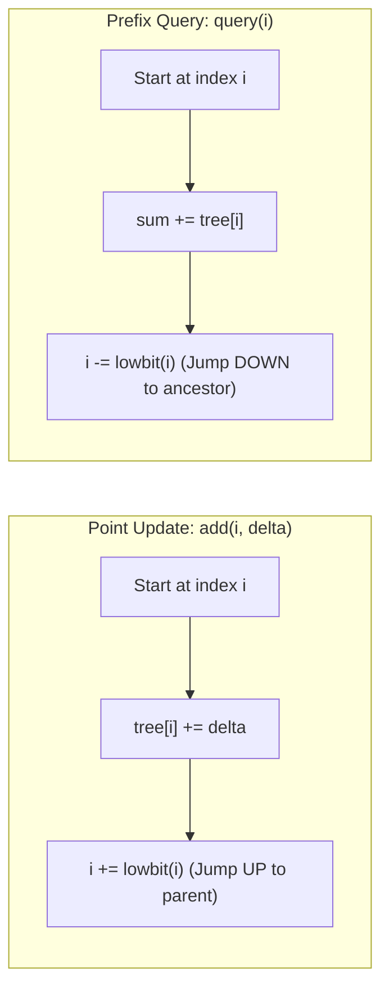

# Fenwick Trees (Binary Indexed Trees), Bitwise LSB & Dynamic Range Queries

## TL;DR

A **Fenwick Tree** (also known as a **Binary Indexed Tree / BIT**) is an implicitly indexed tree structure stored inside a 1D array. It supports **dynamic point updates** and **prefix sum range queries** both in **$O(\log N)$ time** with minimal $O(N)$ space overhead and zero pointer overhead.

---

## 1. Trade-Off Comparison: Fenwick Tree vs Alternatives

| Data Structure | Point Update | Range Sum Query | Memory Space | Code Complexity |
|---|---|---|---|---|
| **Standard Array** | **$O(1)$** | $O(N)$ | $O(N)$ | Minimal |
| **Prefix Sum Array** | $O(N)$ | **$O(1)$** | $O(N)$ | Minimal |
| **Segment Tree** | $O(\log N)$ | $O(\log N)$ | $O(4N)$ (Heavy) | High (Recursive) |
| **Fenwick Tree (BIT)** | **$O(\log N)$** | **$O(\log N)$** | **$O(N)$ (Optimal)** | **Very Low (Bitwise)** |

---

## 2. The Lowbit Engine (`i & -i`)

Fenwick Trees rely entirely on 2's complement bitwise arithmetic to find the **Least Significant Bit (LSB)** of an index `i`:

$$\text{lowbit}(i) = i \; \& \; (-i)$$

### Example Lowbit Calculations

```text
i = 6 (Binary: 0110_2)
-i = -6 (Two's Complement: 1010_2)
i & (-i) = 0110 & 1010 = 0010_2 = 2

i = 8 (Binary: 1000_2) -> lowbit(8) = 8
i = 12 (Binary: 1100_2) -> lowbit(12) = 4
```

---

## 3. How Fenwick Tree Works: Tree Coverage Intervals

Index `i` in a 1-based Fenwick Tree stores the sum of `lowbit(i)` elements ending at `i`:

$$\text{tree}[i] = \sum_{k = i - \text{lowbit}(i) + 1}^{i} A[k]$$

```text
Interval Responsibilities (1-based):

tree[1]: A[1]                      (Length 1)
tree[2]: A[1] + A[2]               (Length 2, lowbit(2)=2)
tree[3]: A[3]                      (Length 1)
tree[4]: A[1] + A[2] + A[3] + A[4] (Length 4, lowbit(4)=4)
tree[5]: A[5]                      (Length 1)
tree[6]: A[5] + A[6]               (Length 2, lowbit(6)=2)
tree[7]: A[7]                      (Length 1)
tree[8]: A[1] + ... + A[8]         (Length 8, lowbit(8)=8)
```

---

## 4. Fundamental Operations



### Range Query Formula ($O(\log N)$)

$$\text{RangeSum}(L, R) = \text{query}(R) - \text{query}(L - 1)$$

---

## 5. Complete Python Implementation

```python
class FenwickTree:
    """
    Fenwick Tree (Binary Indexed Tree) using 1-Based Indexing.
    Time Complexity: O(log N) per update/query, O(N) build
    Space Complexity: O(N)
    """
    def __init__(self, size: int):
        self.n = size
        self.tree = [0] * (size + 1)

    @staticmethod
    def _lowbit(i: int) -> int:
        return i & (-i)

    def add(self, i: int, delta: int) -> None:
        """Adds delta to element at 1-based index i."""
        while i <= self.n:
            self.tree[i] += delta
            i += self._lowbit(i)

    def query(self, i: int) -> int:
        """Returns prefix sum A[1] + A[2] + ... + A[i]."""
        total_sum = 0
        while i > 0:
            total_sum += self.tree[i]
            i -= self._lowbit(i)
        return total_sum

    def range_query(self, left: int, right: int) -> int:
        """Returns range sum A[left] + ... + A[right] (1-based)."""
        return self.query(right) - self.query(left - 1)
```

---

## 6. Advanced Application: Counting Inversions in $O(N \log N)$

An **Inversion** is a pair $(i, j)$ such that $i < j$ and $A[i] > A[j]$.

### Fenwick Tree Rank Frequency Algorithm
1. Coordinate-compress array elements into rank values $1 \dots N$.
2. Traverse array right-to-left:
   - `inversions += bit.query(rank - 1)`
   - `bit.add(rank, 1)`

```python
def count_inversions(nums: list[int]) -> int:
    """
    Count Inversions using Fenwick Tree.
    Time Complexity: O(N log N)
    Auxiliary Space: O(N)
    """
    # Coordinate Compression
    sorted_unique = sorted(set(nums))
    rank_map = {val: i + 1 for i, val in enumerate(sorted_unique)}
    
    n = len(sorted_unique)
    bit = FenwickTree(n)
    inversions = 0
    
    # Process elements from right to left
    for num in reversed(nums):
        rank = rank_map[num]
        inversions += bit.query(rank - 1) # Count numbers smaller than num seen so far
        bit.add(rank, 1)
        
    return inversions
```

---

## 7. Common Pitfalls & Edge Cases

1. **0-Based Indexing Crash**: Passing `i = 0` into `add` or `query` causes an **infinite loop** because `lowbit(0) = 0` $\implies `i += 0` forever! Always convert 0-based indices to 1-based (`i + 1`).
2. **Missing Boundary Checks**: Ensure `i <= n` in `add()` loop to prevent index out of bounds errors.

---

## 8. Practice Problems

### Foundation
- [LeetCode 307: Range Sum Query - Mutable](https://leetcode.com/problems/range-sum-query-mutable/)
- [LeetCode 315: Count of Smaller Numbers After Self](https://leetcode.com/problems/count-of-smaller-numbers-after-self/)

### Intermediate
- [LeetCode 493: Reverse Pairs](https://leetcode.com/problems/reverse-pairs/)
- [LeetCode 1649: Create Sorted Array through Instructions](https://leetcode.com/problems/create-sorted-array-through-instructions/)

### Advanced
- [LeetCode 2179: Count Good Triplets in an Array](https://leetcode.com/problems/count-good-triplets-in-an-array/)

---

## Related Concepts
- [[00 - DSA MOC|Master DSA MOC]]
- [[Prefix Sum]]
- [[Segment Tree]]
- [[Bit Manipulation]]
