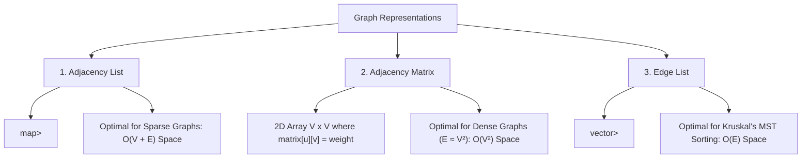

# Graph Fundamentals, Representations & Traversal Patterns

## TL;DR

A **Graph** $G = (V, E)$ is a non-linear data structure consisting of a set of **Vertices (Nodes)** $V$ and a set of **Edges** $E$ connecting pairs of vertices. Unlike trees, graphs can contain **cycles**, **multiple disconnected components**, and **self-loops**. Graph traversal requires tracking a `visited` set to prevent infinite loops.

---

## 1. Core Graph Terminology

```text
Undirected Unweighted Graph:         Directed Weighted Graph (DAG):
        (0) ─── (1)                           (0) ──5──► (1)
         │       │                             │          │
         │       │                             3          2
         ▼       ▼                             ▼          ▼
        (2) ─── (3)                           (2) ──1──► (3)
```

- **Directed (Digraph)**: Edges have a direction ($(u \to v) \neq (v \to u)$).
- **Undirected**: Edges are bidirectional ($(u, v) \equiv (v, u)$).
- **Weighted**: Edges carry numeric weights (e.g. distance, cost, latency).
- **Degree**:
  - **Undirected**: Number of edges connected to vertex $v$.
  - **Directed**: **In-Degree** (incoming edges) vs **Out-Degree** (outgoing edges).
- **Path**: Sequence of vertices connected by edges with no repeated vertices.
- **Cycle**: Path starting and ending at the same vertex.
- **DAG (Directed Acyclic Graph)**: Directed graph with NO cycles (essential for Topological Sort & Dynamic Programming).

---

## 2. Graph Representations & Trade-Off Comparison



### Master Comparison Matrix

| Property | Adjacency List | Adjacency Matrix | Edge List |
|---|---|---|---|
| **Memory Space** | **$O(V + E)$** (Optimal for Sparse) | $O(V^2)$ (Heavy overhead) | $O(E)$ |
| **Check Edge $(u, v)$ Exists** | $O(\text{Degree}(u))$ | **$O(1)$** | $O(E)$ |
| **Iterate Outgoing Neighbors**| **$O(\text{Degree}(u))$** | $O(V)$ | $O(E)$ |
| **Add Edge $(u, v)$** | **$O(1)$** | **$O(1)$** | **$O(1)$** |
| **Remove Edge $(u, v)$** | $O(\text{Degree}(u))$ | **$O(1)$** | $O(E)$ |

---

## 3. Fundamental Graph Traversals: BFS vs DFS

```text
Sample Graph for Traversals:
        (0)
       /   \
     (1)   (2)
     /      \
   (3)      (4)
```

| Traversal | Mechanism | Auxiliary Data Structure | Time Complexity | Auxiliary Space | Key Use Case |
|---|---|---|---|---|---|
| **Breadth-First Search (BFS)** | Level-by-level (Expanding wave) | FIFO **Queue** | $O(V + E)$ | $O(V)$ | **Shortest Path** in unweighted graphs |
| **Depth-First Search (DFS)** | Plunges deep down each path | Recursion / LIFO **Stack** | $O(V + E)$ | $O(V)$ | Cycle detection, Topological Sort, Components |

---

## 4. Code Implementations & Step-by-Step Tracing

### Traversal 1: Breadth-First Search (BFS)

```python
from collections import deque

def bfs_traversal(graph: dict[int, list[int]], start_node: int) -> list[int]:
    """
    BFS Traversal on Graph (Handles Cycles via visited set).
    Time Complexity: O(V + E)
    Auxiliary Space: O(V)
    """
    visited = {start_node}
    queue = deque([start_node])
    traversal_order = []
    
    while queue:
        node = queue.popleft()
        traversal_order.append(node)
        
        for neighbor in graph.get(node, []):
            if neighbor not in visited:
                visited.add(neighbor)
                queue.append(neighbor)
                
    return traversal_order
```

---

### Traversal 2: Depth-First Search (DFS)

```python
def dfs_traversal(graph: dict[int, list[int]], start_node: int) -> list[int]:
    """
    Recursive DFS Traversal.
    Time Complexity: O(V + E)
    Auxiliary Space: O(V) call stack
    """
    visited = set()
    traversal_order = []
    
    def dfs(node: int):
        visited.add(node)
        traversal_order.append(node)
        
        for neighbor in graph.get(node, []):
            if neighbor not in visited:
                dfs(neighbor)

    dfs(start_node)
    return traversal_order
```

---

## 5. Core Algorithmic Patterns

### Pattern A: Connected Components (Number of Islands - Grid Graph DFS)

Given an $M \times N$ 2D grid of `'1'`s (land) and `'0'`s (water), count the number of islands.

```python
def num_islands(grid: list[list[str]]) -> int:
    """
    Count Connected Components on Grid using DFS.
    Time Complexity: O(M · N)
    Auxiliary Space: O(M · N) recursion stack
    """
    if not grid or not grid[0]:
        return 0
        
    m, n = len(grid), len(grid[0])
    islands = 0
    
    def sink_island(r: int, c: int):
        # Base bounds & water check
        if r < 0 or r >= m or c < 0 or c >= n or grid[r][c] == '0':
            return
            
        grid[r][c] = '0' # Mark visited by sinking land to water!
        
        # Explore 4 orthogonal directions
        sink_island(r + 1, c)
        sink_island(r - 1, c)
        sink_island(r, c + 1)
        sink_island(r, c - 1)

    for r in range(m):
        for c in range(n):
            if grid[r][c] == '1':
                islands += 1
                sink_island(r, c) # Sink entire connected component
                
    return islands
```

---

### Pattern B: Cycle Detection in Directed Graph (3-Color DFS)

States for 3-Coloring:
- **0 (White)**: Unvisited.
- **1 (Gray)**: Visiting (Currently in active recursion stack).
- **2 (Black)**: Fully Visited.

#### Key Observation
A directed graph contains a cycle if and only if DFS encounters an edge pointing to a **Gray (Visiting) node** (a back edge)!

```python
def has_cycle_directed(num_nodes: int, edges: list[list[int]]) -> bool:
    """
    Cycle Detection in Directed Graph using 3-Color DFS.
    Time Complexity: O(V + E)
    Auxiliary Space: O(V)
    """
    graph = {i: [] for i in range(num_nodes)}
    for u, v in edges:
        graph[u].append(v)
        
    color = [0] * num_nodes # 0: White, 1: Gray, 2: Black
    
    def dfs(u: int) -> bool:
        color[u] = 1 # Mark Visiting (Gray)
        
        for v in graph[u]:
            if color[v] == 1:
                return True # Back edge found -> Cycle Detected!
            if color[v] == 0:
                if dfs(v):
                    return True
                    
        color[u] = 2 # Mark Fully Visited (Black)
        return False

    for node in range(num_nodes):
        if color[node] == 0:
            if dfs(node):
                return True
                
    return False
```

---

## 6. Common Pitfalls & Edge Cases

1. **Missing Visited Set**: Traversing a graph containing cycles without a `visited` set causes infinite loops / recursion stack overflow!
2. **Disconnected Component Isolation**: Iterating over a graph starting at node `0` misses disconnected components (e.g. node `5` isolated). Always loop through `0` to `V-1` and launch BFS/DFS if unvisited.
3. **Grid Boundary Out-of-Bounds**: Forgetting `0 <= r < M` checks when constructing graph neighbors on 2D matrices leads to `IndexError`.

---

## 7. Practice Problems

### Foundation
- [LeetCode 733: Flood Fill](https://leetcode.com/problems/flood-fill/)
- [LeetCode 200: Number of Islands](https://leetcode.com/problems/number-of-islands/)

### Intermediate
- [LeetCode 133: Clone Graph](https://leetcode.com/problems/clone-graph/)
- [LeetCode 547: Number of Provinces](https://leetcode.com/problems/number-of-provinces/)
- [LeetCode 785: Is Graph Bipartite?](https://leetcode.com/problems/is-graph-bipartite/)
- [LeetCode 207: Course Schedule](https://leetcode.com/problems/course-schedule/) (Cycle Detection)

### Advanced
- [LeetCode 127: Word Ladder](https://leetcode.com/problems/word-ladder/) (Shortest Path BFS)
- [LeetCode 863: All Nodes Distance K in Binary Tree](https://leetcode.com/problems/all-nodes-distance-k-in-binary-tree/) (Tree to Graph Transformation)

---

## Related Concepts
- [[00 - DSA MOC|Master DSA MOC]]
- [[Queues]]
- [[Stacks]]
- [[Recursion]]
- [[Topological Sort]]
- [[Shortest Paths]]
- [[Disjoint Set Union]]
