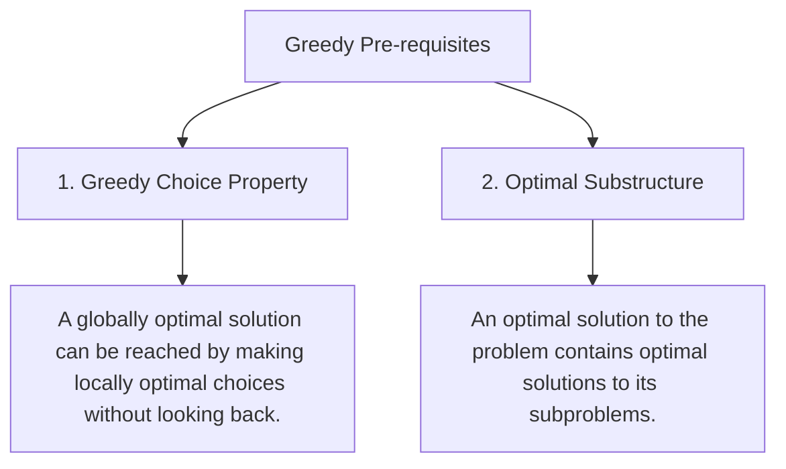

# Greedy Algorithms, Exchange Arguments & Interval Scheduling

## TL;DR

A **Greedy Algorithm** builds a solution step-by-step by always making the **locally optimal choice** at each step, under the assumption that local optimality guarantees a **globally optimal solution**. Unlike Dynamic Programming or Backtracking, a Greedy algorithm **never reconsider or backtracks** on previous decisions.

$$\text{Local Optimum at Step } k \implies \text{Global Optimum}$$

---

## 1. When Does Greedy Work? The 2 Key Properties



---

## 2. Greedy vs Dynamic Programming vs Backtracking

| Dimension | Backtracking | Dynamic Programming | Greedy |
|---|---|---|---|
| **Choices Evaluated** | Explores **all** valid branches | Evaluates **all** valid choices & memoizes | Makes **exactly 1** greedy choice |
| **Backtracking?** | **Yes** (Undoes state) | **No** (Computes subproblems) | **No** (Never revisits decisions) |
| **Time Complexity** | $O(N!)$ or $O(2^N)$ | $O(\text{State Space})$ | **$O(N \log N)$ or $O(N)$** |
| **Correctness Proof** | Complete Search | Induction / Recurrence | **Exchange Argument / Greedy Stays Ahead** |

---

## 3. How to Prove Greedy Correctness: The Exchange Argument

Suppose an optimal solution $O$ exists that differs from our Greedy solution $G$.

1. Identify the **first decision point** where optimal solution $O$ differs from greedy solution $G$.
2. **Exchange** the choice in $O$ with the greedy choice from $G$.
3. Prove that the exchanged solution $O'$ is **still optimal** (its quality is $\ge$ quality of $O$).
4. By induction, we can transform $O$ into $G$ without losing optimality $\implies$ **Greedy is Optimal!**

---

## 4. Canonical Greedy Patterns & Problems

### Pattern A: Activity Selection / Interval Scheduling ($O(N \log N)$)

Given $N$ activities with start time $S[i]$ and finish time $F[i]$, select the **maximum number of non-overlapping activities**.

#### Greedy Choice Rule
Sort activities by **finish time $F[i]$ ascending**. Always pick the activity that finishes earliest!

```text
Why finish time?
Finishing as early as possible leaves the MAXIMUM remaining time for future activities.

Activities (Sorted by End Time):
A1: [ 1 ─────── 4 ]
A2:     [ 3 ─────── 5 ]  ◄── Overlaps with A1! Skip!
A3:             [ 0 ─────────────── 6 ] ◄── Overlaps! Skip!
A4:                 [ 5 ─── 7 ] ◄── Finishes earliest after A1! Select A4!
A5:                         [ 8 ─── 9 ] ◄── Select A5!

Selected: A1, A4, A5
```

#### Python Implementation

```python
def max_non_overlapping_intervals(intervals: list[list[int]]) -> int:
    """
    Activity Selection Problem (Interval Scheduling).
    Time Complexity: O(N log N) due to sorting
    Auxiliary Space: O(1)
    """
    if not intervals:
        return 0
        
    # 1. Sort intervals by end time ascending
    intervals.sort(key=lambda x: x[1])
    
    count = 1
    last_end = intervals[0][1]
    
    for i in range(1, len(intervals)):
        start, end = intervals[i]
        # If current activity starts at or after last selected end time
        if start >= last_end:
            count += 1
            last_end = end
            
    return count
```

---

### Pattern B: Merge Intervals ($O(N \log N)$ Time)

Given an array of `intervals`, merge all overlapping intervals.

#### Greedy Choice Rule
Sort intervals by **start time ascending**. If current interval `start <= prev_end`, they overlap! Merge them by setting `prev_end = max(prev_end, current_end)`.

```text
Sorted Intervals: [[1,3], [2,6], [8,10], [15,18]]

Step 1: [1, 3]
Step 2: [2, 6] -> 2 <= 3 (Overlap!). Merge to [1, max(3, 6)] = [1, 6]
Step 3: [8, 10] -> 8 > 6 (No overlap). Output [1, 6], Start new [8, 10]
Step 4: [15, 18] -> 15 > 10 (No overlap). Output [8, 10], Start new [15, 18]

Result: [[1, 6], [8, 10], [15, 18]]
```

#### Python Implementation

```python
def merge_intervals(intervals: list[list[int]]) -> list[list[int]]:
    """
    Merge Overlapping Intervals.
    Time Complexity: O(N log N)
    Auxiliary Space: O(N) for output
    """
    if not intervals:
        return []
        
    # Sort by start time ascending
    intervals.sort(key=lambda x: x[0])
    
    merged = [intervals[0]]
    
    for current in intervals[1:]:
        last_start, last_end = merged[-1]
        curr_start, curr_end = current
        
        if curr_start <= last_end:
            # Overlap -> Merge by updating end time
            merged[-1][1] = max(last_end, curr_end)
        else:
            # No overlap -> Append current
            merged.append(current)
            
    return merged
```

---

### Pattern C: Jump Game (Greedy Coverage Expansion)

Given an array `nums` where `nums[i]` is your max jump length at index $i$, return `True` if you can reach the last index.

#### Greedy Strategy
Track `max_reachable` index so far as you iterate forward.

```python
def can_jump(nums: list[int]) -> bool:
    """
    Jump Game Greedy Max Reachable Range.
    Time Complexity: O(N)
    Auxiliary Space: O(1)
    """
    max_reachable = 0
    
    for i, jump in enumerate(nums):
        if i > max_reachable:
            return False # Cannot even reach current index i!
            
        max_reachable = max(max_reachable, i + jump)
        if max_reachable >= len(nums) - 1:
            return True
            
    return True
```

---

## 5. When Greedy Fails: Classic Counterexamples

### Counterexample 1: Coin Change with Arbitrary Denominations
- Denominations: `[1, 3, 4]`, Target: `6`.
- **Greedy Choice**: Pick largest coin `4`, remaining `2` $\to$ `4 + 1 + 1` = **3 coins**.
- **Optimal (DP)**: `3 + 3` = **2 coins**!
- **Lesson**: Greedy works for canonical currency (1, 5, 10, 25), but fails for arbitrary coin sets. Use **Dynamic Programming**!

### Counterexample 2: 0/1 Knapsack Problem
- Items cannot be broken into fractions.
- **Fractional Knapsack** $\to$ Greedy works (Sort by Value/Weight ratio).
- **0/1 Knapsack** $\to$ Greedy fails! Must use **DP**.

---

## 6. Practice Problems

### Foundation
- [LeetCode 455: Assign Cookies](https://leetcode.com/problems/assign-cookies/)
- [LeetCode 860: Lemonade Change](https://leetcode.com/problems/lemonade-change/)

### Intermediate
- [LeetCode 55: Jump Game](https://leetcode.com/problems/jump-game/)
- [LeetCode 45: Jump Game II](https://leetcode.com/problems/jump-game-ii/)
- [LeetCode 56: Merge Intervals](https://leetcode.com/problems/merge-intervals/)
- [LeetCode 435: Non-overlapping Intervals](https://leetcode.com/problems/non-overlapping-intervals/)

### Advanced
- [LeetCode 134: Gas Station](https://leetcode.com/problems/gas-station/)
- [LeetCode 763: Partition Labels](https://leetcode.com/problems/partition-labels/)

---

## Related Concepts
- [[00 - DSA MOC|Master DSA MOC]]
- [[Arrays]]
- [[Sorting Algorithms]]
- [[Heap]]
- [[Dynamic Programming]]
