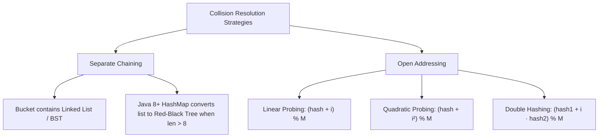

# Hashing, Hash Tables & Lookup Optimization

## TL;DR

**Hashing** maps arbitrary keys (e.g., strings, large integers, objects) to fixed-size array indices using a deterministic **Hash Function**. By storing key-value pairs at calculated array indices, a Hash Table achieves **$O(1)$ average time complexity** for insertions, deletions, and lookups.

---

## 1. What is a Hash Table? How It Works

A Hash Table consists of an underlying bucket array of size $M$ and a hash function $h(k)$.

$$\text{Index} = h(\text{key}) \pmod M$$

```text
Key: "apple" ──► Hash Function h("apple") = 5892341 ──► % Bucket Array Size 8 ──► Index 5

Bucket Array (Size 8):
Index:   0       1       2       3       4       5       6       7
       ┌───────┬───────┬───────┬───────┬───────┬───────┬───────┬───────┐
Bucket:│ NULL  │ NULL  │ NULL  │ NULL  │ NULL  │"apple"│ NULL  │ NULL  │
       └───────┴───────┴───────┴───────┴───────┴───────┴───────┴───────┘
```

### Properties of a Good Hash Function
1. **Deterministic**: The same key always yields the exact same hash value.
2. **Uniform Distribution**: Keys are mapped evenly across all available buckets to minimize collisions.
3. **Fast Computation**: $O(1)$ calculation speed.

---

## 2. Collision Resolution Techniques

A **Collision** occurs when two distinct keys $k_1 \neq k_2$ produce the same bucket index: $h(k_1) \pmod M = h(k_2) \pmod M$.



### Separate Chaining vs Open Addressing

```text
Separate Chaining (Linked Lists):
Index 2: ──► ["apple": 5] ──► ["banana": 8] ──► NULL

Open Addressing (Linear Probing):
Index 2: ["apple": 5]
Index 3: ["banana": 8]  (Collision at Index 2 -> Probe next slot Index 3)
```

---

## 3. Load Factor ($\alpha$) & Rehashing

$$\text{Load Factor } (\alpha) = \frac{N \text{ (Number of Elements)}}{M \text{ (Number of Buckets)}}$$

- When $\alpha$ exceeds a threshold (typically $\alpha > 0.75$), collisions spike, degrading lookup performance toward $O(N)$.
- **Rehashing**: The hash table allocates a new bucket array of size $2M$ and re-inserts all existing elements into new calculated positions.
- **Amortized Complexity**: Resizing takes $O(N)$ time, but happens infrequently enough that insertions remain $O(1)$ amortized.

---

## 4. Hash Data Structure Variations

| Type | Stored Data | Common Use Case | C++ STL | Java | Python |
|---|---|---|---|---|---|
| **Hash Map** | Key-Value Pairs | Mapping keys to counts, indices, metadata | `unordered_map` | `HashMap` | `dict` |
| **Hash Set** | Unique Keys Only | Existence checking, deduplication | `unordered_set` | `HashSet` | `set` |
| **Frequency Map** | Key-Count Pairs | Element occurrence counting | `unordered_map<T, int>` | `HashMap<T, Integer>` | `collections.Counter` |

---

## 5. Core Algorithmic Transformations & Patterns

The single most powerful optimization using hashing is:

$$\text{Transforming Repeated Linear Search } O(N) \implies \text{Hash Lookup } O(1)$$

---

### Pattern A: Two Sum ($O(N)$ Hash Map Lookup)

Given an array of integers `nums` and a `target`, return indices of the two numbers that add up to `target`.

#### Brute Force vs Hash Map

```text
Brute Force: Check every pair (i, j) -> O(N²) Time, O(1) Space
Optimization: For current number x, we need complement = target - x.
              Store visited elements in Hash Map: { number : index } -> O(N) Time, O(N) Space
```

#### Python Implementation

```python
def two_sum(nums: list[int], target: int) -> list[int]:
    """
    Two Sum using Hash Map for O(1) average complement lookups.
    Time Complexity: O(N)
    Auxiliary Space: O(N)
    """
    seen = {} # Maps value -> index
    
    for i, num in enumerate(nums):
        complement = target - num
        if complement in seen:
            return [seen[complement], i]
        seen[num] = i
        
    return []
```

---

### Pattern B: Longest Consecutive Sequence ($O(N)$ Hash Set Boundary Check)

Given an unsorted array of integers `nums`, find the length of the longest consecutive elements sequence in $O(N)$ time.

#### Key Observation

An element `x` is the **start of a sequence** if and only if `x - 1` is NOT present in the set. If `x - 1` exists, `x` cannot be the start, so we skip it!

#### Dry Run Snapshot

```text
Input: nums = [100, 4, 200, 1, 3, 2]
Set: {1, 2, 3, 4, 100, 200}

Check 100: (100 - 1 = 99) in Set? No -> Start of sequence [100]. Length = 1.
Check 4:   (4 - 1 = 3) in Set? Yes -> Skip! (3 will handle sequence [1, 2, 3, 4])
Check 200: (200 - 1 = 199) in Set? No -> Start of sequence [200]. Length = 1.
Check 1:   (1 - 1 = 0) in Set? No -> Start of sequence [1, 2, 3, 4]. Length = 4.
Check 3:   (3 - 1 = 2) in Set? Yes -> Skip!
Check 2:   (2 - 1 = 1) in Set? Yes -> Skip!

Max Length: 4 (Sequence: [1, 2, 3, 4])
```

#### Python Implementation

```python
def longest_consecutive(nums: list[int]) -> int:
    """
    Longest Consecutive Sequence using Hash Set boundary detection.
    Time Complexity: O(N)
    Auxiliary Space: O(N)
    """
    num_set = set(nums)
    longest_streak = 0
    
    for num in num_set:
        # Check if num is the start of a sequence
        if num - 1 not in num_set:
            current_num = num
            current_streak = 1
            
            while current_num + 1 in num_set:
                current_num += 1
                current_streak += 1
                
            longest_streak = max(longest_streak, current_streak)
            
    return longest_streak
```

---

## 6. Common Pitfalls & Edge Cases

1. **Worst-Case $O(N)$ Hash Collisions**: If an attacker craft keys that hash to the exact same bucket (Hash Collision Denial of Service), lookup degrades to $O(N)$. Languages like Python 3 randomize hash seeds per process to mitigate this.
2. **Unhashable Mutable Keys**: In Python, mutable structures like lists or dictionaries cannot be used as dictionary keys because their hash value would change if modified. Use immutable tuples instead.
3. **Custom Hash Functions**: When defining custom objects as hash keys, always override both `hashCode()` and `equals()` (Java) or `__hash__()` and `__eq__()` (Python).

---

## 7. Practice Problems

### Foundation
- [LeetCode 1: Two Sum](https://leetcode.com/problems/two-sum/)
- [LeetCode 217: Contains Duplicate](https://leetcode.com/problems/contains-duplicate/)

### Intermediate
- [LeetCode 49: Group Anagrams](https://leetcode.com/problems/group-anagrams/)
- [LeetCode 128: Longest Consecutive Sequence](https://leetcode.com/problems/longest-consecutive-sequence/)
- [LeetCode 36: Valid Sudoku](https://leetcode.com/problems/valid-sudoku/)

### Advanced
- [LeetCode 146: LRU Cache](https://leetcode.com/problems/lru-cache/) (Connects Hash Map + Doubly Linked List)
- [LeetCode 380: Insert Delete GetRandom O(1)](https://leetcode.com/problems/insert-delete-getrandom-o1/) (Connects Hash Map + Dynamic Array)

---

## Related Concepts
- [[00 - DSA MOC|Master DSA MOC]]
- [[Arrays]]
- [[Strings]]
- [[Two Pointers]]
- [[Sliding Window]]
