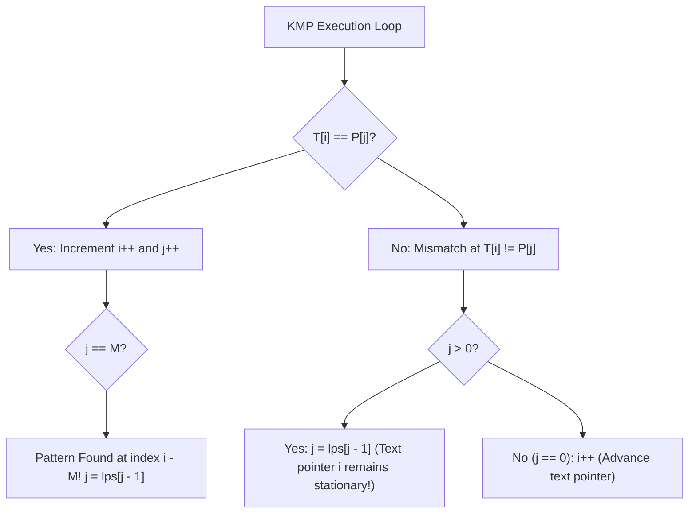

# KMP (Knuth-Morris-Pratt) Algorithm & LPS Prefix Tables

## TL;DR

The **Knuth-Morris-Pratt (KMP)** algorithm searches for occurrences of a pattern string $P$ of length $M$ inside a text string $T$ of length $N$ in **$O(N + M)$ linear time**.

Unlike the naive approach (which takes $O(N \cdot M)$ time by resetting the text pointer on mismatch), KMP **never backtracks the text pointer $i$**. It utilizes a precomputed **LPS (Longest Proper Prefix which is also Suffix)** array to intelligently shift the pattern pointer $j$.

---

## 1. Why KMP Works: Avoiding Redundant Text Shifts

### Naive Backtracking Trap ($O(N \cdot M)$)

```text
Text T:    a b a c a b a b a c a b a c a b a
Pattern P: a b a c a b a c
                  ▲ (Mismatch at P[7] 'c' vs T[7] 'b')

Naive: Resets text pointer i back to 1 ('b'), restarts pattern from j = 0.
KMP: Keeps text pointer i at 7! Looks at LPS table to skip 3 already matched characters!
```

---

## 2. The LPS (Longest Prefix Suffix) Table

The **LPS array** `lps[i]` stores the length of the **longest proper prefix** of `pattern[0..i]` that is also a **suffix** of `pattern[0..i]`.

- A **Proper Prefix** of string $S$ is a prefix that is not equal to $S$ itself (e.g. for "abc", proper prefixes are `""`, `"a"`, `"ab"`).

### LPS Calculation Example for `Pattern P = "a b a c a b a"`

| Substring `P[0..i]` | Proper Prefixes | Suffixes | Longest Matching Prefix & Suffix | `lps[i]` |
|---|---|---|---|---|
| `"a"` | `""` | `""` | `""` | **0** |
| `"a b"` | `"a"` | `"b"` | `""` | **0** |
| `"a b a"` | `"a"`, `"ab"` | `"a"`, `"ba"` | `"a"` | **1** |
| `"a b a c"` | `"a"`, `"ab"`, `"aba"` | `"c"`, `"ac"`, `"bac"` | `""` | **0** |
| `"a b a c a"` | `"a"`, `"ab"`, ... | `"a"`, `"ca"`, ... | `"a"` | **1** |
| `"a b a c a b"` | `"a"`, `"ab"`, ... | `"b"`, `"ab"`, ... | `"ab"` | **2** |
| `"a b a c a b a"` | `"a"`, ..., `"abaca"` | `"a"`, ..., `"acaba"` | `"aba"` | **3** |

$$\text{Final LPS Array for "abacaba"}: [0, 0, 1, 0, 1, 2, 3]$$

---

## 3. Algorithm Step Breakdown



---

## 4. Complete Python Implementation

```python
def compute_lps(pattern: str) -> list[int]:
    """
    Precomputes the LPS (Longest Prefix Suffix) array in O(M) time.
    """
    m = len(pattern)
    lps = [0] * m
    prev_lps = 0 # Length of previous longest prefix suffix
    i = 1
    
    while i < m:
        if pattern[i] == pattern[prev_lps]:
            prev_lps += 1
            lps[i] = prev_lps
            i += 1
        else:
            if prev_lps != 0:
                prev_lps = lps[prev_lps - 1] # Fallback to smaller prefix
            else:
                lps[i] = 0
                i += 1
                
    return lps

def kmp_search(text: str, pattern: str) -> list[int]:
    """
    KMP Pattern Matching Algorithm.
    Time Complexity: O(N + M) where N = len(text), M = len(pattern)
    Auxiliary Space: O(M) for LPS array
    Returns list of 0-based starting indices where pattern occurs in text.
    """
    if not pattern:
        return []
        
    n, m = len(text), len(pattern)
    lps = compute_lps(pattern)
    matches = []
    
    i = 0 # Index for text
    j = 0 # Index for pattern
    
    while i < n:
        if text[i] == pattern[j]:
            i += 1
            j += 1
            
        if j == m:
            matches.append(i - j) # Match found!
            j = lps[j - 1]         # Prepare for next potential match
        elif i < n and text[i] != pattern[j]:
            if j != 0:
                j = lps[j - 1]     # Fallback pattern pointer without moving i!
            else:
                i += 1             # Text pointer advances only when j is at 0
                
    return matches
```

---

## 5. Common Pitfalls & Edge Cases

1. **Off-by-One in LPS Fallback**: Writing `j = lps[j]` instead of `j = lps[j - 1]` causes invalid index access or incorrect fallback.
2. **Infinite Loop when `j == 0`**: On mismatch when `j == 0`, if `i` is not incremented (`i += 1`), the loop gets stuck at `text[i]` indefinitely.
3. **Empty String Inputs**: Always handle edge cases where `pattern` is empty (`""`) or longer than `text` (`M > N`).

---

## 6. Practice Problems

### Foundation
- [LeetCode 28: Find the Index of the First Occurrence in a String](https://leetcode.com/problems/find-the-index-of-the-first-occurrence-in-a-string/)
- [LeetCode 459: Repeated Substring Pattern](https://leetcode.com/problems/repeated-substring-pattern/) (LPS Property)

### Intermediate
- [LeetCode 214: Shortest Palindrome](https://leetcode.com/problems/shortest-palindrome/) (KMP on `pattern + # + reverse(pattern)`)
- [LeetCode 1392: Longest Happy Prefix](https://leetcode.com/problems/longest-happy-prefix/) (Direct LPS lookup)

### Advanced
- [LeetCode 3008: Find Beautiful Indices in the Given Array II](https://leetcode.com/problems/find-beautiful-indices-in-the-given-array-ii/) (Multi-string KMP + Two Pointers)

---

## Related Concepts
- [[00 - DSA MOC|Master DSA MOC]]
- [[Strings]]
- [[Trie]]
- [[Z Algorithm]]
- [[Rolling Hash]]
