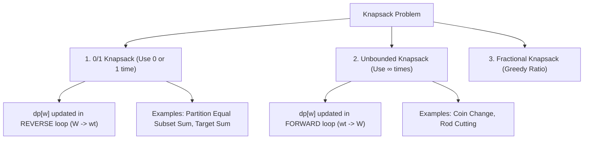

# Knapsack Variants, 0/1 vs Unbounded & Space Optimizations

## TL;DR

The **Knapsack Problem** is a foundational combinatorial optimization problem: given $N$ items (each with a weight $w_i$ and value $v_i$) and a knapsack of capacity $W$, determine the maximum value of items that can be packed into the knapsack without exceeding capacity $W$.

The solution strategy hinges entirely on item reuse rules: **0/1 Knapsack** (each item used at most once) vs **Unbounded Knapsack** (items used unlimited times).

---

## 1. Master Knapsack Taxonomy & Space Optimization



---

## 2. 0/1 Knapsack Problem

### Recurrence Relation

Let `dp[i][w]` be the maximum value obtained using a subset of the first `i` items with capacity `w`:

$$\text{dp}[i][w] = \begin{cases} \text{dp}[i-1][w] & \text{if } \text{wt}[i-1] > w \\ \max(\text{dp}[i-1][w], \; \text{val}[i-1] + \text{dp}[i-1][w - \text{wt}[i-1]]) & \text{if } \text{wt}[i-1] \le w \end{cases}$$

---

### The 1D Space Optimization Secret (Reverse Loop!)

In 2D DP, `dp[i][w]` depends ONLY on values from the **previous row `dp[i-1]`**.

If we collapse the 2D array to a 1D array `dp[w]`, we MUST iterate capacity $w$ in **Reverse Order ($W \to \text{wt}[i]$)**:

```text
Why REVERSE iteration?
When updating dp[w] = max(dp[w], val + dp[w - wt]):
- Reverse (W -> wt): dp[w - wt] holds OLD state from previous item i-1. (Correct 0/1 behavior!)
- Forward (wt -> W): dp[w - wt] holds NEW state from current item i. (Item used MULTIPLE times!)
```

```text
0/1 Knapsack 1D Table State Transition (Item: wt=2, val=3, Cap W=5):

Reverse Loop (w from 5 down to 2):
Initial: dp = [0, 0, 0, 0, 0, 0]
w=5: dp[5] = max(0, 3 + dp[5-2]) = max(0, 3 + 0) = 3
w=4: dp[4] = max(0, 3 + dp[4-2]) = max(0, 3 + 0) = 3
w=3: dp[3] = max(0, 3 + dp[3-2]) = max(0, 3 + 0) = 3
w=2: dp[2] = max(0, 3 + dp[2-2]) = max(0, 3 + 0) = 3
Final:  dp = [0, 0, 3, 3, 3, 3]  (Item used AT MOST ONCE!)
```

#### Python Implementation (0/1 Knapsack $O(W)$ Space)

```python
def knapsack_01(weights: list[int], values: list[int], capacity: int) -> int:
    """
    0/1 Knapsack with 1D Array Space Optimization.
    Time Complexity: O(N · W)
    Auxiliary Space: O(W)
    """
    dp = [0] * (capacity + 1)
    
    for i in range(len(weights)):
        wt = weights[i]
        val = values[i]
        # REVERSE loop for 0/1 constraint!
        for w in range(capacity, wt - 1, -1):
            dp[w] = max(dp[w], val + dp[w - wt])
            
    return dp[capacity]
```

---

## 3. Unbounded Knapsack Problem

In Unbounded Knapsack, items can be selected infinitely many times (e.g. Coin Change, Rod Cutting).

### Recurrence Relation

$$\text{dp}[w] = \max(\text{dp}[w], \; \text{val}[i] + \text{dp}[w - \text{wt}[i]])$$

#### 1D Space Optimization (Forward Loop!)

Because items can be reused, we iterate capacity $w$ in **Forward Order ($\text{wt}[i] \to W$)**, allowing newly updated subproblem values `dp[w - wt]` to be reused immediately in the same pass!

#### Python Implementation (Unbounded Knapsack)

```python
def unbounded_knapsack(weights: list[int], values: list[int], capacity: int) -> int:
    """
    Unbounded Knapsack with 1D Forward Array.
    Time Complexity: O(N · W)
    Auxiliary Space: O(W)
    """
    dp = [0] * (capacity + 1)
    
    for i in range(len(weights)):
        wt = weights[i]
        val = values[i]
        # FORWARD loop allows multiple item reuse!
        for w in range(wt, capacity + 1):
            dp[w] = max(dp[w], val + dp[w - wt])
            
    return dp[capacity]
```

---

## 4. Key Pattern Transformations

### Pattern A: Subset Sum (Partition Equal Subset Sum - LeetCode 416)

Can an array `nums` be partitioned into two subsets with equal sum?

- Equivalent to 0/1 Knapsack where `capacity = sum(nums) // 2`, `weight = num`, `value = num`.

```python
def can_partition(nums: list[int]) -> bool:
    total_sum = sum(nums)
    if total_sum % 2 != 0:
        return False
        
    target = total_sum // 2
    dp = [False] * (target + 1)
    dp[0] = True # Base case: sum 0 is always achievable
    
    for num in nums:
        for w in range(target, num - 1, -1):
            dp[w] = dp[w] or dp[w - num]
            
    return dp[target]
```

---

### Pattern B: Coin Change I (Min Coins - LeetCode 322)

Find minimum number of coins to make total amount $A$. Unbounded items!

```python
def coin_change(coins: list[int], amount: int) -> int:
    dp = [float('inf')] * (amount + 1)
    dp[0] = 0
    
    for coin in coins:
        for w in range(coin, amount + 1):
            dp[w] = min(dp[w], 1 + dp[w - coin])
            
    return dp[amount] if dp[amount] != float('inf') else -1
```

---

## 5. Common Pitfalls & Edge Cases

1. **Forward vs Reverse Loop Mix-up**: Using a forward loop in 0/1 Knapsack allows an item to be selected multiple times, silently converting it into Unbounded Knapsack!
2. **Outer vs Inner Loop Order in Combinations vs Permutations**:
   - `for coin in coins: for w in range(coin, amount+1):` $\implies$ Counts **Combinations** (Order does not matter).
   - `for w in range(1, amount+1): for coin in coins:` $\implies$ Counts **Permutations** (Order matters e.g. `[1, 2]` vs `[2, 1]`).
3. **Capacity Overflow**: When `capacity W` is extremely large ($W = 10^9$), pseudo-polynomial $O(N \cdot W)$ DP fails. Use **Meet-in-the-Middle** ($O(2^{N/2} \log(2^{N/2}))$) instead!

---

## 6. Practice Problems

### Foundation
- [LeetCode 416: Partition Equal Subset Sum](https://leetcode.com/problems/partition-equal-subset-sum/)
- [LeetCode 322: Coin Change](https://leetcode.com/problems/coin-change/)

### Intermediate
- [LeetCode 518: Coin Change II](https://leetcode.com/problems/coin-change-ii/) (Combinations)
- [LeetCode 494: Target Sum](https://leetcode.com/problems/target-sum/) (0/1 Knapsack Subset Difference)
- [LeetCode 1049: Last Stone Weight II](https://leetcode.com/problems/last-stone-weight-ii/)

### Advanced
- [LeetCode 474: Ones and Zeroes](https://leetcode.com/problems/ones-and-zeroes/) (2D Capacity 0/1 Knapsack)

---

## Related Concepts
- [[00 - DSA MOC|Master DSA MOC]]
- [[Dynamic Programming]]
- [[Recursion]]
- [[Greedy Algorithms]]
