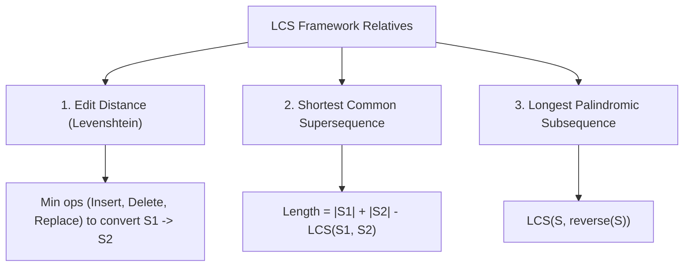

# Longest Common Subsequence (LCS), Edit Distance & String Alignment

## TL;DR

The **Longest Common Subsequence (LCS)** problem finds the length of the longest subsequence present in two sequence strings $S_1$ and $S_2$ in the same relative order (not necessarily contiguous). LCS forms the backbone of diff tools (like `git diff`), DNA sequence alignment (Needleman-Wunsch algorithm), and spell-checking Edit Distance.

---

## 1. Substring vs Subsequence Definition

```text
String S = "ABCDE"

Substrings (Must be contiguous):
"ABC", "BCD", "CDE"

Subsequences (Relative order preserved, NOT necessarily contiguous):
"ACE", "ABD", "ABE", "ACE"
```

---

## 2. Recurrence Relation & DP Table Construction

Let `dp[i][j]` be the length of the LCS for substrings `S1[0..i-1]` and `S2[0..j-1]`.

$$\text{dp}[i][j] = \begin{cases} 0 & \text{if } i = 0 \text{ or } j = 0 \\ 1 + \text{dp}[i-1][j-1] & \text{if } S_1[i-1] == S_2[j-1] \\ \max(\text{dp}[i-1][j], \; \text{dp}[i][j-1]) & \text{if } S_1[i-1] \neq S_2[j-1] \end{cases}$$

### 2D Matrix State Trace (`S1 = "abcde"`, `S2 = "ace"`)

```text
       ""   a   c   e
""    [ 0 , 0 , 0 , 0 ]
a     [ 0 , 1 , 1 , 1 ]  ◄── Matches 'a': 1 + dp[0][0] = 1
b     [ 0 , 1 , 1 , 1 ]
c     [ 0 , 1 , 2 , 2 ]  ◄── Matches 'c': 1 + dp[2][1] = 2
d     [ 0 , 1 , 2 , 2 ]
e     [ 0 , 1 , 2 , 3 ]  ◄── Matches 'e': 1 + dp[4][2] = 3

LCS Length = dp[5][3] = 3 ("ace")
```

---

## 3. Reconstructing the Actual Subsequence String

To extract the exact string (not just its length), **backtrack** from cell `dp[m][n]` up to `dp[0][0]`:
- If `S1[i-1] == S2[j-1]`, character belongs to LCS! Append to output and move diagonally to `(i-1, j-1)`.
- Otherwise, move towards the neighbor with the larger value: `(i-1, j)` or `(i, j-1)`.

```python
def get_lcs_string(s1: str, s2: str, dp: list[list[int]]) -> str:
    i, j = len(s1), len(s2)
    lcs_chars = []
    
    while i > 0 and j > 0:
        if s1[i-1] == s2[j-1]:
            lcs_chars.append(s1[i-1])
            i -= 1
            j -= 1
        elif dp[i-1][j] >= dp[i][j-1]:
            i -= 1
            else:
            j -= 1
            
    return "".join(reversed(lcs_chars))
```

---

## 4. Key Sequence Variants & Transformations



---

### Variant 1: Edit Distance (Levenshtein Distance - LeetCode 72)

Given strings `s1` and `s2`, return minimum operations (Insert, Delete, Replace) to transform `s1` into `s2`.

#### Recurrence Relation
Let `dp[i][j]` be minimum edit distance between `s1[0..i-1]` and `s2[0..j-1]`:

$$\text{dp}[i][j] = \begin{cases} \text{dp}[i-1][j-1] & \text{if } s1[i-1] == s2[j-1] \\ 1 + \min\left( \text{dp}[i-1][j], \; \text{dp}[i][j-1], \; \text{dp}[i-1][j-1] \right) & \text{if } s1[i-1] \neq s2[j-1] \end{cases}$$

Where:
- `dp[i-1][j]` $\implies$ **Delete** character from `s1`
- `dp[i][j-1]` $\implies$ **Insert** character into `s1`
- `dp[i-1][j-1]` $\implies$ **Replace** character in `s1`

#### Python Implementation

```python
def min_distance(s1: str, s2: str) -> int:
    """
    Edit Distance (Levenshtein Distance) using 2D DP.
    Time Complexity: O(|S1| · |S2|)
    Auxiliary Space: O(|S1| · |S2|)
    """
    m, n = len(s1), len(s2)
    dp = [[0] * (n + 1) for _ in range(m + 1)]
    
    # Base cases: converting empty string to string of length k requires k operations
    for i in range(m + 1):
        dp[i][0] = i
    for j in range(n + 1):
        dp[0][j] = j
        
    for i in range(1, m + 1):
        for j in range(1, n + 1):
            if s1[i-1] == s2[j-1]:
                dp[i][j] = dp[i-1][j-1]
            else:
                dp[i][j] = 1 + min(
                    dp[i-1][j],   # Delete
                    dp[i][j-1],   # Insert
                    dp[i-1][j-1]  # Replace
                )
                
    return dp[m][n]
```

---

### Variant 2: Longest Palindromic Subsequence (LeetCode 516)

Find length of the longest palindromic subsequence in string $S$.

#### Transformation Trick
The Longest Palindromic Subsequence of $S$ IS the **Longest Common Subsequence of $S$ and $\text{reverse}(S)$**!

$$\text{LPS}(S) = \text{LCS}(S, \; \text{reverse}(S))$$

```python
def longest_palindrome_subseq(s: str) -> int:
    """
    Longest Palindromic Subsequence via LCS Transformation.
    Time Complexity: O(N²)
    Auxiliary Space: O(N²)
    """
    reversed_s = s[::-1]
    n = len(s)
    dp = [[0] * (n + 1) for _ in range(n + 1)]
    
    for i in range(1, n + 1):
        for j in range(1, n + 1):
            if s[i-1] == reversed_s[j-1]:
                dp[i][j] = 1 + dp[i-1][j-1]
            else:
                dp[i][j] = max(dp[i-1][j], dp[i][j-1])
                
    return dp[n][n]
```

---

## 5. Common Pitfalls & Edge Cases

1. **Forgetting Base Case Initialization in Edit Distance**: Failing to initialize `dp[i][0] = i` and `dp[0][j] = j` returns invalid operation counts.
2. **Confusing Substring vs Subsequence**: Longest Common Substring requires contiguous character matching (`dp[i][j] = 1 + dp[i-1][j-1]` on match, else `dp[i][j] = 0`). Subsequence carries over `max(dp[i-1][j], dp[i][j-1])`.
3. **Loss of String Reconstruction in 1D DP Space Optimization**: Collapsing the 2D DP table to a 1D array reduces space from $O(M \cdot N)$ to $O(N)$, but makes it impossible to reconstruct the exact matching string without Hirschberg's Divide & Conquer algorithm.

---

## 6. Practice Problems

### Foundation
- [LeetCode 1143: Longest Common Subsequence](https://leetcode.com/problems/longest-common-subsequence/)
- [LeetCode 516: Longest Palindromic Subsequence](https://leetcode.com/problems/longest-palindromic-subsequence/)

### Intermediate
- [LeetCode 72: Edit Distance](https://leetcode.com/problems/edit-distance/)
- [LeetCode 583: Delete Operation for Two Strings](https://leetcode.com/problems/delete-operation-for-two-strings/)
- [LeetCode 1092: Shortest Common Supersequence](https://leetcode.com/problems/shortest-common-supersequence/)

### Advanced
- [LeetCode 115: Distinct Subsequences](https://leetcode.com/problems/distinct-subsequences/)
- [LeetCode 97: Interleaving String](https://leetcode.com/problems/interleaving-string/)

---

## Related Concepts
- [[00 - DSA MOC|Master DSA MOC]]
- [[Dynamic Programming]]
- [[Strings]]
- [[Knapsack]]
- [[Pattern Recognition]]
