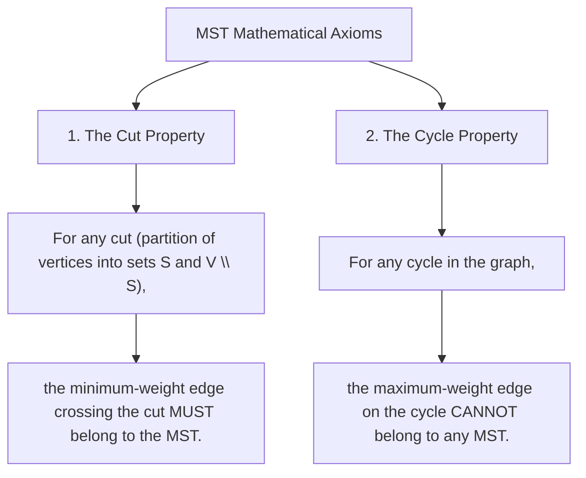

# Minimum Spanning Trees, Kruskal's & Prim's Algorithms

## TL;DR

Given a connected, undirected, weighted graph $G = (V, E, W)$, a **Minimum Spanning Tree (MST)** is a subgraph that:
1. Connects **all $V$ vertices**.
2. Contains **no cycles** (forms a valid tree of exactly **$V - 1$ edges**).
3. Minimizes the **total sum of edge weights**:

$$\text{Cost}(\text{MST}) = \sum_{e \in \text{MST}} w(e) \quad \text{is minimized.}$$

---

## 1. Structural Properties of MSTs

```text
Original Graph G (V=4, E=5):           Minimum Spanning Tree MST (V=4, E=3):
       (0) ─── 1 ─── (1)                      (0) ─── 1 ─── (1)
        │ \           │                        │             │
        4   3         2                        4             2
        │     \       │                        │             │
       (2) ─── 5 ─── (3)                      (2)           (3)
                                       Total Weight = 1 + 4 + 2 = 7
```

### The 2 Fundamental Axioms



---

## 2. Master MST Algorithm Selection Matrix

| Dimension | Kruskal's Algorithm | Prim's Algorithm |
|---|---|---|
| **Strategy** | **Edge-Centric** Greedy Choice | **Vertex-Centric** Greedy Choice |
| **Core Mechanism** | Sort all $E$ edges $\to$ Pick using **DSU** | Grow tree from node $s$ using **Min-Heap** |
| **Time Complexity** | **$O(E \log E)$** | **$O((V + E) \log V)$** |
| **Space Complexity**| $O(V + E)$ | $O(V + E)$ |
| **Optimal Graph Type**| **Sparse Graphs** ($E \approx V$) | **Dense Graphs** ($E \approx V^2$) |

---

## 3. Algorithm Breakdown 1: Kruskal's Algorithm ($O(E \log E)$ Time)

### Execution Steps
1. Extract all edges `(u, v, weight)` into an Edge List.
2. **Sort** all edges in non-decreasing order of weight $w$.
3. Initialize a **Disjoint Set Union (DSU)** data structure with $V$ elements.
4. Iterate through sorted edges:
   - If `find(u) != find(v)` (adding edge `(u, v)` does NOT create a cycle):
     - Unify sets `union(u, v)`.
     - Add edge `(u, v)` to MST.
     - Increment `edge_count`. Stop when `edge_count == V - 1`.

#### Python Implementation

```python
class UnionFind:
    def __init__(self, n: int):
        self.parent = list(range(n))
        self.rank = [0] * n

    def find(self, i: int) -> int:
        if self.parent[i] != i:
            self.parent[i] = self.find(self.parent[i])
        return self.parent[i]

    def union(self, i: int, j: int) -> bool:
        root_i, root_j = self.find(i), self.find(j)
        if root_i == root_j:
            return False
        if self.rank[root_i] < self.rank[root_j]:
            self.parent[root_i] = root_j
        elif self.rank[root_i] > self.rank[root_j]:
            self.parent[root_j] = root_i
        else:
            self.parent[root_j] = root_i
            self.rank[root_i] += 1
        return True

def kruskal_mst(num_nodes: int, edges: list[tuple[int, int, int]]) -> tuple[int, list[tuple[int, int, int]]]:
    """
    Kruskal's MST Algorithm using DSU.
    Time Complexity: O(E log E)
    Auxiliary Space: O(V + E)
    """
    # 1. Sort edges by weight ascending
    edges.sort(key=lambda x: x[2])
    
    dsu = UnionFind(num_nodes)
    mst_edges = []
    total_cost = 0
    
    for u, v, weight in edges:
        # If u and v are in different components, add edge to MST!
        if dsu.union(u, v):
            total_cost += weight
            mst_edges.append((u, v, weight))
            if len(mst_edges) == num_nodes - 1:
                break
                
    if len(mst_edges) != num_nodes - 1:
        return -1, [] # Graph is disconnected, no single MST possible!
        
    return total_cost, mst_edges
```

---

## 4. Algorithm Breakdown 2: Prim's Algorithm ($O((V + E) \log V)$ Time)

### Execution Steps
1. Maintain `visited` set tracking nodes already added to the MST tree. Start with `visited = {0}`.
2. Maintain a **Min-Heap** storing tuples `(weight, u, v)` representing candidate edges connecting the tree to non-tree nodes.
3. Push all outgoing edges from starting node `0` into the Min-Heap.
4. While Min-Heap is non-empty and `len(visited) < V`:
   - Pop minimum edge `(weight, u, v)` from Min-Heap.
   - If target $v$ is ALREADY in `visited`, skip!
   - Mark $v$ as `visited`, add `weight` to total cost.
   - Push all outgoing edges from $v$ to unvisited neighbors into Min-Heap.

#### Python Implementation

```python
import heapq

def prim_mst(num_nodes: int, graph: dict[int, list[tuple[int, int]]]) -> tuple[int, list[tuple[int, int, int]]]:
    """
    Prim's MST Algorithm using Min-Heap Priority Queue.
    Time Complexity: O((V + E) log V)
    Auxiliary Space: O(V + E)
    """
    visited = set([0])
    mst_edges = []
    total_cost = 0
    
    # Min-Heap stores: (weight, source_node, target_node)
    pq = []
    for neighbor, weight in graph.get(0, []):
        heapq.heappush(pq, (weight, 0, neighbor))
        
    while pq and len(visited) < num_nodes:
        weight, u, v = heapq.heappop(pq)
        
        if v in visited:
            continue # Skip if node v is already in MST
            
        visited.add(v)
        total_cost += weight
        mst_edges.append((u, v, weight))
        
        # Add all outgoing edges from newly added node v
        for next_node, next_weight in graph.get(v, []):
            if next_node not in visited:
                heapq.heappush(pq, (next_weight, v, next_node))
                
    if len(visited) != num_nodes:
        return -1, [] # Graph is disconnected
        
    return total_cost, mst_edges
```

---

## 5. Common Pitfalls & Edge Cases

1. **Disconnected Graph Handling**: If the graph has multiple disconnected components, a single MST connecting all nodes does NOT exist. The result is a **Minimum Spanning Forest**. Always check `len(mst_edges) == V - 1`.
2. **Directed Graph Input**: Kruskal's and Prim's algorithms operate on **Undirected Graphs**. If given directed edges, verify if the problem asks for Arborescence (Edmonds' Algorithm).
3. **Pointers/Vertices Out-of-Bounds**: In Prim's algorithm, popping duplicate stale entries from the Priority Queue without checking `if v in visited:` causes redundant edge evaluations.

---

## 6. Practice Problems

### Foundation
- [LeetCode 1584: Min Cost to Connect All Points](https://leetcode.com/problems/min-cost-to-connect-all-points/) (Manhattan Distance Prim's/Kruskal's)
- [LeetCode 1135: Connecting Cities With Minimum Cost](https://leetcode.com/problems/connecting-cities-with-minimum-cost/)

### Intermediate
- [LeetCode 1489: Find Critical and Pseudo-Critical Edges in Minimum Spanning Tree](https://leetcode.com/problems/find-critical-and-pseudo-critical-edges-in-minimum-spanning-tree/)
- [LeetCode 1168: Optimize Water Distribution in a Village](https://leetcode.com/problems/optimize-water-distribution-in-a-village/) (Virtual Dummy Node Trick)

### Advanced
- [LeetCode 1697: Checking Existence of Edge Length Limited Paths](https://leetcode.com/problems/checking-existence-of-edge-length-limited-paths/) (Offline Queries + Kruskal's DSU)

---

## Related Concepts
- [[00 - DSA MOC|Master DSA MOC]]
- [[Disjoint Set Union]]
- [[Heap]]
- [[Shortest Paths]]
- [[Greedy Algorithms]]
