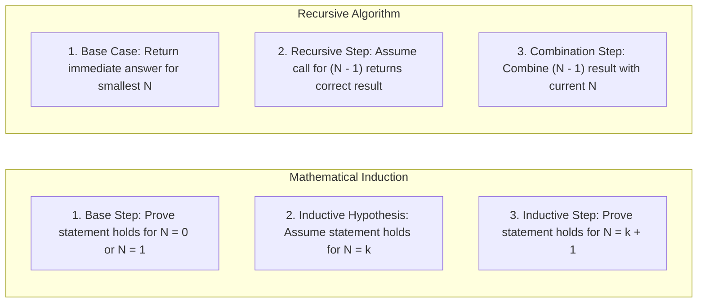

# Recursion, Call Stack Mechanics & Recurrences

## TL;DR

**Recursion** is an algorithmic technique where a function solves a complex problem by calling itself with smaller instances of the same problem. Recursion is directly equivalent to **Mathematical Induction**: it requires a **Base Case** (the stopping condition) and a **Recursive Step** (reducing the problem size toward the base case).

---

## 1. What is Recursion? Connection to Induction

Recursion and Mathematical Induction are two sides of the same coin:



---

## 2. Mechanics of the CPU Call Stack

Every recursive call creates a new **Stack Frame** on the CPU call stack storing:
1. Function arguments and parameters.
2. Return memory address (where execution resumes after the call completes).
3. Local variables.

### Stack Frame Execution Trace: `factorial(3)`

```text
CALL EXPANSION PHASE (Winding Up):

Step 1: main() calls factorial(3)
Stack: [ factorial(3): n=3, return_addr=main ]

Step 2: factorial(3) evaluates 3 * factorial(2)
Stack: [ factorial(3): n=3 ] ──► [ factorial(2): n=2, return_addr=fact(3) ]

Step 3: factorial(2) evaluates 2 * factorial(1)
Stack: [ factorial(3) ] ──► [ factorial(2) ] ──► [ factorial(1): n=1, return_addr=fact(2) ]

Step 4: Base Case Reached! n == 1 returns 1.

RETURN PROPAGATION PHASE (Unwinding Down):

Step 4: factorial(1) returns 1  ──► Stack pops factorial(1)
Step 5: factorial(2) computes 2 * 1 = 2 ──► Returns 2, Stack pops factorial(2)
Step 6: factorial(3) computes 3 * 2 = 6 ──► Returns 6 to main(), Stack pops factorial(3)
```

---

## 3. The 3 Golden Rules of Writing Recursive Algorithms

```text
┌────────────────────────────────────────────────────────┐
│ 1. Base Case: When do I stop? (Must reach without infinite loop)
├────────────────────────────────────────────────────────┤
│ 2. Subproblem Decomposition: How do I reduce N? (N -> N-1 or N/2)
├────────────────────────────────────────────────────────┤
│ 3. Combination Rule: How do I merge results from subproblems?
└────────────────────────────────────────────────────────┘
```

---

## 4. Types of Recursion

### A. Tail Recursion (Optimizable to $O(1)$ Stack Space)
A function is **Tail Recursive** if the recursive call is the **very last operation** performed in the function (no arithmetic or modification performed after the call returns).

Compilers with **Tail-Call Optimization (TCO)** reuse the current stack frame instead of pushing a new frame, converting recursion into an $O(1)$ space loop!

```python
# Non-Tail Recursive (Operation 'n * ...' waits for return)
def fact_non_tail(n: int) -> int:
    if n <= 1:
        return 1
    return n * fact_non_tail(n - 1)  # Multiplication pending after return!

# Tail Recursive (Accumulator holds intermediate state)
def fact_tail(n: int, accumulator: int = 1) -> int:
    if n <= 1:
        return accumulator
    return fact_tail(n - 1, n * accumulator)  # Pure call, nothing pending!
```

---

### B. Tree / Branching Recursion (Overlapping Subproblems)

When a recursive function makes **multiple** recursive calls within a single invocation, execution forms a **Recursion Tree**.

#### Example: Naive Fibonacci ($O(2^N)$ Explosive Growth)

```python
def fib(n: int) -> int:
    if n <= 1:
        return n
    return fib(n - 1) + fib(n - 2)
```

```text
Recursion Tree for fib(5):

                      fib(5)
                   /          \
             fib(4)            fib(3)  ◄── Redundant Work!
            /      \          /      \
       fib(3)     fib(2)   fib(2)   fib(1)
      /      \    /   \    /   \
  fib(2)   fib(1) 1    0  1     0
  /    \
 1      0

Total Nodes: O(2ᴺ)  (2⁰ + 2¹ + 2² + ... + 2ᴺ⁻¹)
Notice fib(3) and fib(2) are computed multiple times from scratch!
```

---

## 5. Recursion vs Iteration: Trade-offs

| Feature | Recursion | Iteration |
|---|---|---|
| **Code Elegance** | High (Natural for Trees, Graphs, Backtracking) | Can be verbose with explicit manual stacks |
| **Memory Overhead** | $O(\text{Depth})$ stack frames | $O(1)$ auxiliary memory (usually) |
| **Execution Speed** | Slightly slower (Function call overhead) | Faster (Direct register/loop operations) |
| **Overflow Risk** | Risk of `StackOverflowError` if depth $> 1000$ | No stack overflow risk |

---

## 6. Comprehensive Problem Walkthrough: Power Function $X^N$

Calculate $x^n$ in $O(\log N)$ time using **Binary Exponentiation** (Divide & Conquer Recursion).

### Mathematical Property

$$x^n = \begin{cases} 1 & \text{if } n = 0 \\ \left(x^{n/2}\right)^2 & \text{if } n \text{ is even} \\ x \cdot \left(x^{(n-1)/2}\right)^2 & \text{if } n \text{ is odd} \end{cases}$$

#### Python Implementation

```python
def my_pow(x: float, n: int) -> float:
    """
    Binary Exponentiation via Divide & Conquer Recursion.
    Time Complexity: O(log N)
    Auxiliary Space: O(log N) call stack depth
    """
    if n < 0:
        x = 1 / x
        n = -n
        
    def helper(base: float, exp: int) -> float:
        # Base Case
        if exp == 0:
            return 1.0
            
        half = helper(base, exp // 2)
        
        if exp % 2 == 0:
            return half * half
        else:
            return base * half * half

    return helper(x, n)
```

---

## 7. Common Pitfalls & Edge Cases

1. **Missing or Unreachable Base Case**: Causes infinite recursion, terminating with `RecursionError: maximum recursion depth exceeded`.
2. **State Mutation Bug**: Passing mutable data structures (like lists) across recursive calls without backtracking/reverting mutations corrupts state across sibling branches.
3. **Integer Overflow in Call Count**: Recursive trees without memoization (like Fibonacci) freeze programs for $N \ge 50$ ($2^{50} \approx 1.12 \times 10^{15}$ operations).

---

## 8. Practice Problems

### Foundation
- [LeetCode 509: Fibonacci Number](https://leetcode.com/problems/fibonacci-number/)
- [LeetCode 344: Reverse String (Recursively)](https://leetcode.com/problems/reverse-string/)

### Intermediate
- [LeetCode 50: Pow(x, n)](https://leetcode.com/problems/powx-n/)
- [LeetCode 24: Swap Nodes in Pairs](https://leetcode.com/problems/swap-nodes-in-pairs/)

### Advanced
- [LeetCode 776: Split BST](https://leetcode.com/problems/split-bst/)
- [Hanoi Tower Problem](https://en.wikipedia.org/wiki/Tower_of_Hanoi)

---

## Related Concepts
- [[00 - DSA MOC|Master DSA MOC]]
- [[Complexity Analysis]]
- [[Stacks]]
- [[Backtracking]]
- [[Dynamic Programming]]
- [[Trees]]
