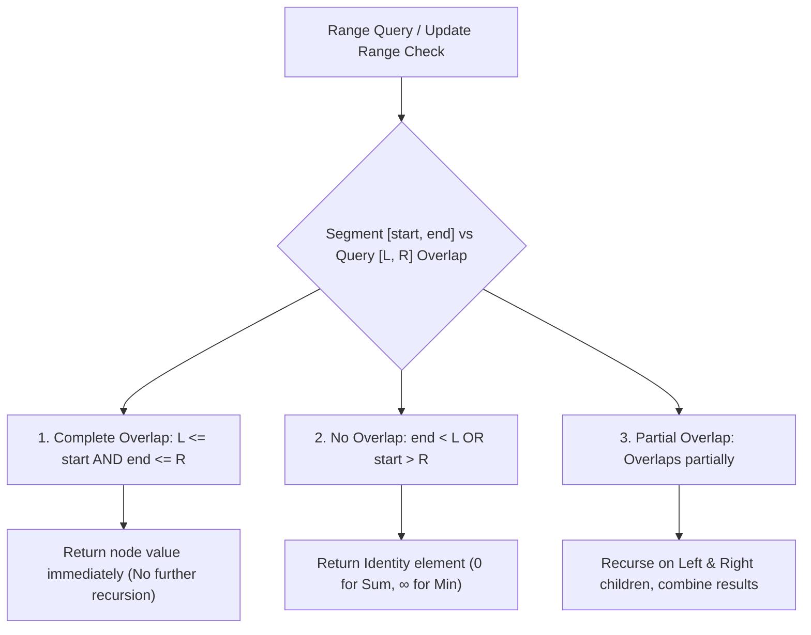

# Segment Trees, Lazy Propagation & Range Query Abstractions

## TL;DR

A **Segment Tree** is a versatile binary tree structure used to store information about array intervals or segments. It enables both **Range Queries** (Sum, Min, Max, GCD) and **Point/Range Updates** in **$O(\log N)$ time**. By incorporating **Lazy Propagation**, range updates (e.g. "Add $V$ to all elements in range $[L, R]$") are optimized from $O(N)$ to **$O(\log N)$ time**.

---

## 1. Range Query Structural Comparison

| Feature | Prefix Sum Array | Fenwick Tree (BIT) | Sparse Table | Segment Tree |
|---|---|---|---|---|
| **Point Update** | $O(N)$ | $O(\log N)$ | Impossible ($O(N \log N)$ rebuild) | **$O(\log N)$** |
| **Range Update** | $O(N)$ | $O(\log N)$ (via diff array) | Impossible | **$O(\log N)$ (via Lazy)** |
| **Range Query** | $O(1)$ | $O(\log N)$ | **$O(1)$** | **$O(\log N)$** |
| **Associative Functions**| Sum, XOR (Invertible) | Sum, XOR | Min, Max, GCD (Idempotent) | **Any Associative Operator!** |
| **Array Allocation** | $N$ | $N+1$ | $N \log N$ | **$4N$** |

---

## 2. Why $4N$ Memory Array Allocation?

A Segment Tree for $N$ elements is a full binary tree with $N$ leaf nodes:
- Height of tree $H = \lceil \log_2 N \rceil$.
- Total nodes in full binary tree $= 2^{H+1} - 1 < 2^{\lceil \log_2 N \rceil + 1} < 4N$.

```text
Segment Tree Array Allocation (N = 4, Array Size = 4 * 4 = 16):

                      [0..3] (Node 0: Sum of 0..3)
                    /                             \
        [0..1] (Node 1)                         [2..3] (Node 2)
       /               \                       /               \
[0..0] (Node 3)   [1..1] (Node 4)       [2..2] (Node 5)   [3..3] (Node 6)
```

---

## 3. Core Operations & Segment Overlap Logic



---

## 4. Range Updates via Lazy Propagation

Without Lazy Propagation, updating range $[L, R]$ requires visiting every leaf in range, taking $O(N \log N)$ time.

**Lazy Propagation** defers updates to child nodes:
1. When a range update completely covers node `[start, end]`, apply update to current node and record pending update in `lazy[node]`.
2. Do NOT recurse deeper immediately!
3. Before visiting any node in future queries/updates, **push down** `lazy[node]` to its left and right children!

```text
Lazy Push-Down Mechanism:

          [0..3] (Node val updated, Lazy = +5)
        /                                     \
    [0..1] (Child un-updated)             [2..3] (Child un-updated)

When query touches [0..1]:
  1. Push +5 down to Left child [0..1] and Right child [2..3].
  2. Clear lazy[0..3] = 0.
  3. Now proceed safely with query!
```

---

## 5. Complete Python Implementation (Segment Tree with Lazy Propagation)

```python
class SegmentTree:
    """
    Segment Tree with Lazy Propagation for Range Sum Queries & Range Updates.
    Time Complexity: O(N) build, O(log N) query & update
    Space Complexity: O(4N)
    """
    def __init__(self, nums: list[int]):
        self.n = len(nums)
        self.tree = [0] * (4 * self.n)
        self.lazy = [0] * (4 * self.n)
        if self.n > 0:
            self._build(nums, 0, 0, self.n - 1)

    def _build(self, nums: list[int], node: int, start: int, end: int) -> None:
        if start == end:
            self.tree[node] = nums[start]
            return
            
        mid = (start + end) // 2
        left_child = 2 * node + 1
        right_child = 2 * node + 2
        
        self._build(nums, left_child, start, mid)
        self._build(nums, right_child, mid + 1, end)
        
        self.tree[node] = self.tree[left_child] + self.tree[right_child]

    def _push_down(self, node: int, start: int, end: int) -> None:
        """Pushes pending lazy updates down to children."""
        if self.lazy[node] != 0:
            val = self.lazy[node]
            mid = (start + end) // 2
            left_child = 2 * node + 1
            right_child = 2 * node + 2
            
            # Apply update to left child
            self.tree[left_child] += val * (mid - start + 1)
            self.lazy[left_child] += val
            
            # Apply update to right child
            self.tree[right_child] += val * (end - mid)
            self.lazy[right_child] += val
            
            # Clear current lazy state
            self.lazy[node] = 0

    def range_update(self, l: int, r: int, val: int, node: int = 0, start: int = 0, end: int | None = None) -> None:
        """Adds val to all elements in range [l, r]."""
        if end is None:
            end = self.n - 1
            
        # 1. Complete No Overlap
        if r < start or end < l:
            return
            
        # 2. Complete Overlap
        if l <= start and end <= r:
            self.tree[node] += val * (end - start + 1)
            self.lazy[node] += val
            return
            
        # 3. Partial Overlap -> Push down lazy state first
        self._push_down(node, start, end)
        
        mid = (start + end) // 2
        left_child = 2 * node + 1
        right_child = 2 * node + 2
        
        self.range_update(l, r, val, left_child, start, mid)
        self.range_update(l, r, val, right_child, mid + 1, end)
        
        self.tree[node] = self.tree[left_child] + self.tree[right_child]

    def range_query(self, l: int, r: int, node: int = 0, start: int = 0, end: int | None = None) -> int:
        """Returns sum of elements in range [l, r]."""
        if end is None:
            end = self.n - 1
            
        # 1. Complete No Overlap
        if r < start or end < l:
            return 0
            
        # 2. Complete Overlap
        if l <= start and end <= r:
            return self.tree[node]
            
        # 3. Partial Overlap -> Push down lazy state first
        self._push_down(node, start, end)
        
        mid = (start + end) // 2
        left_child = 2 * node + 1
        right_child = 2 * node + 2
        
        left_sum = self.range_query(l, r, left_child, start, mid)
        right_sum = self.range_query(l, r, right_child, mid + 1, end)
        
        return left_sum + right_sum
```

---

## 6. Common Pitfalls & Edge Cases

1. **Array Out of Bounds ($2N$ vs $4N$)**: Allocating `2 * N` size for Segment Tree causes index out of bounds. Always allocate **`4 * N`**!
2. **Forgetting Lazy Push-Down in Query**: In `range_query()`, failing to call `_push_down()` before reading children returns stale, un-updated values.
3. **Lazy Multiplication for Range Sum**: For Range Sum queries, `lazy[node]` added to `tree[node]` MUST be multiplied by segment length: `val * (end - start + 1)`.

---

## 7. Practice Problems

### Foundation
- [LeetCode 307: Range Sum Query - Mutable](https://leetcode.com/problems/range-sum-query-mutable/)
- [LeetCode 370: Range Addition](https://leetcode.com/problems/range-addition/)

### Intermediate
- [LeetCode 699: Falling Squares](https://leetcode.com/problems/falling-squares/)
- [LeetCode 715: Range Module](https://leetcode.com/problems/range-module/)

### Advanced
- [LeetCode 218: The Skyline Problem](https://leetcode.com/problems/the-skyline-problem/)
- [LeetCode 2286: Booking Concert Tickets in Groups](https://leetcode.com/problems/booking-concert-tickets-in-groups/)

---

## Related Concepts
- [[00 - DSA MOC|Master DSA MOC]]
- [[Fenwick Tree]]
- [[Prefix Sum]]
- [[Binary Trees]]
- [[Recursion]]
