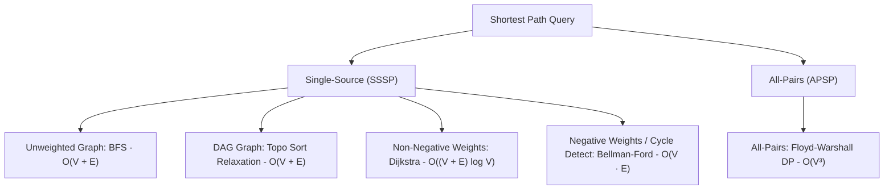

# Shortest Path Algorithms & Graph Relaxation Theory

## TL;DR

Given a weighted graph $G = (V, E, W)$, a **Shortest Path** algorithm finds a path between vertices such that the total sum of constituent edge weights is minimized. Choosing the correct algorithm depends on **edge weight signs**, **graph structure (DAG vs General)**, and whether queries are **Single-Source (SSSP)** or **All-Pairs (APSP)**.

---

## 1. Master Shortest Path Decision Matrix



### Comprehensive Summary Table

| Algorithm | Scope | Edge Weights | Time Complexity | Auxiliary Space | Key Mechanism |
|---|---|---|---|---|---|
| **BFS** | Single-Source | Unweighted ($w=1$) | **$O(V + E)$** | $O(V)$ | Level order FIFO Queue |
| **DAG Relaxation** | Single-Source | Any (in DAG) | **$O(V + E)$** | $O(V)$ | Topo Sort + Edge Relaxation |
| **Dijkstra** | Single-Source | **Non-Negative Only** ($w \ge 0$) | **$O((V + E) \log V)$** | $O(V)$ | Min-Heap Priority Queue |
| **Bellman-Ford** | Single-Source | Any (Detects Negative Cycles) | **$O(V \cdot E)$** | $O(V)$ | $V-1$ Passes Edge Relaxation |
| **Floyd-Warshall** | All-Pairs | Any (No Negative Cycles) | **$O(V^3)$** | $O(V^2)$ | 3-Loop Dynamic Programming |

---

## 2. Core Fundamental Concept: Edge Relaxation

The cornerstone of almost all shortest path algorithms is **Edge Relaxation**.

### Relaxation Invariant

Let $d[u]$ be the shortest tentative distance from source to node $u$.
For a directed edge $u \xrightarrow{w} v$, if traveling through $u$ offers a shorter path to $v$ than currently known:

$$\text{If } d[u] + w(u, v) < d[v] \implies d[v] = d[u] + w(u, v)$$

```text
Relaxation Visual:
         (u) ─── w=3 ───► (v)
       d[u]=4           d[v]=10 (Old tentative distance)

New Path via u: d[u] + w = 4 + 3 = 7
Since 7 < 10, RELAX edge: d[v] is updated from 10 to 7!
```

---

## 3. Why Negative Edge Weights Break Dijkstra

Dijkstra's algorithm relies on a **Greedy Choice Assumption**: once a vertex $u$ with the minimum tentative distance is popped from the Min-Heap, its distance $d[u]$ is finalized and **will never decrease**.

If negative edges exist, this greedy assumption fails catastrophically!

```text
Counterexample Graph for Dijkstra:

        (Source: A)
          /     \
      w=5/       \ w=2
        ▼         ▼
       (B) ◄────── (C)
            w=-10

Dijkstra Step 1: Pops A (dist 0). Enqueues B (dist 5), C (dist 2).
Dijkstra Step 2: Pops C (min dist 2). Finalizes C!
Dijkstra Step 3: Pops B (dist 5). Finalizes B!
Dijkstra ignores edge C -> B (-10) because B is already marked finalized!

Real Shortest Path to B: A -> C -> B (Cost: 2 - 10 = -8 < 5).
Dijkstra output is WRONG (-8 missed)! Use Bellman-Ford instead.
```

---

## 4. Comprehensive Algorithm Walkthroughs & Code

### Algorithm 1: Dijkstra's Algorithm ($O((V + E) \log V)$ Time)

#### Python Implementation

```python
import heapq

def dijkstra(num_nodes: int, graph: dict[int, list[tuple[int, int]]], source: int) -> list[float]:
    """
    Dijkstra's Algorithm using Min-Heap for non-negative edge weights.
    Time Complexity: O((V + E) log V)
    Auxiliary Space: O(V)
    """
    distances = [float('inf')] * num_nodes
    distances[source] = 0
    
    # Min-Heap stores tuples: (current_distance, node)
    pq = [(0, source)]
    
    while pq:
        curr_dist, u = heapq.heappop(pq)
        
        # Skip stale entries popped from heap
        if curr_dist > distances[u]:
            continue
            
        for v, weight in graph.get(u, []):
            if distances[u] + weight < distances[v]:
                distances[v] = distances[u] + weight
                heapq.heappush(pq, (distances[v], v))
                
    return distances
```

---

### Algorithm 2: Bellman-Ford Algorithm ($O(V \cdot E)$ Time)

Relaxes all $E$ edges $V - 1$ times. On the $V$-th pass, if any distance can still be relaxed, a **Negative Weight Cycle** exists in the graph!

#### Python Implementation

```python
def bellman_ford(num_nodes: int, edges: list[tuple[int, int, int]], source: int) -> list[float] | None:
    """
    Bellman-Ford Algorithm with Negative Cycle Detection.
    Time Complexity: O(V · E)
    Auxiliary Space: O(V)
    """
    distances = [float('inf')] * num_nodes
    distances[source] = 0
    
    # Relax all edges V - 1 times
    for _ in range(num_nodes - 1):
        updated = False
        for u, v, weight in edges:
            if distances[u] != float('inf') and distances[u] + weight < distances[v]:
                distances[v] = distances[u] + weight
                updated = True
        if not updated:
            break # Early termination if no distances changed
            
    # V-th Pass: Check for Negative Cycles
    for u, v, weight in edges:
        if distances[u] != float('inf') and distances[u] + weight < distances[v]:
            return None # Negative Cycle Detected!
            
    return distances
```

---

### Algorithm 3: Floyd-Warshall Algorithm ($O(V^3)$ All-Pairs Dynamic Programming)

Computes shortest paths between **all pairs of nodes $(i, j)$** by allowing intermediate nodes $k \in \{0 \dots V-1\}$.

#### DP Recurrence Formula

$$\text{dist}[i][j] = \min(\text{dist}[i][j], \; \text{dist}[i][k] + \text{dist}[k][j])$$

#### Python Implementation

```python
def floyd_warshall(num_nodes: int, matrix: list[list[float]]) -> list[list[float]]:
    """
    Floyd-Warshall All-Pairs Shortest Path.
    Time Complexity: O(V³)
    Auxiliary Space: O(V²)
    """
    # Create copy of adjacency matrix
    dist = [row[:] for row in matrix]
    
    for k in range(num_nodes):       # Intermediate node k (MUST be outermost loop!)
        for i in range(num_nodes):   # Source node i
            for j in range(num_nodes):# Destination node j
                if dist[i][k] != float('inf') and dist[k][j] != float('inf'):
                    dist[i][j] = min(dist[i][j], dist[i][k] + dist[k][j])
                    
    return dist
```

---

## 5. Common Pitfalls & Edge Cases

1. **Floyd-Warshall Loop Order Error**: In Floyd-Warshall, the intermediate node $k$ **MUST be the outermost loop**. Putting $k$ as the innermost loop computes incorrect distances!
2. **Integer Overflow on Infinity Initialization**: Using `dist[u] + weight` when `dist[u] = 2^31 - 1` causes 32-bit integer overflow. Initialize with `float('inf')` in Python or `INF = 1e9` in C++.
3. **Running Dijkstra on Negative Edges**: Yields incorrect path costs. Always check edge weight constraints before choosing Dijkstra.

---

## 6. Practice Problems

### Foundation
- [LeetCode 743: Network Delay Time](https://leetcode.com/problems/network-delay-time/) (Dijkstra)
- [LeetCode 1334: Find the City With the Smallest Number of Neighbors](https://leetcode.com/problems/find-the-city-with-the-smallest-number-of-neighbors-at-a-threshold-distance/) (Floyd-Warshall)

### Intermediate
- [LeetCode 787: Cheapest Flights Within K Stops](https://leetcode.com/problems/cheapest-flights-within-k-stops/) (Modified Bellman-Ford / BFS)
- [LeetCode 1631: Path With Minimum Effort](https://leetcode.com/problems/path-with-minimum-effort/) (Dijkstra on Grid)

### Advanced
- [LeetCode 778: Swim in Rising Water](https://leetcode.com/problems/swim-in-rising-water/) (Dijkstra / Binary Search + BFS)
- [LeetCode 882: Reachable Nodes In Subdivided Graph](https://leetcode.com/problems/reachable-nodes-in-subdivided-graph/)

---

## Related Concepts
- [[00 - DSA MOC|Master DSA MOC]]
- [[Graph Fundamentals]]
- [[Heap]]
- [[BFS]]
- [[Topological Sort]]
- [[Minimum Spanning Tree]]
