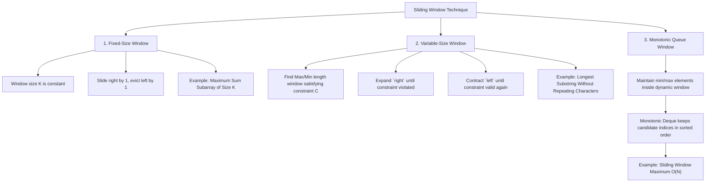

# Sliding Window Technique & Subarray Optimization

## TL;DR

The **Sliding Window** technique converts nested loops ($O(N \cdot K)$ or $O(N^2)$) operating over contiguous subarrays or substrings into a single linear pass ($O(N)$). By maintaining a dynamic range `[left, right]` and updating window aggregates incrementally as `right` expands and `left` contracts, we avoid recalculating overlapping subproblems from scratch.

---

## 1. Why Does Sliding Window Work?

Consider calculating the sum of every contiguous subarray of size $K = 3$ in an array of size $N = 6$:

```text
Naive Approach O(N · K):
Window 1: [A0 + A1 + A2]
Window 2:      [A1 + A2 + A3]      <-- Recomputes (A1 + A2) from scratch!
Window 3:           [A2 + A3 + A4] <-- Recomputes (A2 + A3) from scratch!
```

### The Incremental Window Invariant

Notice that Window 2 differs from Window 1 by exactly two elements:
- It **adds** the incoming element `A3`.
- It **subtracts** the outgoing element `A0`.

$$\text{Window Sum}_{\text{new}} = \text{Window Sum}_{\text{old}} + A[\text{right}] - A[\text{left} - 1]$$

```text
Sliding Step (O(1) Update):
[ 2 , 1 , 5 , 1 , 3 , 2 ]
 ───┼───────┼───
 -2 │ 1   5 │ +1   ==>  Sum_new = (2 + 1 + 5) - 2 + 1 = 7
    └───┬───┘
     Overlapping Range (Preserved)
```

---

## 2. Taxonomy of Sliding Window Variants



---

## 3. Detailed Walkthrough of Key Variations

### Variation 1: Fixed-Size Window (Max Sum Subarray of Size $K$)

Given an array `nums` and integer $K$, find the maximum sum of any contiguous subarray of size $K$.

#### Python Implementation

```python
def max_sub_array_of_size_k(nums: list[int], k: int) -> int:
    """
    Fixed-Size Sliding Window.
    Time Complexity: O(N)
    Auxiliary Space: O(1)
    """
    if len(nums) < k:
        return 0
        
    window_sum = sum(nums[:k])
    max_sum = window_sum
    
    for right in range(k, len(nums)):
        window_sum += nums[right] - nums[right - k]
        max_sum = max(max_sum, window_sum)
        
    return max_sum
```

---

### Variation 2: Variable-Size Window (Longest Substring Without Repeating Characters)

Given a string `s`, find the length of the longest substring without repeating characters.

#### Expansion & Contraction Template

1. Expand `right` pointer one character at a time.
2. Update character frequency map.
3. While window constraint is violated (character count $> 1$):
   - Contract `left` pointer and decrement frequency.
4. Record valid window size ($\text{right} - \text{left} + 1$).

#### ASCII Window Snapshot

```text
String s = "p w w k e w"

Step 1: right = 0 ('p') -> Window: "p", counts = {'p':1}. Valid. Max Len = 1
Step 2: right = 1 ('w') -> Window: "pw", counts = {'p':1, 'w':1}. Valid. Max Len = 2
Step 3: right = 2 ('w') -> Window: "pww", counts = {'p':1, 'w':2}. INVALID ('w' repeated!)
        Shrink left until 'w' count == 1:
        - Shrink left=0 ('p'): Window "ww", counts = {'w':2}
        - Shrink left=1 ('w'): Window "w", counts = {'w':1}. Valid again!
Step 4: right = 3 ('k') -> Window: "wk", Valid. Max Len = 2
Step 5: right = 4 ('e') -> Window: "wke", Valid. Max Len = 3
Step 6: right = 5 ('w') -> Window: "wkew", INVALID ('w' repeated)
        Shrink left=2 ('w') -> Window "kew", Valid. Max Len = 3.

Result: 3 ("wke")
```

#### Python Implementation

```python
def length_of_longest_substring(s: str) -> int:
    """
    Variable-Size Sliding Window with Last Seen Index Map.
    Time Complexity: O(N)
    Auxiliary Space: O(min(N, M)) where M is character set size
    """
    char_map = {} # Maps char -> last seen index
    left = 0
    max_len = 0
    
    for right, char in enumerate(s):
        if char in char_map and char_map[char] >= left:
            # Jump left pointer directly past the previous occurrence
            left = char_map[char] + 1
            
        char_map[char] = right
        max_len = max(max_len, right - left + 1)
        
    return max_len
```

---

### Variation 3: Advanced Variable Window (Minimum Window Substring)

Given two strings `s` and `t`, return the minimum window substring of `s` such that every character in `t` (including duplicates) is included in the window.

#### Python Implementation

```python
from collections import Counter

def min_window(s: str, t: str) -> str:
    """
    Minimum Window Substring using Expansion/Contraction.
    Time Complexity: O(|S| + |T|)
    Auxiliary Space: O(|S| + |T|)
    """
    if not s or not t:
        return ""
        
    target_counts = Counter(t)
    required_unique = len(target_counts)
    
    window_counts = {}
    formed_unique = 0
    
    left = 0
    min_len = float('inf')
    min_window_start = 0
    
    for right, char in enumerate(s):
        window_counts[char] = window_counts.get(char, 0) + 1
        
        if char in target_counts and window_counts[char] == target_counts[char]:
            formed_unique += 1
            
        # Try contracting the window from the left once all required chars are present
        while formed_unique == required_unique:
            current_len = right - left + 1
            if current_len < min_len:
                min_len = current_len
                min_window_start = left
                
            left_char = s[left]
            window_counts[left_char] -= 1
            if left_char in target_counts and window_counts[left_char] < target_counts[left_char]:
                formed_unique -= 1
                
            left += 1
            
    return "" if min_len == float('inf') else s[min_window_start : min_window_start + min_len]
```

---

## 4. Common Pitfalls & Edge Cases

1. **Incorrect Window Length Calculation**: For window `[left, right]`, the element count is **$\text{right} - \text{left} + 1$**, NOT $\text{right} - \text{left}$.
2. **Shrinking Shrink-Loop Conditions**: In variable window problems, make sure the `while` shrink loop correctly handles multi-element contraction until the condition is fully restored.
3. **Invalid Window Key Offsets**: Forgetting to update hash frequencies when moving `left` leaves invalid state in frequency maps.

---

## 5. Practice Problems

### Foundation
- [LeetCode 643: Maximum Average Subarray I](https://leetcode.com/problems/maximum-average-subarray-i/)
- [LeetCode 1876: Substrings of Size Three with Distinct Characters](https://leetcode.com/problems/substrings-of-size-three-with-distinct-characters/)

### Intermediate
- [LeetCode 3: Longest Substring Without Repeating Characters](https://leetcode.com/problems/longest-substring-without-repeating-characters/)
- [LeetCode 1004: Max Consecutive Ones III](https://leetcode.com/problems/max-consecutive-ones-iii/)
- [LeetCode 438: Find All Anagrams in a String](https://leetcode.com/problems/find-all-anagrams-in-a-string/)

### Advanced
- [LeetCode 76: Minimum Window Substring](https://leetcode.com/problems/minimum-window-substring/)
- [LeetCode 239: Sliding Window Maximum](https://leetcode.com/problems/sliding-window-maximum/) (Monotonic Deque)

---

## Related Concepts
- [[00 - DSA MOC|Master DSA MOC]]
- [[Arrays]]
- [[Strings]]
- [[Two Pointers]]
- [[Hashing]]
- [[Deques]]
